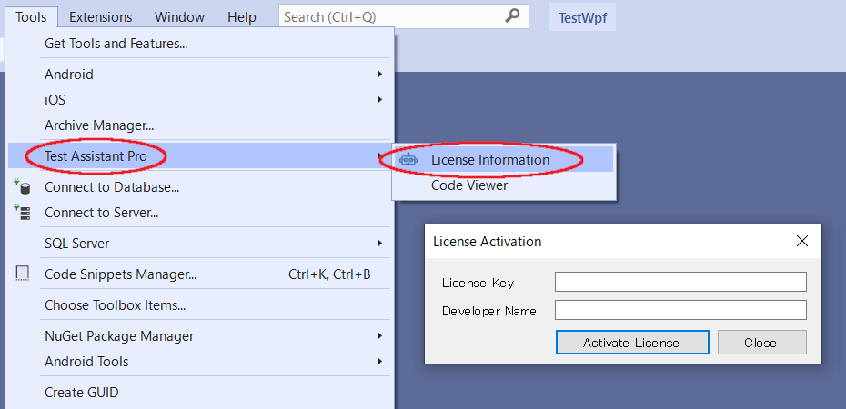

# インストール
VisualStudioの拡張機能から TestAssistantProと NUnit 3 Test Adapter をインストールします。

## TestAssistantPro のインストール
Visual Studio のメニューから拡張機能を開きます。

Onlineを選択して検索に「Codeer」と入力します。TestAssistantProが表示されるのでダウンロードします。ダウンロード後に Visual Studio を再起動すると TestAssistantPro が有効になりますが、再起動は次の手順を実行してから行ってください。

## NUnit 3 Test Adapter のインストール（Visual Studio 2022では不要）

続いて Nunit 3 Test Adapter をインストールします。Onlineを選択して検索に「Nunit」と入力してダウンロードしてください。ダウンロード完了後に、Visual Studio を再起動します。

## TestAssistantProのライセンスのActivate
インストール後にVisual Studio を再起動してからメニューの拡張機能から 「Licence Information」 を選択してください。
表示されたダイアログで「Licence Key」と「Developer Name」を入力して「Activate」を実行してください。
「Developer Name」はご担当者の方がランセンスサーバーで識別するために付けるものなので任意の値でかまいません。

