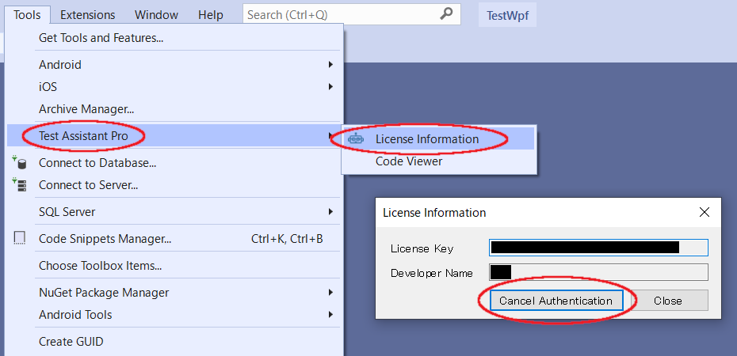

# ライセンスの管理
PCを変更する場合や担当者の変更に伴いラインセス所有者を変更することができます。
開発者ライセンスの場合はフローティングライセンスではありませんのでご注意ください。
詳細は[こちら](https://tools.codeer.co.jp/Home/LicensePolicy)をご参照ください。

## ライセンスサーバーにログイン
こちらからログインしてください。 
https://tools.codeer.co.jp/ 
メールアドレスとパスワードは購入時にご担当者にメールで送られます。
初期パスワードは必ず変更してください。

ログイン

パスワードリセット

## ライセンス削除
### Visual Studio からライセンスの削除
メニューの拡張機能から 「Licence Information」 を選択し、ダイアログで「Cancel Authentication」を実行してください。

### ライセンスサーバーから担当者の削除
