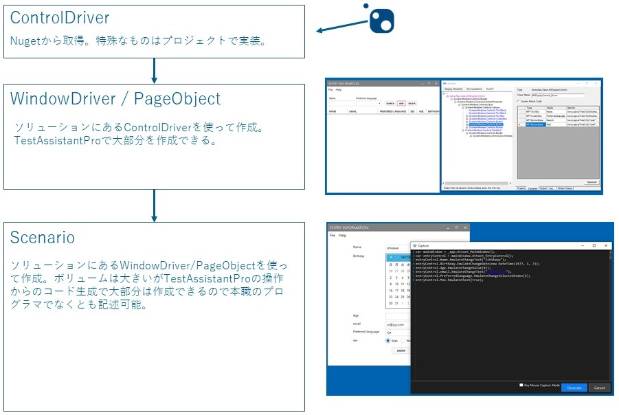

TestAssistantPro.Manual
========

## 具体的な使い方はこちら
+ [WPF](WPF/README.md)
+ [WinForms](WinForms/README.md)
+ [Web](Web/README.md)

# 概略
TestAssistantProはC#で自動テストの実装を補助するためのツールです。 
以下の設計方針のコード作成を補助します。 

+ Webアプリ Seleniumを使ったPageObjectパターンのテストプログラム。 
+ Windowsアプリ  Friendlyを使ったDriver/Scenarioパーンのテストプログラム。 

FriendlyとDriver/Scenarioパターンはこちらを参照お願いします。 
+ [Friendly](https://github.com/Codeer-Software/Friendly/blob/master/README.jp.md)
+ [Driver/Scenarioパターン](https://github.com/Codeer-Software/Friendly/blob/master/TestAutomationDesign.jp.md)

Seleniumは公式ドキュメントやその他の情報を参照してください。 

# アーキテクチャ
TestAssistantProはソリューション内のクラスを使って順次コードを生成していきます。 

# TestAssistantProの目的は自動テスト作成/運用工数を圧倒的に削減することです
SeleniumとFriendlyはともにOSSのライブラリなのでTestAssistantProを使わなくても作成/メンテすることは可能です。 
またどちらのライブラリも強力なので工数を投入すればほとんどのテストを実装することが可能でしょう。 
TestAssistantProの目的はその作業工数を圧倒的に減らすことです。 
PageObject/WindowDriver/シナリオのコードの大部分をツールで作成できます。 
またプロジェクトごとで出てくるその他の自動化したい部分（多くはボリュームが出てくる部分）にもカスタム機能を追加することにより対応することが可能でここでも大幅に工数を削減できます。 
注意点としては、実装するために必要な知識が減るわけではありません。 
しかし、ツールのサポートにより学習コスト自体も減らすことが可能です。 
自動テスト作成に特化した強化型のインテリセンスのイメージで使ってもらうと良いと思います。 

# 高いメンテナンス性能
ポイントはこの作業は手書きでも可能ということです。 
それをツールによって効率的に作成することができるようになっていることです。 
ツールしか読めない/書けないではなく、あくまで手書きの効率を高めただけなので、作成されるコードはPagetObject/Driverパターンに従った可読性の高いものとなります。 
これは長期間メンテの必要な自動テストにおいて非常に重要です。 

# メンバーのアサインの最適化
ドライバは開発者が書いた方が良いでしょう。 
ただ、アプリ自体も開発しているのでTestAssistantProを使って少ない工数で作成するのが理想です。 

シナリオは技術的な知識はほとんど必要ないのでテスト担当者が書くのが理想です。 
ただテストには詳しくとも本職のプログラマ程はコードを書くのが得意でないことが多いと思います。 
その点TestAssistantProのサポートがあれば迷わずに作成を進めていくことができます。 
さらにキャプチャ以外でコードを書く必要があるもの(Assertなど）に関してもメニューとして追加しておくと 
テスト担当者は右クリックメニューなどからそれを呼びだすことができ、効率よくテスト実装を勧めていくことができます。 

# 費用対効果を高めます
自動テストを作成するということはテストを自動で実行するソフトウェアを開発するということです。 
そして対象のアプリと同じだけのライフサイクルがあり多くの場合は長期にわたってメンテナンスしていきます。 
これはそれなりにコストのかかる作業なのです。 
コスト対策をしなければ現実的に役に立つものにはなりません。 
また作成/メンテナンスコストを下げることで初めてテストケースの数を増やすことができます。 
ケースの数を増やせるということは保証できる範囲が広がり効果が高まります。 
良い循環を回すことができるのです。 

+ 作成効率up
+ メンテナンス性up
+ メンバーのアサイン最適化

# 詳細な使い方はこちらを参照お願いします。
+ [WPF](WPF.md)
+ [WinForms](WinForms.md)
+ [Web](Web.md)

