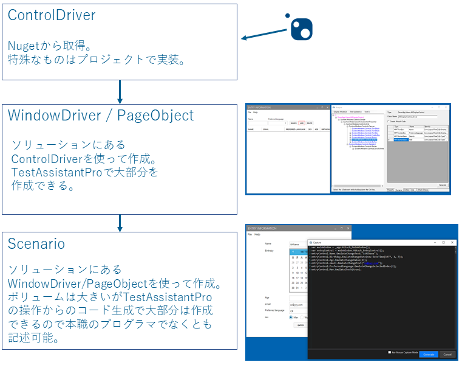

TestAssistantPro.Manual
========

[English](README.en.md)

## 初期設定
  1. [インストール](Install.md)
  2. [ライセンスの管理](License.md)

## 具体的な使い方はこちら
+ [WinForms](WinForms/README.md)
+ [WPF](WPF/README.md)
+ [Web](Web/README.md)

# 概略
TestAssistantProはC#で自動テストの実装を補助するためのツールです。 
以下の設計方針のコード作成を補助します。 

+ Webアプリケーション Selenium を使った PageObject パターンのテストプログラム。 
+ Windowsアプリケーション  Friendly を使った Driver/Scenario パーンのテストプログラム。 

Friendly と Driver/Scenario パターンはこちらを参照お願いします。 
+ [Friendly](https://github.com/Codeer-Software/Friendly/blob/master/README.jp.md)
+ [Driver/Scenarioパターン](https://github.com/Codeer-Software/Friendly/blob/master/TestAutomationDesign.jp.md)

Seleniumは公式ドキュメントやそのほかの情報を参照してください。 

# アーキテクチャ
TestAssistantProはソリューション内のクラスを使って順次コードを生成していきます。

# 高品質なコード生成をサポートします
Selenium と Friendly はともに OSS のライブラリなので TestAssistantPro を使わなくても作成/メンテナンスすることは可能です。
どちらのライブラリも強力なので工数を投入すればほとんどのテストを実装できしょう。
TestAssistantPro の目的はその作業工数を圧倒的に減らすことです。
PageObject/WindowDriver/シナリオのコードの大部分をツールで作成できます。
またプロジェクトごとで出てくるそのほかの自動化したい部分（多くはボリュームが出てくる部分）にもカスタム機能を追加することにより対応できここでも大幅に工数を削減できます。
注意点としては、実装するために必要な知識が減るわけではありません。
しかし、ツールのサポートにより学習コスト自体も減らすことが可能です。
自動テスト作成に特化した強化型のインテリセンスのイメージで使ってもらうと良いと思います。

# 高いメンテナンス性能
ポイントはこの作業を手書きで行うこともできるということです。
それをツールによって効率的に作成できるようにしています。
ツールしか読めない/書けないではなく、あくまで手書きの効率を高めただけですので、作成されるコードは PagetObject/Driver パターンに従った可読性の高いものとなります。
これは長期間メンテナンスの必要な自動テストにおいて非常に重要です。

# メンバーのアサインの最適化
テスト自動化はテクニカルな面を持つ作業です。
一部は必ずアプリケーション開発者との共同作業が必要になります。
ドライバは技術的な知識を求められるので開発者が書くべきでしょう。
TestAssistantPro を使えば少ない工数で作成できます。
シナリオは逆に技術的な知識はほとんど必要ないのですが、かわりにテストに関する知識が必要になります。そのため、これはテスト担当者が書くことを推奨します。
しかしテストには詳しくとも本職のプログラマー程、コードを書くことに長けていないが多いと思います。
その点 TestAssistantPro のサポートがあれば迷わずに作成を進めていくことができます。
キャプチャ以外でコードを書く必要がある場合(Assertなど)もあるでしょう。
そのような場合はメニューとして追加できます。テスト担当者は右クリックメニューなどからそれを呼び出すことができ、効率よくテスト実装を勧めていくことができます。

# 費用対効果を高めます
自動テストを作成するということはテストを自動で実行するソフトウェアを開発するということです。
そして対象のアプリケーションと同じだけのライフサイクルがあり多くの場合は長期にわたってメンテナンスしていきます。
これはそれなりにコストのかかる作業なのです。
コスト対策をしなければ現実的に役に立つものにはなりません。
また作成/メンテナンスコストを下げることで初めてテストケースの数を増やすことができます。
テストケース数を増やせるということは、保証できる範囲を広げることができ、テストの効果を高められるということです。
そうすることで、良い循環を回すことができるのです。

+ 作成効率up
+ メンテナンス性up
+ メンバーのアサイン最適化
