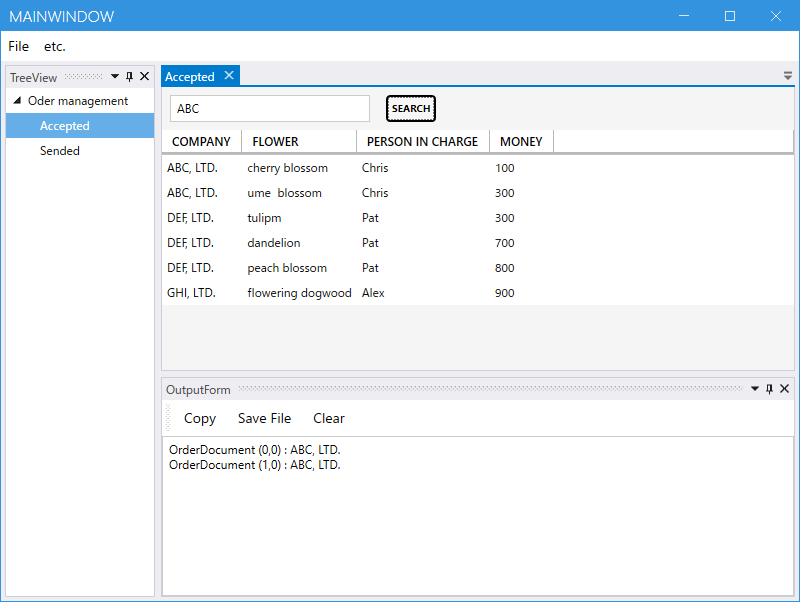
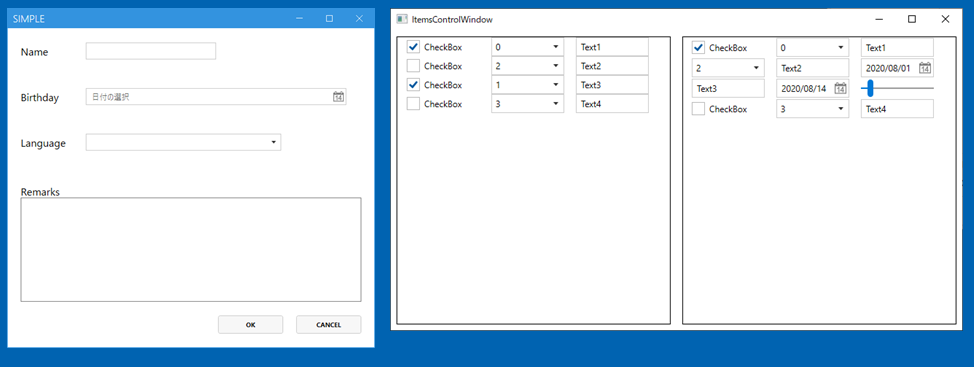
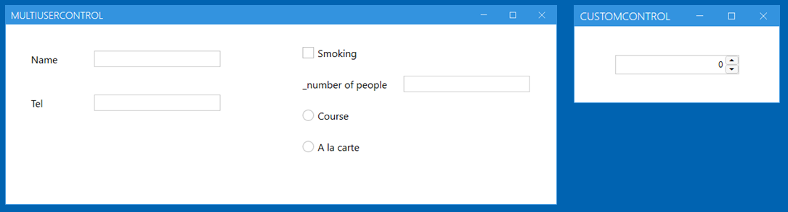
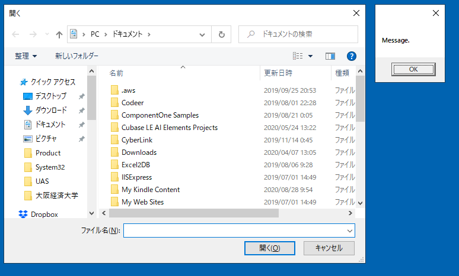

# TestAssistantProを利用してWPFアプリケーションのテストを構築する

## 前提知識
TestAssistantProを使ってFriendlyでの`Driver/Scenarioパターン`に沿ったテストを実装します。
そのためFriendlyと`Driver/Scenarioパターン`の知識が必要となります。
特に`Driver/Scenarioパターン`の理解は必須です。
Friendlyと`Driver/Scenarioパターン`は次のリンクを参照してください。

+ [Friendly](https://github.com/Codeer-Software/Friendly/blob/master/README.jp.md)
+ [Driver/Scenarioパターン](https://github.com/Codeer-Software/Friendly/blob/master/TestAutomationDesign.jp.md)

## 目次
初めてTestAssistantProを使う場合はチュートリアルから読んでください。チュートリアル中に各機能の詳細説明へのリンクを入れているので効率良く使用方法を学習することができます。

- 拡張機能のインストール
  1. [インストール](feature/Install.md)

- チュートリアル
  1. [テストソリューションを新規作成する](tutorial/Sln.md)
  2. [アプリケーションを解析してWindowDriverおよびUserControlDriverを作成する](tutorial/WindowDriver.md)
  2. [カスタマイズされたItemsControlに対応する](tutorial/ItemsControlDriver.md)
  3. [ControlDriverとCaptureCodeGeneratorを作成する](tutorial/ControlDriver.md)
  4. [アプリケーションの操作を記録してシナリオを作成する](tutorial/Scenario.md)

- 機能
  - [AnalyzeWindowの使い方](feature/AnalyzeWindow.md)
  - [画面操作のキャプチャと再生](feature/CaptureAndExecute.md)
  - [WindowDriver/UserControlDriverのコード](feature/GeneratedCode.md)
  - [Attach方法ごとのコード](feature/Attach.md)
  - [ControlDriverのコード](feature/ControlDriver.md)
  - [CaptureCodeGeneratorのコード](feature/CaptureCodeGenerator.md)
  - [AnalyzeWindowをカスタマイズする](feature/CustomizeAnalyzeWindow.md)
  - [Captureウィンドウをカスタマイズする](feature/CustomizeCaptureWindow.md)
 
## 利用するサンプルアプリケーション
### ダウンロード
サンプルアプリケーションは[こちら](https://github.com/Codeer-Software/TestAssistantPro.Manual/releases/download/ver0.2/WpfDockApp.zip)からダウンロードできます。ダウンロード後には「ブロックの解除」を行ってください。ソースコードは[こちら](WpfDockApp)にあります。

### 内容
サンプルには WPF でよくあるドッキングウィンドウタイプのアプリケーションを用意しました。
Friendly を使って自動テストを作成しようとするときに多くの場合最初に表示されるメインウィンドウでつまずきます。
ドッキングウィンドウはドライバ作成にコツが必要で前提知識なしに作成するのは困難です。
そのほか、シンプルなダイアログ、ネイティブのダイアログ、プロジェクト固有のコントロールもあり
一般的な WPF のアプリケーションの操作方法が一通り学べるようにしています。

