# AnalyzeWindow

AnalyzeWindow は対象のアプリケーションを解析してツリーのルートのコントロールに対して WindowDriver および UserControlDriver を作成するものです。
右ペインの下段あるタブ領域で選択できる Designer タブの設定をもとにコードを生成します。生成されるコードは Current Code タブでプレビューできます。

WindowDriver と UserControlDriver に関しては[Driver/Scenarioパターン](https://github.com/Codeer-Software/Friendly/blob/master/TestAutomationDesign.jp.md)を参照してください。


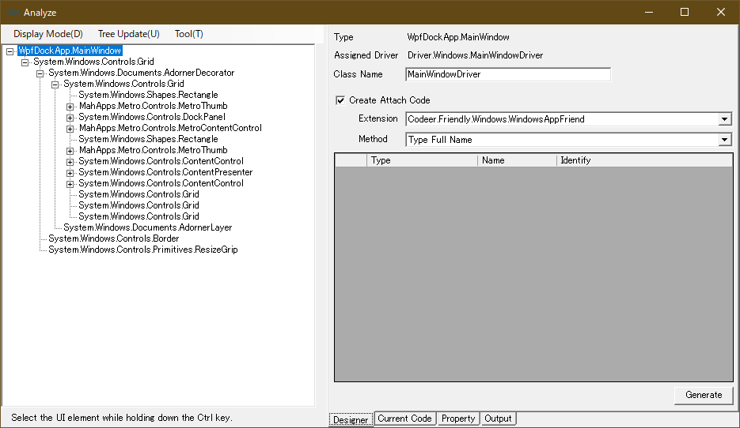

## AnalyzeWindowの起動

AnalyzeWindow を起動するには Driver プロジェクトで生成するコードを配置したいフォルダで右クリックをします。表示されたコンテキストメニューより「Analyze Window」を選択してください。テンプレートでは Window フォルダが生成したコードを配置するフォルダとして定義されています。


テスト対象のアプリケーションを選択する画面が出ますので、対象を選択してください。表示されるアプリケーションは現在起動されているアプリケーションのため、テスト対象のアプリケーションが起動されていない場合は、あらかじめ起動しておく必要があります。

この操作では選択したアプリケーションに対して、解析を行うための処理が追加されます。
間違ったアプリケーションを選択すると OS の再起動が必要になる場合がありますので間違えないように選択してください。

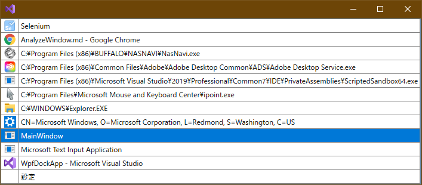

以降、VisualStudio を終了させるまでの間はこの画面が表示されません。
途中で対象のアプリケーションを変えたい場合はコンテキストメニューで表示される「Select Target」を選択することで対象を変更できます。


## メニュー

メニューは AnalyzeWindow の上部にあり表示方法の選択や操作を行えます。

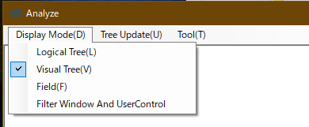

| メニュー | 説明 |
|--------|-----|
| Display Mode | |
| - Logical Tree | 論理ツリー を元にしたツリーを表示します。 |
| - Visual Tree | ビジュアル ツリー を元にしたツリーを表示します。 |
| - Field | Field を元にしたツリーを表示します。 |
| - Filter Window And UserControl | Window と UserControl のみをツリー上に表示します。 |
| Tree Update | |
| - Auto Update | Tree 自動で更新するかどうかを設定します。通常はONを利用してください。画面の要素が頻繁に更新される場合は動作が重くなるのでチェックをOFFにしてください。 |
| - Update Now | Tree を即時更新します。 |
| - Sync with Visual Studio | AnalyzeWindow 上で選択した要素に対応するドライバコードの行が VisualStudio 上で選択されます。またその逆に VisualStudio 上で行を選択するとAnalyzeWindow 上で対応する要素が選択されます。 |
| Tool | |
| - Compile & update | AnalyzeWindow の情報が現在の Visual Stuido のドライバコードをコンパイルしたものに更新されます。 |
| - Option | ツリーに表示するコントロールの種類を選択します。 |

## UI解析ツリー

UI解析ツリーは AnalyzeWindow の左ペインに表示される対象アプリケーションのコントロールがツリー上に表示されているエリアです。
このUI解析ツリーを選択して、WindowDriver/UserControlDriver のプロパティにする対象を決定します。
ツリーで要素を選択することで対象アプリケーションの対応するコントロールが赤枠で囲まれます。
また、Ctrl キーを押しながらアプリケーションのコントロールにマウスオーバーすることでツリーの対応するノードを選択することもできます。


要素をダブルクリックすることで、WindowDriver/UserControlDriver のプロパティとして登録されます。
登録されたコントロールは右ペインのグリッドに追加されます。

要素を右クリックすることで次のコンテキストメニューが表示され、操作を行えます。

| <div style="width:200px">メニュー</div>| 説明 |
|--------|-----|
| Change The Analysis Target | 解析対象を現在選択中のノードのUIオブジェクトに変更します。Ctrl+ダブルクリックでも同様の処理を行うことができます。 |
| Pickup | 選択している要素が右側のグリッドに登録されます。 |
| Pickup Children | 指定したコントロールの子孫のコントロールでドライバが割り当たっているものを一括でピックアップしてグリッドに登録します。子孫をたどるときに UserControl を発見した場合、それ以下は検索しません。それ以下のコントロールもグリッドに登録したい場合はそのUserControlを選択し再度 Pickup Children を実行してください。|
| Create Control Driver | コントロールドライバを作成します。 |
| Show Base Class | 選択したコントロールの親クラスをアウトプットウィンドウに表示します。 |
| Expand All | ツリーをすべて開きます。 |
| Close All | ツリーをすべて閉じます。 |
| View Code | プロジェクト内に対応するソースコードがある場合はVisualStudioで開きます。この時、AnalyzeWindowを開いていない別のVisualStudioでも、VisualStudioのメニュー（ツール - TestAssistantPro - Code Viewer）がチェックされている場合は、そのVisualStudioでもソースコードを開きます。テストプロジェクトと開発用プロジェクトが別のVisualStudioで開かれている場合に便利です。|
| Trace Event | Event Trace ウィンドウ（後述）を表示します。 |
| Trace Message | Message Trace ウィンドウ（後述）を表示します。ウィンドウメッセージが取得できる場合のみこの項目が表示されます。 |

右クリックで表示されるコンテキストメニューはカスタマイズできます。詳しくは[こちら](CustomizeAnalyzeWindow.md#UI解析ツリーのコンテキストメニューの拡張)

### WPFでのコンテキストメニューとポップアップ
WPFではPopup属性の要素やコンテキストメニュー（右クリックメニュー）に対する要素も追加することができます。
だたし、Ctrl+ダブルクリックではメニューが閉じてしまって登録できない為、このような場合は以下のいずれかの方法で登録が可能です。<br>
・Ctrl+ダブルクリックではなく、Ctrl+Altキー押下で登録<br>
・対象となる要素が表示されている時に、<br>
　１．AnalyzeWindowのツリー上でCtrlキーを押しながらドラッグしてツリー上の項目を選択<br>
　２．ツリーの項目上でCtrl+Altキー押下で登録<br>
・対象となる要素が表示されている時に、<br>
　１．Ctrlキーを押したままマウスのホイールを上下に動かしてツリー上の項目を選択<br>
　２．Ctrl+Altキー押下で登録<br>
<br>
上記3つの登録方法を通して動かすと以下のようになります（アニメーションgifです。動かない場合は画像をクリックしてください）。<br>
<br>

Ctrl+Altキーの操作に関してはAnalyzeWindowのステータスバーの「Shortcut Operation」リンクをクリックすると表示されるツールチップで確認できます。<br>
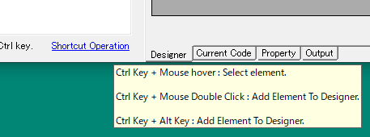<br>

### Trace Event
右クリックで表示されるコンテキストメニューで「Trace Event」を選択すると「Event Traceウィンドウ」が表示されます。<br>
画面上部は表示するイベントの種別です。チェックされているイベントが「Log」欄に表示されます。<br>
「Log」欄で項目をクリックすると「Event Args」欄にイベントの引数が表示されます（取得できた場合のみ）。<br>
<br>

#### 右クリックメニュー
「Log」欄で右クリックするとコンテキストメニューが表示されます。<br>
<br>

| メニュー| 説明 |
|--------|-----|
| Clear | ログを全消去します。 |
| Check Off | 以後ログの出力対象としないように、「Log」欄で選択されているイベントをチェックOFFします。 |

### Trace Message
右クリックで表示されるコンテキストメニューで「Trace Message」を選択すると「Message Traceウィンドウ」が表示されます。<br>
画面上部は表示するウィンドウメッセージの種別です。チェックされているメッセージが「Log」欄に表示されます。<br>
「Log」欄で項目をクリックすると「Parameter」欄にパラメータが表示されます。<br>
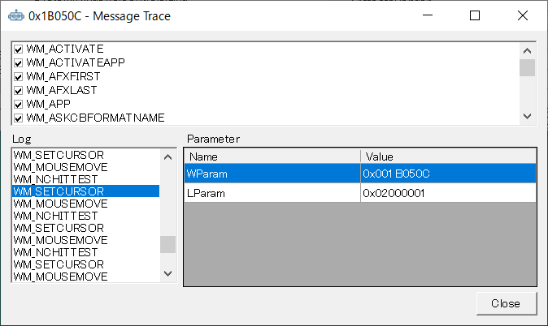<br>

#### 右クリックメニュー
「Log」欄で右クリックするとコンテキストメニューが表示されます。<br>
<br>

| メニュー| 説明 |
|--------|-----|
| Clear | ログを全消去します。 |
| Check Off | 以後ログの出力対象としないように、「Log」欄で選択されているメッセージをチェックOFFします。 |


## Designerタブ

右ペインの下段にある「Designerタブ」を選択することで表示されます。
作成する WindowDriver/UserControlDriver の構成を設定します。

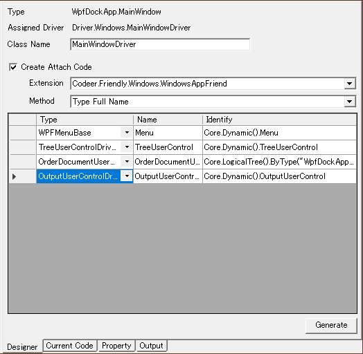

| 項目 | 説明 |
|-----|-----|
| Type | コントロールのタイプフルネームが表示されます。 |
| Assigned Driver | 割り当たっている Driver のタイプフルネームが表示されます。 |
| Class Name | 作成する WindowDriver/UserControlDriver の名前を指定します。ネームスペースは AnalyzeWindow を表示するときに指定していたフォルダになります。 |
| Create Attach Code | AttachMethod を作るかどうかを指定します。 |
| Extension | Attach する対象のクラスを指定します。 |
| Method | WindowDriver/UserControlDriverをアプリケーションもしくは親のWindowDriver/UserControlDriverから取得する方法です。 <br />- Type Full Name: .Net の TypeFullName で特定します。<br>- Window Text: Win32 の WindowText で特定します。<br />- Variable Window Text: WindowText から特定しますが常に同じ WindowText でない場合に使います。<br>- Custom: カスタムの特定手法です。 |
| グリッド | WindowDriver/UserControlDriver の子要素です。Tree から選択します。 |


Attachに関しては[Attach方法ごとのコード](Attach.md)を参照してください。

## Current Code タブ

右ペインの下段にある「Current Code」タブを選択することで表示されます。
Designer タブでの設定によって出力されるコードが表示されます。
Generate でコードを生成せずにここからコードをコピーして利用することもできます。<br>
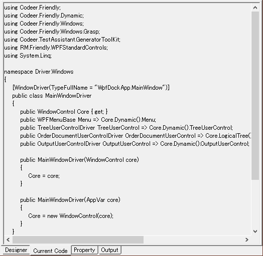

## Property タブ

選択しているコントロールのプロパティが表示されます。<br>
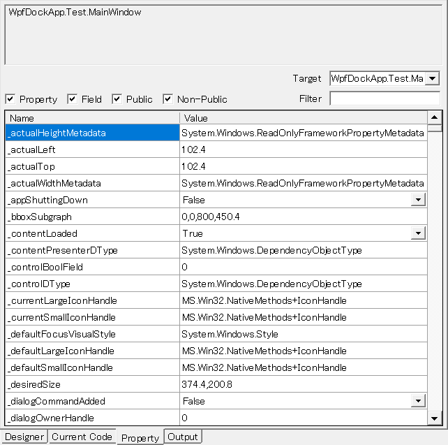

#### Target

表示対象が選択できます。チェックが ON のクラスのメンバのみ表示されます。<br>
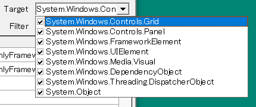

#### Filter
表示対象が絞り込めます。メンバ名、型名（bool、string等）でフィルタされます。<br>
<br>

#### 表示対象種別
表示対象の種別が指定できます。チェックが ON の属性の項目のみ表示されます。<br>
<br>

#### 右クリックメニュー
右クリックするとコンテキストメニューが表示されます。<br>
<br>

| 項目 | 説明 |
|--------|-----|
| View Detail | 表示対象を選択されている項目のクラス（または型）へ変更します。<br>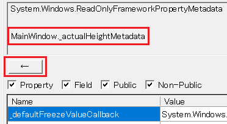<br>移動すると上部に「←」ボタンが表示されます。これを押すと1つ上の階層へ戻ります。<br>現在の階層は上部情報表示欄に表示されます。 |
| Add to Driver | 選択されている項目が参照できる場合はドライバへ追加します。<br>結果は「Current Code」タブにて確認できます。 |
| Copy Text | 選択されている項目（Name、Value）をクリップボードへコピーします。Ctrl+Cでも同様の動作が可能です。 |
| View Code | 選択されている項目の値がクラス名で、プロジェクトに登録されている場合はVisualStudio上で開きます。 |


## Outputタブ

メニューによって実行した結果が表示されます。詳しくは[こちら](CustomizeAnalyzeWindow.md#Outputタブへの出力)<br>


## Create Control Driver

ControlDriver と CaptureGenerator のひな型を作成します。Visual Studio 上で格納するフォルダにドロップします。この時ネームスペースはそのフォルダ名が使われます。コードの詳細に関しては[ControlDriverのコード](ControlDriver.md)と[CaptureCodeGeneratorのコード](CaptureCodeGenerator.md)を参照してください。

どのコントロールに対して ControlDriver を作成するか選択します。<br>
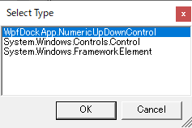

ダイアログから ControlDriver に、どのプロパティ、フィールド、メソッドを追加するかを選択できます。
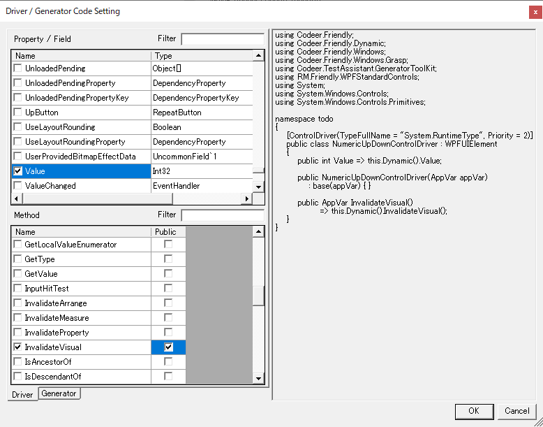

タブを Generator にすると CaptureCodeGenerator に、どのイベントを追加するかを選択できます。
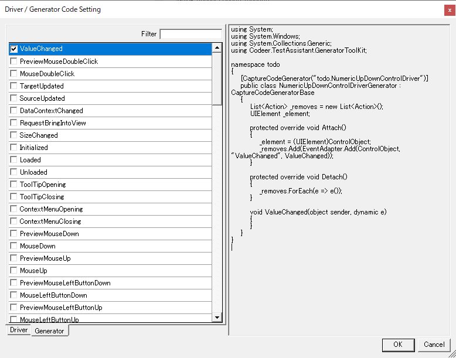

OKボタンを押すと生成する ControlDriver や CaptureGenerator をドロップするダイアログが表示されます。


# デバッグ

これらの WindowDriver/UserControlDriver は、テスト中はもちろん Capture 中にも使われます。
うまくキャプチャできない場合はデバッグして原因を突き止めてください。
Ctrl キーを押しながら Capture するとデバッグできます。
Attach メソッドをカスタマイズした場合などデバッグの必要性が出てくると思います。
ログを出したい場合は Logger を 使えば Capture ウィンドウにログを出力できます。
現在 Capture 中なのかどうかは TestAssistantMode を使うと判定できます。
Capture 中だけの処理を書きたい場合に便利です。

```cs
using Codeer.Friendly;
using Codeer.Friendly.Dynamic;
using Codeer.Friendly.Windows;
using Codeer.Friendly.Windows.Grasp;
using Codeer.TestAssistant.GeneratorToolKit;
using RM.Friendly.WPFStandardControls;
using System.Linq;

namespace Driver.Windows
{
    [WindowDriver(TypeFullName = "WpfDockApp.MainWindow")]
    public class MainWindowDriver
    {
        public WindowControl Core { get; }
        public WPFMenuBase Menu => Core.Dynamic().Menu; 

        public MainWindowDriver(WindowControl core)
        {
            Core = core;
        }

        public MainWindowDriver(AppVar core)
        {
            Core = new WindowControl(core);
        }
    }

    public static class MainWindowDriverExtensions
    {
        [WindowDriverIdentify(TypeFullName = "WpfDockApp.MainWindow")]
        public static MainWindowDriver AttachMainWindow(this WindowsAppFriend app)
        {
            switch (TestAssistantMode.CurrentMode)
            {
                //TestAssistantPro以外で実行
                case TestAssistantMode.Mode.Non:
                    break;
                //AnalyzeWindowから呼ばれた場合
                case TestAssistantMode.Mode.Analyze:
                    break;
                //Captureから呼ばれた場合
                case TestAssistantMode.Mode.Capture:
                    break;
                //Executeから呼ばれた場合
                case TestAssistantMode.Mode.Execute:
                    break;
            }

            //Analyze or Capture から呼ばれた場合に true
            if (TestAssistantMode.IsCreatingMode)
            {
                //ログを出力できる
                Logger.WriteLine("log ....");
            }

            return app.WaitForIdentifyFromTypeFullName("WpfDockApp.MainWindow").Dynamic();
        }
    }
}
```
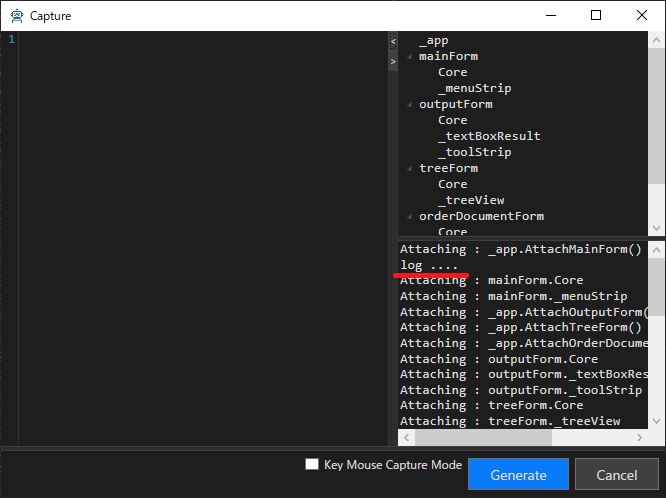

# ネイティブのウィンドウに関して

.Netで実装していても以下のウィンドウは Windows 標準のものが使われます。

|  Window  |  Driver  |
| ---- | ---- |
| MessageBox | MessageBoxDriver |
| OpenFileDialog | OpenFileDialogDriver |
| SaveFileDialog | SaveFileDialogDriver |
| FolderBrowserDialog | FolderDialogDriver |

これらのドライバは新規作成時、 Driver/Windows/Native 以下に作成されています。

# 生成済みのドライバのメンテナンス

AnalyzeWindow で生成済みのドライバに関しては基本は手作業でのメンテナンスになります。プロパティの名前変更などもVisualStudioのリファクタリング機能を使って自由にできます。
ただ コントロールドライバを付け足したい場合やAttach方法を変更したい場合など、AnalyzeWindow を使った方が楽な場合もあります。
そのようなときは、AnalyzeWindow で目的の状態にして 右ペインの下段あるタブ領域で選択できる Current Code タブから必要なコードをコピーして元のコードに貼り付けてください。

