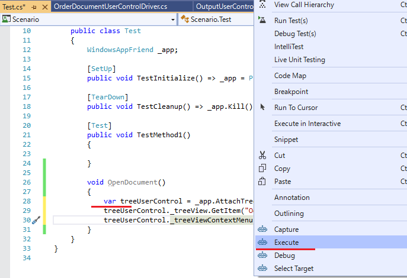
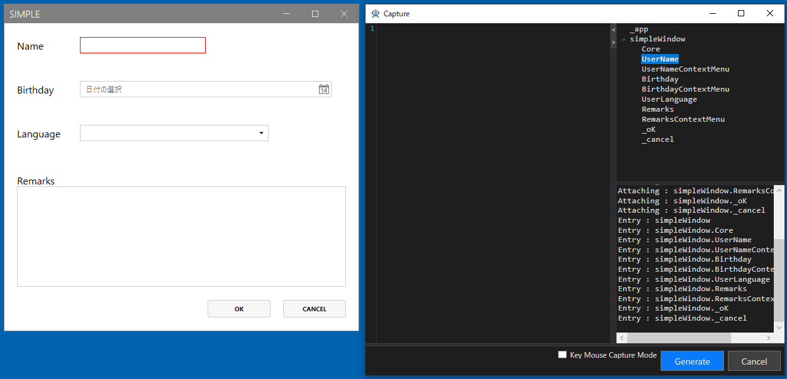
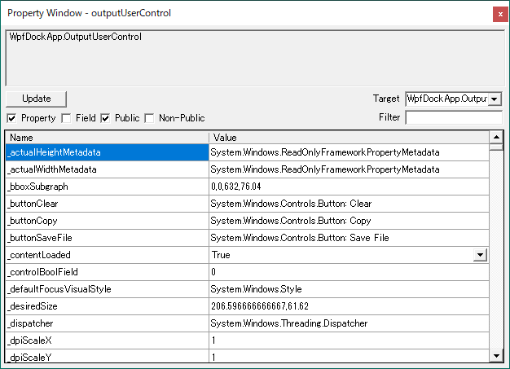

# 画面操作のキャプチャと実行

TestAssistantProには、対になるCaptureとExecuteという機能があります。

- Capture機能は、アプリケーションの操作からプログラムコードを生成します。
- Execute機能は、指定の関数を実行します。この時WindowsAppFriendには現在接続しているプロセスが入ります。

## Capture

アプリケーションの操作からプログラムコードを生成します。
Captureでプログラムコードを生成するためには、WindowDriverおよびUserControlDriverが作成されている必要があります。詳細な内容は[AnalyzeWindowの使い方](./AnalyzeWindow.md)を参照してください。

Capture機能を実行するには、プログラムコードを生成したいメソッドを右クリックして、[Capture]を選択してください。Captureウィンドウが表示され、画面操作のキャプチャが開始されます。


この状態で画面操作を行うことで、Captureウィンドウにプログラムコードが追加されていきます。標準の状態では、ControlDriverおよびCaptureCodeGeneratorを利用して、追加するプログラムコードが生成されます。


最後に、[Captureウィンドウ]の[Generate]ボタンをクリックすることで選択したメソッドに生成されたコードが追加されます。


### キーボード操作とマウス操作の生成

Friendly の操作は一般的に最適な操作方法を提供していますが、API呼び出しが基本ですので人の操作とは異なります。
場合によってはより人の操作に近い方が良い場合もあります。
そのような場合は Key Mouse Capture Mode にチェックを入れてください。
その間はより低レベルなキーマウス操作のコードを作成します。
これは Friendly.Windows.KeyMouse を利用したコードになります。
一般的なキーマウス処理よりはタイミングの面で有利です。


### 非同期処理(Async)の出力

モーダルダイアログが出る関数に関しては非同期処理が出力されます。
たとえば メニューの Simple Dialog を実行してダイアログを閉じる処理をキャプチャすると次のようになります。
Async の詳細は[こちら](https://github.com/Codeer-Software/Friendly/blob/master/README.jp.md#async)を参照してください。

```cs
void AsyncTest()
{
    var mainWindow = _app.AttachMainWindow();

    var async = new Async();
    mainWindow.Menu.GetItem("etc.", "Simple Dialog").EmulateClick(async);
    var simpleWindow = _app.AttachSimpleWindow();
    simpleWindow.OK.EmulateClick();
    async.WaitForCompletion();
}
```

### 複数のアプリケーションを操作する

WindowsAppFriend を複数持つ場合は AppInfoAttribute でアプリケーションの名前を指定できます。
これによって Capture 時に変数を使い分けることができます。
ただし複数同時にキャプチャすることはできないので、一つずつキャプチャして処理を作成してください。

```cs
using System.Diagnostics;
using Codeer.Friendly.Windows;
using Driver;
using NUnit.Framework;
using Codeer.TestAssistant.GeneratorToolKit;

namespace Scenario
{
    [TestFixture]
    public class Test
    {
        [AppInfo(Name = "WinFormsApp")]
        WindowsAppFriend _winFormsApp;

        [AppInfo(Name = "WpfApp")]
        WindowsAppFriend _wpfApp;
```

## Execute

指定の関数を実行します。この時WindowsAppFriendには現在接続しているプロセスが入ります。

実行したいメソッドを右クリックして、[Execute]を選択してください。プログラムコードが実行されます。



関数を意図通り実行するためにはアプリケーションが操作を実行できる状態になっている必要があります。たとえば、ダイアログの操作するプログラムコードを実行する場合は、ダイアログが表示されている状態から実行する必要があることに注意してください。

### デバッグ

Ctrl キーを押しながらExecuteを実行するとテストプロセスをデバッグできます。
(これは Debug メニューと同じ動作になります)
Shift キーを押しながら Excecute を実行すると対象プロセスをデバッグできます。Dll インジェクションで対象プロセスにロードさせる処理を作っている時に便利です。
Ctrl + Shift を押しながら Execute を実行すると両方を同時にデバッグできます。
<br>
<!-- textlint-disable japanese/no-doubled-joshi -->
またこれはCaptureも同様で、操作してもコードが出力されない場合があります。その場合は、特定の方法に問題があるため、デバッグして原因を突きとめてください。上手く動作しないWindowDriver/UserControlDriverのAttachやプロパティにブレイクポイントを貼ってみてください。
<!-- textlint-enable japanese/no-doubled-joshi -->

<br>
デバッグにはCaptureウィンドウのAttachツリーも役に立ちます。現在アタッチされているWindowが表示されます。



### プロパティウィンドウ

Capture Windowのツリーでコンテキストメニュー（右クリックメニュー）を開くと「Show Property」という項目があります。<br>


この項目をクリックすると、選択されている項目のプロパティが表示されます。<br>


使い方はAnalyze Windowのプロパティタブと同じです（Add to DriverとView Codeは使えません）。<br>
ウィンドウは複数表示できる為、各項目を同時に確認することができます。
