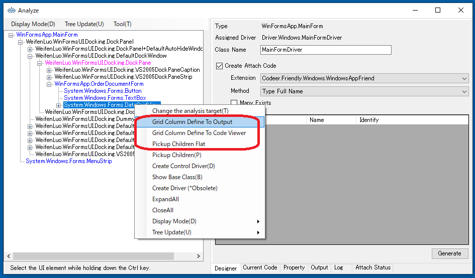
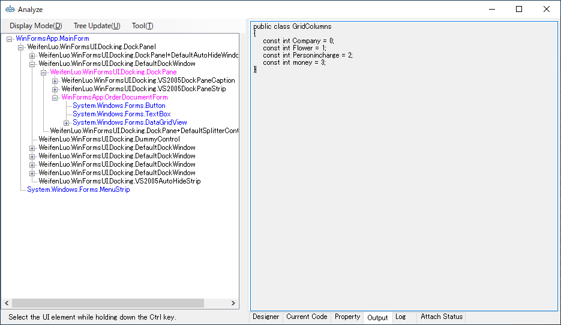
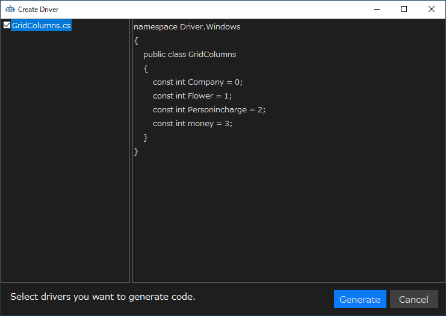
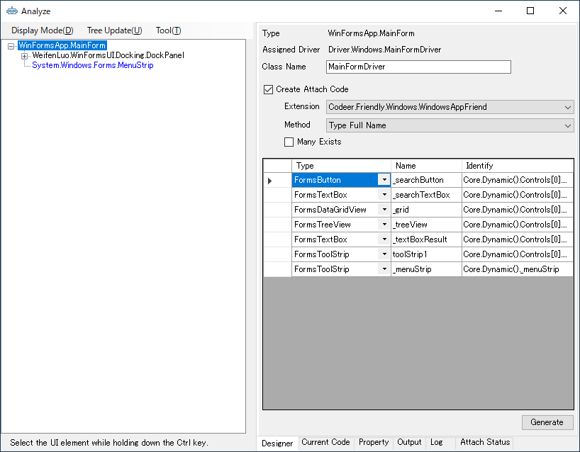
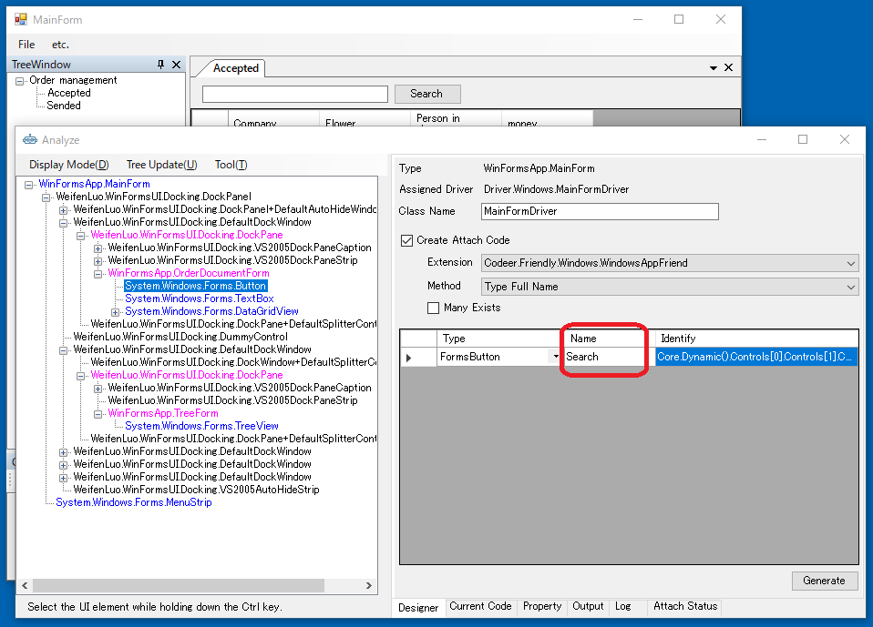

# AnalyzeWindowをカスタマイズする

TestAssitantProはCodeer.TestAssistant.GeneratorToolkit に定義されているインタフェースを実装することでその挙動をカスタマイズできます。
ソリューション内で実装および実装されているdllの参照のどちらも利用できます。

## UI解析ツリーのコンテキストメニューの拡張

IWindowAnalysisMenuActionを実装することでAnalyzeWindowのツリーに表示されるメニューを拡張できます。
テンプレートを利用したテストソリューションのDriver.InTargetプロジェクトに空の定義が作成されています。
Driver.InTargetプロジェクトのコードは対象アプリケーションの内部で実行されます。
デバッグする場合は Shift キーを押しながらAnalyzeを実行してください。
ツリーで選択されているコントロールのオブジェクトを元にコードを生成したりデザイナーへのコントロールの登録を実行したりできます。
プロジェクトでドライバを使っていて定型作業のようなものが見つかればメニューとして追加することで作業の効率を上げることができます。

`GetAction`メソッドの戻り値の`Dictionary`に追加するメニュー項目と選択された場合のアクションを定義します。次にコード例を記載します。

```cs
using Codeer.TestAssistant.GeneratorToolKit;
using System.Collections.Generic;
using System.Text;
using System.Windows.Forms;

namespace Driver.InTarget
{
    public class WindowAnalysisMenuAction : IWindowAnalysisMenuAction
    {
        //ツリーを右クリックしたときに呼び出されます。
        public Dictionary<string, MenuAction> GetAction(object target, WindowAnalysisTreeInfo info)
        {
            //コンテキストメニューに表示する文字列と実行したときのアクションのDictionaryです。
            var dic = new Dictionary<string, MenuAction>();

            //選択されているオブジェクトがグリッドの場合にメニューを登録します。
            if (target is DataGridView grid)
            {
                dic["グリッドのカラム定義をアウトプットに出力"] = 
                    () => GridColumnDefineToOutput(grid);

                dic["グリッドのカラム定義をコードビューワーに出力"] = 
                    () => GridColumnDefineToCodeViewer(target, grid);
            }

            //Controlの時の追加メニュー
            if (target is Control control)
            {
                //カスタマイズされた子要素のピックアップ
                dic["Pickup Children Flat"] =
                    () => PickupChildrenFlat(control);
            }
            return dic;
        }
    }
}
```



## Outputタブへの出力

任意のテキストをOutputタブに出力できます。`AnalyzeWindow`クラスの`Output`プロパティを利用します。

```cs
static void GridColumnDefineToOutput(DataGridView grid)
{
    //アウトプットタブを表示状態にする
    AnalyzeWindow.Output.Show();

    //アウトプットタブに一行出力
    AnalyzeWindow.Output.WriteLine("public class GridColumns");
    AnalyzeWindow.Output.WriteLine("{");
    int i = 0;
    foreach (DataGridViewColumn e in grid.Columns)
    {
        AnalyzeWindow.Output.WriteLine("    const int " + e.HeaderText.Replace(" ", "") + " = " + i++ + ";");
    }
    AnalyzeWindow.Output.WriteLine("}");
}
```



## コードビューアへのコードの出力

<!--TODO: コードビューア自体の説明がないため、AnalyzeWindow.mdに説明セクションを追加-->
`DriverCreateAdapter`の`AddCode`メソッドを利用することで、任意のコードをコードビューアに出力できます。

```cs
static void GridColumnDefineToCodeViewer(object target, DataGridView grid)
{
    var code = new StringBuilder();
    code.AppendLine("namespace " + DriverCreatorAdapter.SelectedNamespace);
    code.AppendLine("{");
    code.AppendLine("    public class GridColumns");
    code.AppendLine("    {");
    int i = 0;
    foreach (DataGridViewColumn e in grid.Columns)
    {
        code.AppendLine("        const int " + e.HeaderText.Replace(" ", "") + " = " + i++ + ";");
    }
    code.AppendLine("    }");
    code.AppendLine("}");

    //作成したコードをGridColumns.csという名前で登録する
    DriverCreatorAdapter.AddCode("GridColumns.cs", code.ToString(), target);
}
```



## WindowDriver/UserControlDriverへのコントロールの追加

`DriverCreateAdapter`の`AddDriverElement`メソッドを利用することで、コントロールをWindowDriver/UserControlDriverの要素に追加できます。
通常の PickupChildren で取得されないコントロールの登録処理なども作くることができます。

```cs
void PickupChildrenFlat(Control control)
{
    foreach (Control e in control.Controls)
    {
        var type = e.GetType();
        bool hit = false;
        while (type != null)
        {
            if (DriverCreatorAdapter.TypeFullNameAndControlDriver.ContainsKey(type.FullName) ||
                DriverCreatorAdapter.TypeFullNameAndUserControlDriver.ContainsKey(type.FullName) ||
                DriverCreatorAdapter.TypeFullNameAndWindowDriver.ContainsKey(type.FullName))
            {
                //ドライバが割り当たっていたらデザイナに登録する
                DriverCreatorAdapter.AddDriverElements(e);
                hit = true;
                break;
            }
            type = type.BaseType;
        }
        if (!hit)
        {
            PickupChildrenFlat(e);
        }
    }
}
```



### コントロール追加時の名前のカスタマイズ

WindowDriver/UserControlDriverへのコントロールの追加時の`Name`の値をカスタマイズできます。
`IDriverElementNameGenerator`を実装してください。

```cs
using Codeer.TestAssistant.GeneratorToolKit;
using Microsoft.CSharp;
using System.Windows.Forms;

namespace Driver.InTarget
{
    public class NamingRule : IDriverElementNameGenerator
    {
        //プライオリティ
        //IDriverElementNameGeneratorを実装したクラスが複数存在する場合は
        //この数値が大きいものが採用されます
        public int Priority => 1;

        public string GenerateName(object target)
        {
            //例 : ボタンの場合だけテキストを使った名前にする
            if (target is Button)
            {
                return ((Button)target).Text.Replace(" ", string.Empty);
            }
            //カスタマイズしない場合は空文字を返す
            return string.Empty;
        }
    }
}
```



## DriverCreatorAdapter

DriverCreatorAdapter は IWindowAnalysisMenuAction, IDriverElementNameGenerator の実装中に使うことができます。
前述の例にあるようにコードの追加、デザイナーへのコントロールの登録に使るほか、現在ソリューションに保持しているドライバの情報を使うことができます。

### プロパティ


| 型 | 名前 | 説明 |
| ---- | ---- | ---- |
| Dictionary<string, ControlDriverInfo> | TypeFullNameAndControlDriver | コントロールドライバ情報です。.Netのオブジェクトのタイプフルネームがキーになります。複数存在する場合はPriorityが一番高いものが取得されます。 |
| Dictionary<string, ControlDriverInfo> | WindowClassNameAndControlDriver | コントロールドライバ情報です。Win32のWindowクラス名がキーになります。複数存在する場合はPriorityが一番高いものが取得されます。 |
| Dictionary<string, WindowDriverInfo> | TypeFullNameAndWindowDriver | ウィンドウドライバ情報です。.Netのオブジェクトのタイプフルネームがキーになります。複数存在する場合はPriorityが一番高いものが取得されます。 |
| Dictionary<string, WindowDriverInfo> | WindowClassNameAndWindowDriver | ウィンドウドライバ情報です。Win32のWindowクラス名がキーになります。複数存在する場合はPriorityが一番高いものが取得されます。 |
| Dictionary<string, WindowDriverInfo> | WindowTextAndWindowDriver | ウィンドウドライバ情報です。Win32のWindowTextがキーになります。複数存在する場合はPriorityが一番高いものが取得されます。 |
| Dictionary<string, UserControlDriverInfo> | TypeFullNameAndUserControlDriver | UserControlに割り当たっているウィンドウドライバ情報です。.Netのオブジェクトのタイプフルネームがキーになります。複数存在する場合はPriorityが一番高いものが取得されます。 |
| Dictionary<string, List&lt;ControlDriverInfo>> | MultiWindowClassNameAndControlDriver | コントロールドライバ情報です。.Netのオブジェクトのタイプフルネームがキーになります。リストはPriorityの高い順に並んでいます。 |
| Dictionary<string, List&lt;ControlDriverInfo>> | MultiTypeFullNameAndControlDriver | コントロールドライバ情報です。Win32のWindowクラス名がキーになります。リストはPriorityの高い順に並んでいます。  |
| Dictionary<string, List&lt;WindowDriverInfo>> | MultiTypeFullNameAndWindowDriver | ウィンドウドライバ情報です。.Netのオブジェクトのタイプフルネームがキーになります。リストはPriorityの高い順に並んでいます。  |
| Dictionary<string, List&lt;WindowDriverInfo>> | MultiWindowClassNameAndWindowDriver | ウィンドウドライバ情報です。Win32のWindowクラス名がキーになります。リストはPriorityの高い順に並んでいます。  |
| Dictionary<string, List&lt;WindowDriverInfo>> | MultiWindowTextAndWindowDriver | ウィンドウドライバ情報です。Win32のWindowTextがキーになります。リストはPriorityの高い順に並んでいます。  |
| Dictionary<string, List&lt;UserControlDriverInfo>> | MultiTypeFullNameAndUserControlDriver | UserControlに割り当たっているウィンドウドライバ情報です。.Netのオブジェクトのタイプフルネームがキーになります。リストはPriorityの高い順に並んでいます。  |


### 関数

| 定義 | 説明 |
| ---- | ---- |
| void AddDriverElements(object driverElement) | デザイナーにコントロールを追加します。 |
| void AddCode(string fileName, string code, object target)  | コードを追加します。 |
| void AddCodeLineSelectInfo(string fileName, string key, object target)  | コードに含まれるキーワードに対応するオブジェクトを設定します。たとえばプロパティ名に対応するコントロールを設定しておけば、コードビューア上で行が選択されたときに対象アプリケーション上でそのコントロールが強調表示されます。 |
