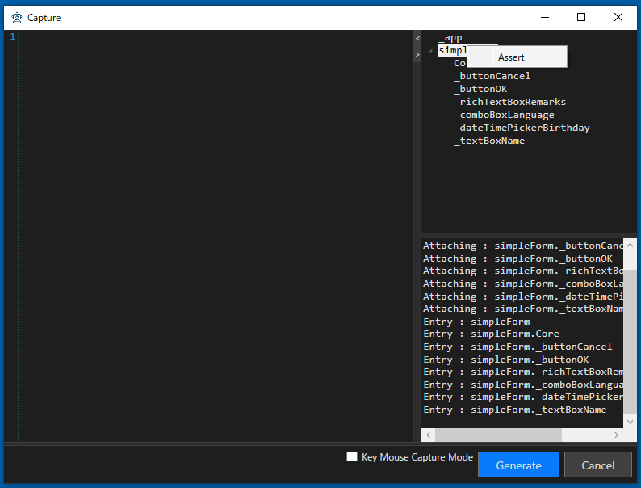

# Captureウィンドウをカスタマイズする

TestAssitantProはCodeer.TestAssistant.GeneratorToolkit に定義されているインタフェースを実装することでその挙動をカスタマイズできます。
ソリューション内で実装および実装されているdllの参照のどちらも利用できます。

## ドライバツリーのコンテキストメニューの拡張

ICaptureAttachTreeMenuActionを実装することでドライバツリーに表示されるメニューを拡張できます。
テストソリューションのDriverプロジェクトにある、Tools/CaptureAttachTreeMenuAction.csファイルにはAssertの定義が標準で実装されています。


```cs
using System;
using System.Collections.Generic;
using Codeer.Friendly.Windows;
using Codeer.TestAssistant.GeneratorToolKit;
using Ong.Friendly.FormsStandardControls;

namespace Driver.Tools
{
    public class CapterAttachTreeMenuAction : ICaptureAttachTreeMenuAction
    {
        public Dictionary<string, MenuAction> GetAction(string accessPath, object driver)
        {
            var dic = new Dictionary<string, MenuAction>();

            if (driver is FormsCheckBox checkBox) dic["Assert"] = () => Assert(accessPath, checkBox);
            else if (driver is FormsCheckedListBox checkedListBox) dic["Assert"] = () => Assert(accessPath, checkedListBox);
            else if (driver is FormsComboBox comboBox) dic["Assert"] = () => Assert(accessPath, comboBox);
            else if (driver is FormsDataGridView dataGridView) dic["Assert"] = () => Assert(accessPath, dataGridView);
            else if (driver is FormsDateTimePicker dateTimePicker) dic["Assert"] = () => Assert(accessPath, dateTimePicker);
            else if (driver is FormsLinkLabel linkLable) dic["Assert"] = () => Assert(accessPath, linkLable);
            else if (driver is FormsListBox listBox) dic["Assert"] = () => Assert(accessPath, listBox);
            else if (driver is FormsListView listView) dic["Assert"] = () => Assert(accessPath, listView);
            else if (driver is FormsMaskedTextBox maskedTextBox) dic["Assert"] = () => Assert(accessPath, maskedTextBox);
            else if (driver is FormsMonthCalendar monthCalendar) dic["Assert"] = () => Assert(accessPath, monthCalendar);
            else if (driver is FormsNumericUpDown numericUpDown) dic["Assert"] = () => Assert(accessPath, numericUpDown);
            else if (driver is FormsProgressBar progressBar) dic["Assert"] = () => Assert(accessPath, progressBar);
            else if (driver is FormsRadioButton radioButton) dic["Assert"] = () => Assert(accessPath, radioButton);
            else if (driver is FormsRichTextBox richTextBox) dic["Assert"] = () => Assert(accessPath, richTextBox);
            else if (driver is FormsTabControl tabControl) dic["Assert"] = () => Assert(accessPath, tabControl);
            else if (driver is FormsTextBox textBox) dic["Assert"] = () => Assert(accessPath, textBox);
            else if (driver is FormsToolStrip toolStrip) dic["Assert"] = () => Assert(accessPath, toolStrip);
            else if (driver is FormsToolStripButton toolStripStripButton) dic["Assert"] = () => Assert(accessPath, toolStripStripButton);
            else if (driver is FormsToolStripComboBox toolStripComboBox) dic["Assert"] = () => Assert(accessPath, toolStripComboBox);
            else if (driver is FormsToolStripTextBox toolStripTextBox) dic["Assert"] = () => Assert(accessPath, toolStripTextBox);
            else if (driver is FormsTrackBar trackBar) dic["Assert"] = () => Assert(accessPath, trackBar);
            else if (driver is FormsTreeView treeView) dic["Assert"] = () => Assert(accessPath, treeView);
            else if (!(driver is WindowsAppFriend)) dic["Assert"] = () => AssertAll(accessPath, driver);

            return dic;
        }

        static void Assert(string accessPath, FormsCheckBox checkBox)
        {
            //現在のCheckStateを期待値とするコードを作成
            CaptureAdaptor.AddCode($"{accessPath}.CheckState.Is(CheckState.{checkBox.CheckState});");
            //CheckStateをネームスペース修飾無しで使うのでコード生成後にusingも追加されるようにする
            CaptureAdaptor.AddUsing(typeof(CheckState).Namespace);
        }
```



