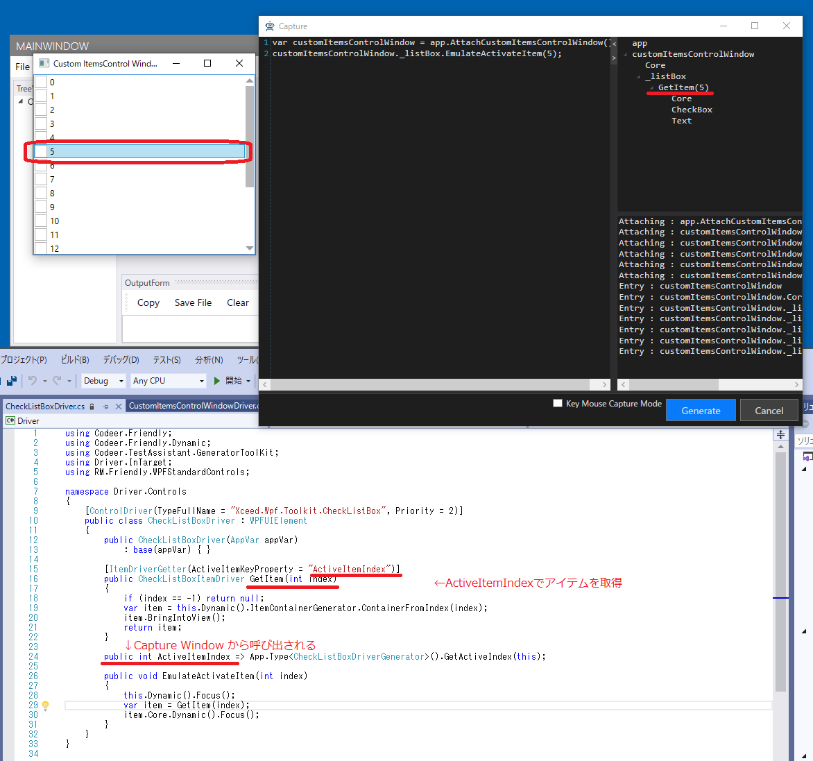

# ItemsControlのControlDriver

## ControlDriver
WPFでの ItemsControlのControlDriver を作るときはいくつかの手法があり、判断ポイントがあります。

+ ItemDriverを作るか
+ ItemDriverをどのようにつくるか
	+ ControlDriverで作る
	+ UserControlDriverで作る
+ ItemDriverへのAttach/As 拡張メソッド
	+ Attach
	+ As

### ItemDriverを作るか
Item を独立した存在として操作する必要があるかで判断します。
シンプルなものだと ItemsContorl の API だけで問題ない場合があります。
例えばコンボボックスもそれぞれの Item を操作するものも作れますが、一般的には必要ないので WPFComboBox では Item の操作までは行っていません。

### ItemDriverをContorlDriverとして作る
Item を一つのコントロールとしてとらえてそれに対する操作を与える方法です。この場合 Item への操作のコードを TestAssistantPro で生成するなら CaptureGenrator もこのクラスに対して作成します。

### ItemDriverをUserControlDriverとして作る
Item を UserControl としてとらえる方法です。
こちらの方がツールのサポートを多く使えるので最初は作りやすいと思います。
WPFListBox<T>、WPFListView<T>、WPFTreeView<T>は Item を UserControlDriver として定義できるようにしています。
<br>
サンプルはこちらを参照してください。

[DateTemplateでカスタマイズしたListBoxItemのドライバ作成する](../tutorial/ItemsControlDriver1.md)

### ItemDriverへのAttach/As 拡張メソッド
Item が様々な形態を持つ場合、一つの UserContorl にそのすべてを定義するのが難しければ拡張ソッドとして作成した Attach で ItemDriver から操作対象のコントロールを取得したり、As で変形させたりして目的の操作を行います。
<br>
サンプルはこちらを参照してください。

[複数種類のアイテムへの対応(DataTemplateSelector)](../tutorial/ItemsControlDriver2.md)
[DataGrid のカスタマイズ](../tutorial/ItemsControlDriver4.md)

## CaptureGeneratorのサポート
ItemDriver を作るときにはそれをキャプチャするための仕組みとして ItemDriverGetterAttribute を用意しています。
現在アクティブになっているアイテムをキャプチャ対象にします。
これは Item  は多い場合があるので必要な物のみキャプチャ対象にしています。
注意点としてアクティブになった後にキャプチャ対象になるので一度選択してから操作してもらう必要があります。
<br>
サンプルはこちらを参照してください。

[ItemsControlのControlDriverを作る](../tutorial/ControlDriver4.md)

### ItemDriverGetterAttribute
ItemDriverGetterAttribute をアイテムを取得するメソッドに設定します。
キャプチャ中には ActiveItemKeyProperty で指定されたプロパティが呼び出されます。
それを使ってアイテムが取得されキャプチャ対象になります。



ActiveItemKeyProperty には int,string,int[],string[],IItemKey を使うことができます。
例えば ActiveItemKeyProperty の CurrentCell は WPFDataGridCell になっています。
WPFDataGridCell は IItemKey を実装しています。
```cs
public WPFDataGridCell CurrentCell { get; }

[ItemDriverGetter(ActiveItemKeyProperty = "CurrentCell")]
public WPFDataGridCell GetCell(int itemIndex, int col)
```

実際に WPFDataGridのGetCell を呼び出すときには GetArguments() で取得したオブジェクトが使われ、生成されるコードには GetArgumentsCode() が使われます。

```cs
public class WPFDataGridCell : IItemKey
{
    //実際の引数
    public object[] GetArguments()
        => new object[] { 
                (int)App.Type<WPFDataGridCell>().GetItemIndex(this),
                (int)App.Type<WPFDataGridCell>().GetColumnIndex(this) 
            };

    //生成されるコード
    public string GetArgumentsCode()
        => $"{(int)App.Type<WPFDataGridCell>().GetItemIndex(this)}, {(int)App.Type<WPFDataGridCell>().GetColumnIndex(this)}";
}