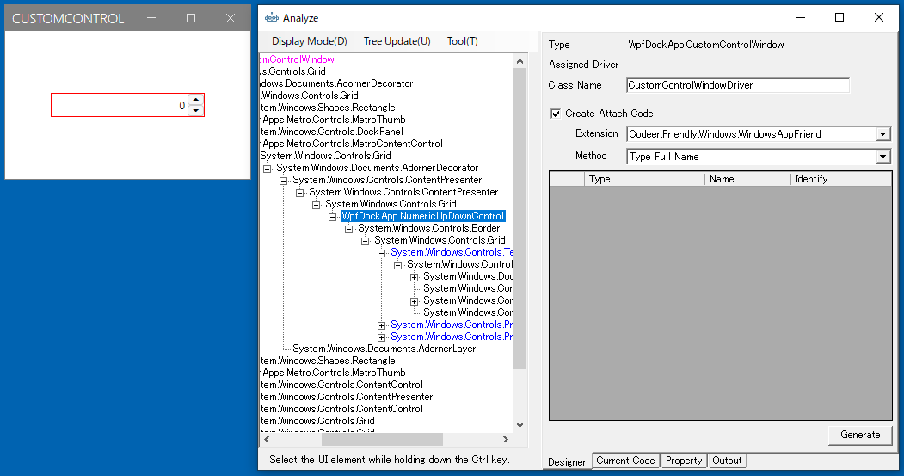

# 自社のプロダクトに適用する

チュートリアルを一通り学習してもらった後は、目的のアプリケーションのテスト自動化に移ります。
アプリケーションによっては3rdパーティ製のコントロールを多く利用していて、全く動かせない場合があります。
そのような場合でもControlDriverとCaptureGeneratorを作成することでWindowDriverやシナリオをTestAssisnstantProによって生成することができるようになります。
まずは落ち着いて対象のアプリケーションを調査してみます。
また、最初にテスト自動化にかかる工数を見積もったりアサインするメンバーを考慮しておくのも大事です。

## アプリケーションの調査

### コントロールドライバ
AnalyzeWindowを使って画面を調べます。
コントロールドライバが最も難易度が高いです。
またこの作業は開発者をアサインする必要があります。
自社で作成するのが大変な場合はCodeerに依頼することも可能です。
ここでは利用している箇所ではなく種類を調べます。
例えば特殊なグリッドをほとんどの画面で使っているとしても同一ものであるならば作成するControlDriverの数は1つですみます。
アサインするメンバーはそのコントロールに詳しい人にします。
（それを使ってアプリを作成したということは開発チームには詳しい人がいるはずです）

### 画面数
コントロールドライバを揃えることができればWindowDriver/UserControlDriverはTestAssistantProによって作成できるので低コストで作成できます。
とは言え、画面数が多ければその分工数が発生します。最初にWindowDriver/UserControlDriverを作成する数を把握しておくことは重要です。
そして可能ならWindowDriver/UserControlDriverの作成作業はアプリ開発者をアサインすることが望ましいです。

### テスト設計
テスト設計は重要です。自動テストのメリットは成功したテストケースに関しては品質の保証が得られているということです。
そのため実行する自動テストがどの部分をカバーしているか把握しておく必要があります。
100%を自動テストでカバーすることは大変ですが、どれくらいはカバーされたのか知っていれば、残りどれくらいを人間がテストを実行すればいいのか判断できます。
またテストを設計するときにはシナリオ中に必要な定型作業を見つけることが出来たら抜き出しましょう。
[メニューのカスタマイズ](../feature/CustomizeCaptureWindow.md)で仕込むことができればシナリオ作成のコストを減らすことができます。

## Codeerに依頼する
これらの作業は初めてTestAssistantProを使う場合には戸惑うこともあります。
Codeerのテスト自動化コンサルティングサービスに依頼することもできます。
[こちら](https://www.codeer.co.jp/Contact)からご依頼ください。

https://www.codeer.co.jp/Contact