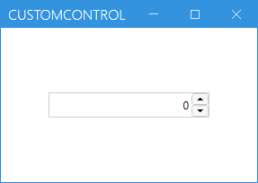

# ControlDriverとCaptureCodeGeneratorを作成する

ここではサンプルとしてNumericUpDownControlのControlDriverとCaptureCodeGeneratorを作成します。
メニューから[etc]-[Custom Control Dialog]選択して、[CustomControlWindow]を表示してください。
WPFではNumericUpDownは標準では存在しないため必要なら自作します。

## WPFの場合はUserControlDriverにしてもよい

WinFormsの場合、カスタムコントロールは独自のControlDriverを作るしかありません。
しかし、WPFの場合は標準コントロールを組み合わせて作ることが多く、場合によってはUserControlDriverにしてもよいでしょう。
この例のように、NumericUpDownもUserControlにすることも可能です。どちらにするかは状況によって判断してください。
