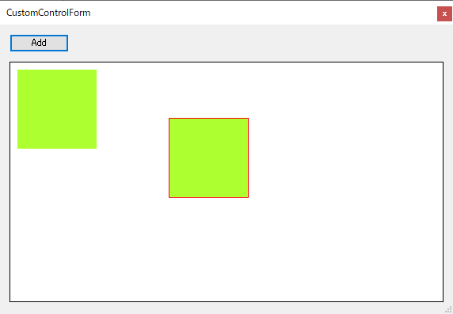
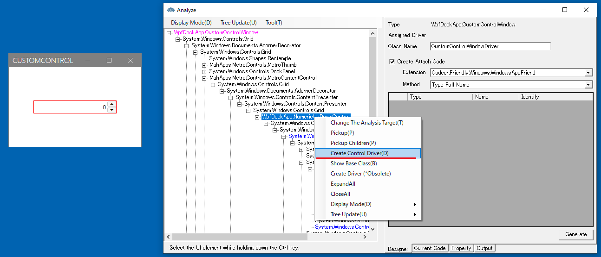
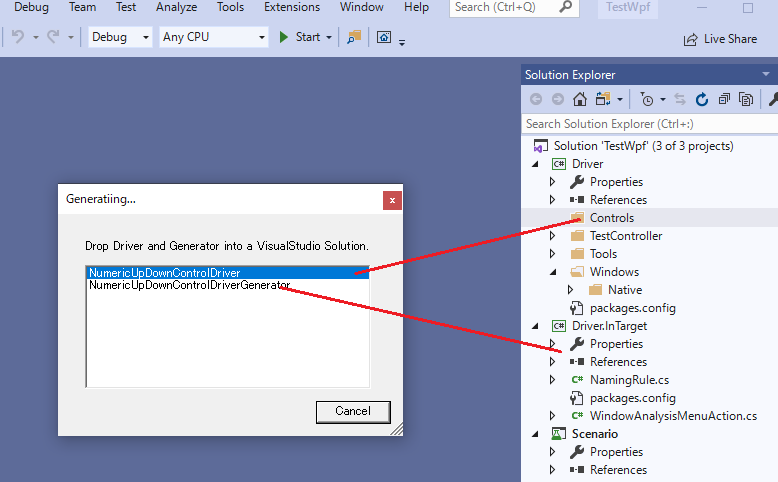
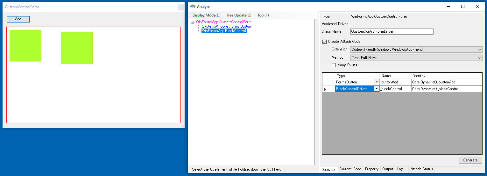
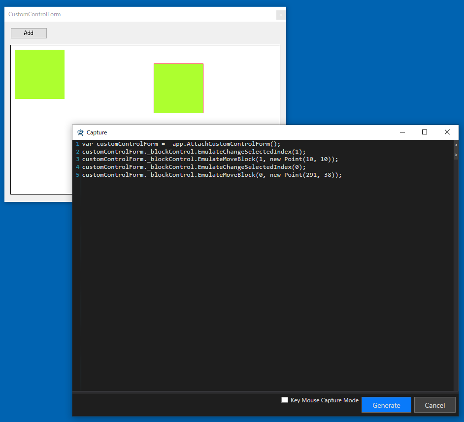
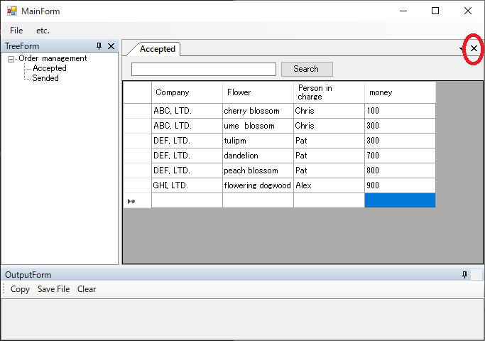

# ControlDriverとCaptureCodeGeneratorを作成する

ここではサンプルとしてBlockControlのControlDriverとCaptureCodeGeneratorを作成します。
MainFrameのメニューから[etc]-[Custom Control Dialog]選択して、[CustomControlDialog]を表示してください。
このダイアログではAddボタンを押すことでブロックが画面上に追加されます。
BlockControlはブロックをドラッグで移動させることができます。



## ControlDriverとCaptureCodeGeneratorのコードテンプレートを生成する

最初にAnalyzeWindowを使ってControlDriverのコードテンプレートを作成します。
UI解析ツリーからBlockControlを選択し、コンテキスメニューより[Create Control Driver]を選択してください。



ダイアログから ControlDriver を選択し Driver プロジェクトの任意のフォルダにドロップします。
どこでも良いのですが、今回は Controls というフォルダを作ってそこにドロップしました。
次に CaptureGenerator を選択し Driver.InTarget の任意のフォルダにドロップします。



## ControlDriverの実装

BlockControlはSelectIndexという現在選択されているブロックのインデックスを取得または設定するプロパティを公開しています。
また、MoveBlockというメソッドも公開しているため、このドライバではその2つを実装します。

生成したControlDriverのコードテンプレートを次のように変更してください。

```cs
using Codeer.Friendly;
using Codeer.Friendly.Dynamic;
using Codeer.TestAssistant.GeneratorToolKit;
using Ong.Friendly.FormsStandardControls;
using System.Drawing;

namespace Driver.Controls
{
    //実装するにはBlockControlのAPIを知っている必要がある
    [ControlDriver(TypeFullName = "WinFormsApp.BlockControl", Priority = 2)]
    public class BlockControlDriver : FormsControlBase
    {
        public BlockControlDriver(AppVar appVar)
            : base(appVar) { }

        //選択インデックス
        public int SelectedIndex => this.Dynamic().SelectedIndex;

        //選択変更
        public void EmulateChangeSelectedIndex(int index) => this.Dynamic().SelectedIndex = index;

        //移動
        public void EmulateMoveBlock(int index, Point location) => this.Dynamic().MoveBlock(index, location);
    }
}
```

## CaptureCodeGeneratorの実装

次にBlockControlのCaptureCodeGeneratorをコードテンプレートを編集して作成します。
イベントを受ける必要があるので BlockControl が定義されている WinFormApp.exe を参照します。
コードテンプレートを次のように変更してください。

```cs
using System;
using System.Drawing;
using Codeer.TestAssistant.GeneratorToolKit;
using WinFormsApp;

namespace Driver.InTarget
{
    [CaptureCodeGenerator("Driver.Controls.BlockControlDriver")]
    public class BlockControlDriverGenerator : CaptureCodeGeneratorBase
    {
        BlockControl _control;

        protected override void Attach()
        {
            _control = (BlockControl)ControlObject;
            _control.SelectChanged += SelectChanged;
            _control.BlockMoved += BlockMoved;
        }

        protected override void Detach()
        {
            _control.SelectChanged -= SelectChanged;
            _control.BlockMoved -= BlockMoved;
        }

        void SelectChanged(object sender, EventArgs e)
        {
            if (!_control.Focused) return;
            AddSentence(new TokenName(), ".EmulateChangeSelectedIndex(" + _control.SelectedIndex, new TokenAsync(CommaType.Before), ");");
        }

        void BlockMoved(object sender, BlockMoveEventArgs e)
        {
            if (!_control.Focused) return;
            AddUsingNamespace(typeof(Point).Namespace);
            AddSentence(new TokenName(), ".EmulateMoveBlock(" + _control.SelectedIndex, $", new Point({e.MoveLocation.X}, {e.MoveLocation.Y})", new TokenAsync(CommaType.Before), ");");
        }
    }
}

```

## ControlDriverとCaptureCodeGeneratorの利用

作成したControlDriverとCaptureCodeGenaratorを利用してコードを生成します。
通常の手順でWindowDriverを作成してください。UI解析ツリーからBlockControlを選択することで、グリッドに作成したBlockControlDriverを利用したプロパティが追加されることを確認できます。



WindowDriverを作成してキャプチャも行ってください。操作を行うことでCaptureCodeGeneratorを利用してコードが生成されることを確認できます。



### デバッグ

うまく動かない場合はデバッグして問題を見つけます。
Attach にブレークポイントを貼って Shift キーを押しながら Capture を実行してみてください。

### DockContentの閉じるに反応するようにする

DockContentも標準のコントロールではないのでそのままでは対応できません。
こちらも同様に作成してみます。
作成後にDockContentを継承したウィンドウに対してドライバを作るとCoreの部分がDockContentDriverになります。
演習の順番的に先ほどすでに作っている場合は、手動でWindowControlの部分を書き換えてください。



```cs
using Codeer.Friendly;
using Codeer.TestAssistant.GeneratorToolKit;
using Ong.Friendly.FormsStandardControls;

namespace Driver.Controls
{
    [ControlDriver(TypeFullName = "WeifenLuo.WinFormsUI.Docking.DockContent", Priority = 2)]
    public class DockContentDriver : FormsControlBase
    {
        public DockContentDriver(AppVar appVar)
            : base(appVar) { }
    }
}
```

```cs
using System.Windows.Forms;
using Codeer.TestAssistant.GeneratorToolKit;

namespace Driver.InTarget
{
    [CaptureCodeGenerator("Driver.Controls.DockContentDriver")]
    public class DockContentDriverGenerator : CaptureCodeGeneratorBase
    {
        Form _control;

        protected override void Attach()
        {
            _control = (Form)ControlObject;
            _control.FormClosed += FormClosed;
        }

        protected override void Detach()
        {
            _control.FormClosed -= FormClosed;
        }

        void FormClosed(object sender, FormClosedEventArgs e)
        {
            AddSentence(new TokenName(), ".Close();");
        }
    }
}
```

```cs
[UserControlDriver(TypeFullName = "WinFormsApp.OrderDocumentForm")]
public class OrderDocumentFormDriver
{
    //WindowControl -> DockContentDriver
    public DockContentDriver Core { get; }

    public FormsButton _searchButton => Core.Dynamic()._searchButton;
    public FormsTextBox _searchTextBox => Core.Dynamic()._searchTextBox;
    public FormsDataGridView _grid => Core.Dynamic()._grid;

    public OrderDocumentFormDriver(WindowControl core)
    {
        Core = new DockContentDriver(core.AppVar);
    }

    public OrderDocumentFormDriver(AppVar core)
    {
        Core = new DockContentDriver(core);
    }
}
```

## 次の手順

ここまで画面キャプチャを行うためのすべての処理が完了しました。
次は実際に画面をキャプチャしてシナリオを作成します。

[アプリケーションの操作を記録してシナリオを作成する](Scenario.md)