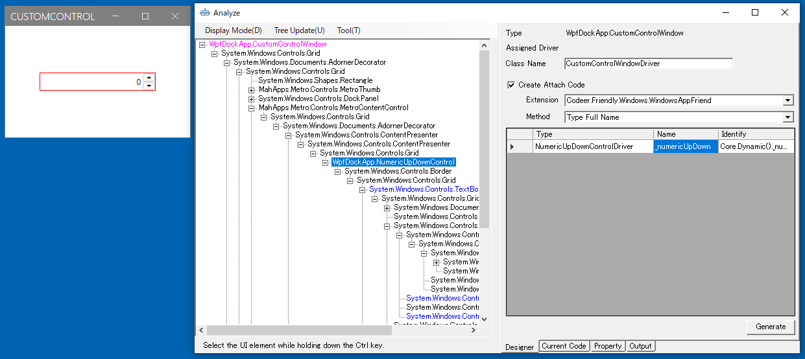
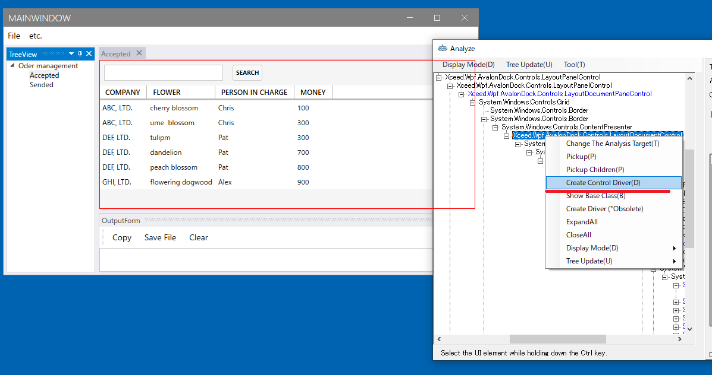
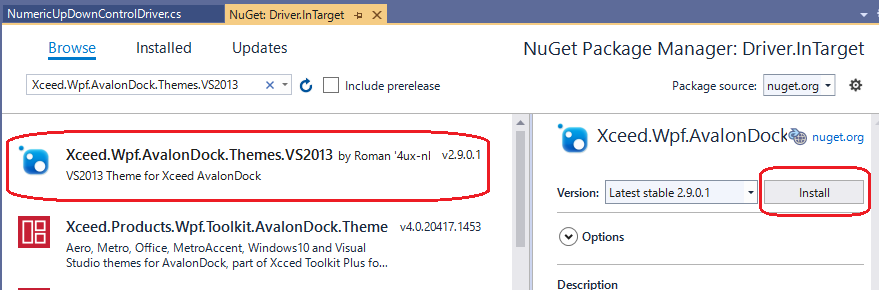

# ControlDriverとCaptureCodeGeneratorを作成する

ここではサンプルとしてNumericUpDownControlのControlDriverとCaptureCodeGeneratorを作成します。
メニューから[etc]-[Custom Control Dialog]選択して、[CustomControlWindow]を表示してください。
WPFではNumericUpDownは標準では存在しないため必要なら自作します。


## WPFの場合はUserControlDriverにしてもよい
WinFormsの場合はカスタムコントロールは独自のControlDriverを作るしかないのですが、WPFの場合は標準コントロールを組み合わせて作ることが多く、場合によってはUserControlDriverにしてもよいです。この例のNumericUpDownもUserControlにすることも可能です。どちらにするかは時々で判断してください。

## ControlDriverとCaptureCodeGeneratorのコードテンプレートを生成する

最初にAnalyzeWindowを使ってControlDriverのコードテンプレートを作成します。
UI解析ツリーからBlockControlを選択し、コンテキスメニューより[Create Control Driver]を選択してください。


ダイアログから ControlDriver を選択し Driver プロジェクトの任意のフォルダにドロップします。
どこでも良いのですが、今回は Controls というフォルダを作ってそこにドロップしました。
次に CaptureGenerator を選択し Driver.InTarget の任意のフォルダにドロップします。


## ControlDriverの実装

NumericUpDownControlはValueを取得または設定するプロパティを公開しています。
また、TextBoxをValueTextBoxで取得できますので操作することができます。
生成したControlDriverのコードテンプレートを次のように変更してください。

プロセスを超えたプロパティやメソッドの操作にはFriendlyを使っています。詳細は[Friendly](https://github.com/Codeer-Software/Friendly/blob/master/README.jp.md)を参照してください。
```cs
using Codeer.Friendly;
using Codeer.Friendly.Dynamic;
using Codeer.TestAssistant.GeneratorToolKit;
using RM.Friendly.WPFStandardControls;

namespace Driver.Controls
{
    [ControlDriver(TypeFullName = "WpfDockApp.NumericUpDownControl", Priority = 2)]
    public class NumericUpDownControlDriver : WPFUIElement
    {
        public NumericUpDownControlDriver(AppVar appVar)
            : base(appVar) { }

		public int Value => this.Dynamic().Value;

		public void EmulateChangeValue(int value)
		{
			var textBox = this.Dynamic().ValueTextBox;
			if (textBox != null)
			{
				textBox.Focus();
				textBox.Text = value.ToString();
			}
		}
	}
}
```

## CaptureCodeGeneratorの実装

次にNumericUpDownControlのCaptureCodeGeneratorをコードテンプレートを編集して作成します。
イベントを受ける必要があるので NumericUpDownControl が定義されている WpfDockApp.exe を参照します。
コードテンプレートを次のように変更してください。

```cs
using System;
using Codeer.TestAssistant.GeneratorToolKit;
using WpfDockApp;

namespace Driver.InTarget
{
    [CaptureCodeGenerator("Driver.Controls.NumericUpDownControlDriver")]
    public class NumericUpDownControlDriverGenerator : CaptureCodeGeneratorBase
    {
		NumericUpDownControl _control;
		protected override void Attach()
		{
			_control = (NumericUpDownControl)ControlObject;
			_control.ValueChanged += ValueChanged;
		}

		protected override void Detach()
		{
			_control.ValueChanged -= ValueChanged;
		}

		void ValueChanged(object sender, EventArgs e)
		{
			if (_control.ValueTextBox.IsFocused || _control.UpButton.IsFocused || _control.DownButton.IsFocused)
				AddSentence(new TokenName(), ".EmulateChangeValue(" + _control.Value, new TokenAsync(CommaType.Before), ");");
		}
	}
}
```

## ControlDriverとCaptureCodeGeneratorの利用

作成したControlDriverとCaptureCodeGenaratorを利用してコードを生成します。
通常の手順でWindowDriverを作成してください。UI解析ツリーからNumericUpDownControlを選択することで、グリッドに作成したNumericUpDownControlDriverを利用したプロパティが追加されることを確認できます。



WindowDriverを作成してキャプチャも行ってください。操作を行うことでCaptureCodeGeneratorを利用してコードが生成されることを確認できます。


### デバッグ

うまく動かない場合はデバッグして問題を見つけます。
Attach にブレークポイントを貼って Shift キーを押しながら Capture を実行してみてください。

### ドキュメントの閉じるに反応するようにする

ドキュメントも標準のコントロールではないのでそのままでは対応できません。
こちらも同様に作成してみます。
これはドキュメントを親方向にたどっていって存在するLayoutDocumentControlに対する操作で実現できます。
この辺りは使っているライブラリの知識が必要です。
多くの場合アプリ開発チームのメンバーならば対応可能です。



```cs
using Codeer.Friendly;
using Codeer.Friendly.Dynamic;
using Codeer.TestAssistant.GeneratorToolKit;
using RM.Friendly.WPFStandardControls;

namespace Driver.Controls
{
    [ControlDriver(TypeFullName = "Xceed.Wpf.AvalonDock.Controls.LayoutDocumentControl", Priority = 2)]
    public class LayoutDocumentControlDriver : WPFUIElement
    {
        public LayoutDocumentControlDriver(AppVar appVar)
            : base(appVar) { }

        public void Close() => this.Dynamic().Model.Close();
    }
}
```

CaptureGeneratorはイベントを使うので、Xceed.Wpf.AvalonDock.Themes.VS2013をNugetからインストールします。バージョンはWpfDockAppに入っているものと合わせてください。



```cs
using Codeer.TestAssistant.GeneratorToolKit;
using Xceed.Wpf.AvalonDock.Controls;

namespace Driver.InTarget
{
    [CaptureCodeGenerator("Driver.Controls.LayoutDocumentControlDriver")]
    public class LayoutDocumentControlDriverGenerator : CaptureCodeGeneratorBase
    {
        LayoutDocumentControl _control;

        protected override void Attach()
        {
            _control = (LayoutDocumentControl)ControlObject;
            _control.Model.Closed += ModelClosed;
        }

        protected override void Detach()
        {
            _control.Model.Closed -= ModelClosed;
        }

        private void ModelClosed(object sender, System.EventArgs e)
        {
            AddSentence(new TokenName(), ".Close();");
        }
    }
}
```

LayoutDocumentControlはOrderDocumentUserControlより親方向に存在します。
これはAnalyzeWindowでは見つけることができません。
OrderDocumentUserControlDriverに手書きで加えます。
```cs
[UserControlDriver(TypeFullName = "WpfDockApp.OrderDocumentUserControl")]
public class OrderDocumentUserControlDriver
{
    public WPFUserControl Core { get; }
    public WPFTextBox _searchText => Core.Dynamic()._searchText; 
    public WPFContextMenu _searchTextContextMenu => new WPFContextMenu{Target = _searchText.AppVar};
    public WPFButtonBase _searchButton => Core.Dynamic()._searchButton; 
    public WPFDataGrid _dataGrid => Core.Dynamic()._dataGrid;

    //追加
    public LayoutDocumentControlDriver LayoutDocumentControl 
        //親方向に検索して最初に見つかったLayoutDocumentControl
        => Core.VisualTree(TreeRunDirection.Ancestors).ByType("Xceed.Wpf.AvalonDock.Controls.LayoutDocumentControl").FirstOrDefault()?.Dynamic();

    public OrderDocumentUserControlDriver(AppVar core)
    {
        Core = new WPFUserControl(core);
    }
}
```

## 次の手順

ここまで画面キャプチャを行うためのすべての処理が完了しました。
次は実際に画面をキャプチャしてシナリオを作成します。

[アプリケーションの操作を記録してシナリオを作成する](Scenario.md)