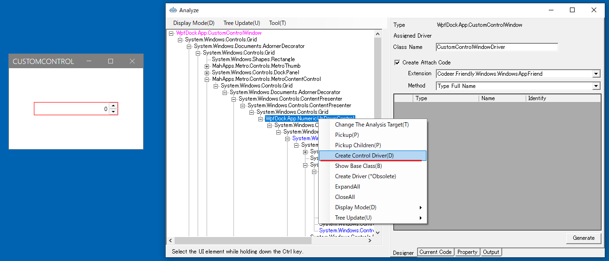
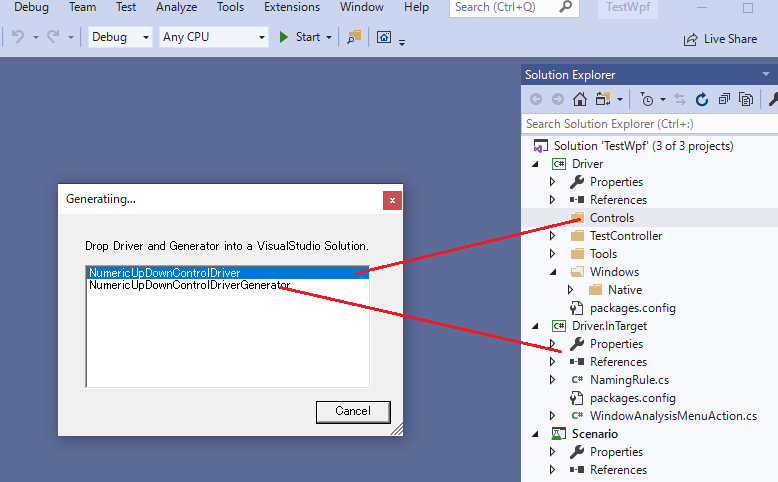

## ControlDriverとCaptureCodeGeneratorのコードテンプレートを生成する

最初にAnalyzeWindowを使ってControlDriverのコードテンプレートを作成します。
UI解析ツリーからBlockControlを選択し、コンテキスメニューより[Create Control Driver]を選択してください。

ダイアログから ControlDriver を選択し Driver プロジェクトの任意のフォルダにドロップします。
どこでも良いのですが、今回は Controls というフォルダを作ってそこにドロップしました。
次に CaptureGenerator を選択し Driver.InTarget の任意のフォルダにドロップします。

