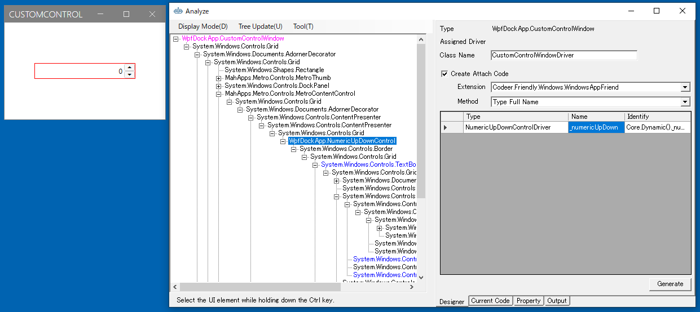
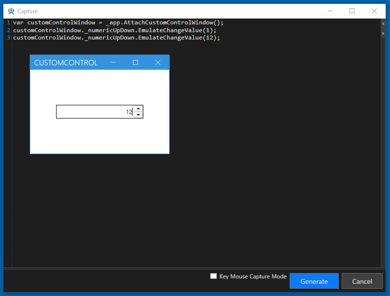

# NumericUpDownControl

## ControlDriverの実装

NumericUpDownControlはValueを取得または設定するプロパティを公開しています。
また、TextBoxをValueTextBoxで取得できますので操作できます。
生成したControlDriverのコードテンプレートを次のように変更してください。

プロセスを超えたプロパティやメソッドの操作にはFriendlyを使っています。詳細は[Friendly](https://github.com/Codeer-Software/Friendly/blob/master/README.jp.md)を参照してください。
```cs
using Codeer.Friendly;
using Codeer.Friendly.Dynamic;
using Codeer.TestAssistant.GeneratorToolKit;
using RM.Friendly.WPFStandardControls;

namespace Driver.Controls
{
    [ControlDriver(TypeFullName = "WpfDockApp.NumericUpDownControl", Priority = 2)]
    public class NumericUpDownControlDriver : WPFUIElement
    {
        public NumericUpDownControlDriver(AppVar appVar)
            : base(appVar) { }

		public int Value => this.Dynamic().Value;

		public void EmulateChangeValue(int value)
		{
			var textBox = this.Dynamic().ValueTextBox;
			if (textBox != null)
			{
				textBox.Focus();
				textBox.Text = value.ToString();
			}
		}
	}
}
```

## CaptureCodeGeneratorの実装

次にNumericUpDownControlのCaptureCodeGeneratorをコードテンプレートを編集して作成します。
イベントを受ける必要があるので NumericUpDownControl が定義されている WpfDockApp.exe を参照します。
コードテンプレートを次のように変更してください。

```cs
using System;
using Codeer.TestAssistant.GeneratorToolKit;
using WpfDockApp;

namespace Driver.InTarget
{
    [CaptureCodeGenerator("Driver.Controls.NumericUpDownControlDriver")]
    public class NumericUpDownControlDriverGenerator : CaptureCodeGeneratorBase
    {
		NumericUpDownControl _control;
		protected override void Attach()
		{
			_control = (NumericUpDownControl)ControlObject;
			_control.ValueChanged += ValueChanged;
		}

		protected override void Detach()
		{
			_control.ValueChanged -= ValueChanged;
		}

		void ValueChanged(object sender, EventArgs e)
		{
			if (_control.ValueTextBox.IsFocused || _control.UpButton.IsFocused || _control.DownButton.IsFocused)
				AddSentence(new TokenName(), ".EmulateChangeValue(" + _control.Value, new TokenAsync(CommaType.Before), ");");
		}
	}
}
```
## 注意
Driver.InTarget.dllは対象プロセス内部で動作します。そのため対象プロセスにアタッチした後、そのプロセスが起動している間にビルドしようとしてもdllファイルは対象プロセスが握っている状態なのでビルドできません。ビルドする場合は対象プロセスを一度終了させてください。

## ControlDriverとCaptureCodeGeneratorの利用

作成したControlDriverとCaptureCodeGenaratorを利用してコードを生成します。
通常の手順でWindowDriverを作成してください。UI解析ツリーからNumericUpDownControlを選択することで、グリッドに作成したNumericUpDownControlDriverを利用したプロパティが追加されることを確認できます。



WindowDriverを作成してキャプチャも行ってください。操作を行うことでCaptureCodeGeneratorを利用してコードが生成されることを確認できます。



## デバッグ
上手く動かない場合は[デバッグ](../feature/CaptureAndExecute.md#デバッグ)で原因を特定することができます。

## 次の手順
[ドキュメントの閉じるに反応するようにする](ControlDriver3.md)