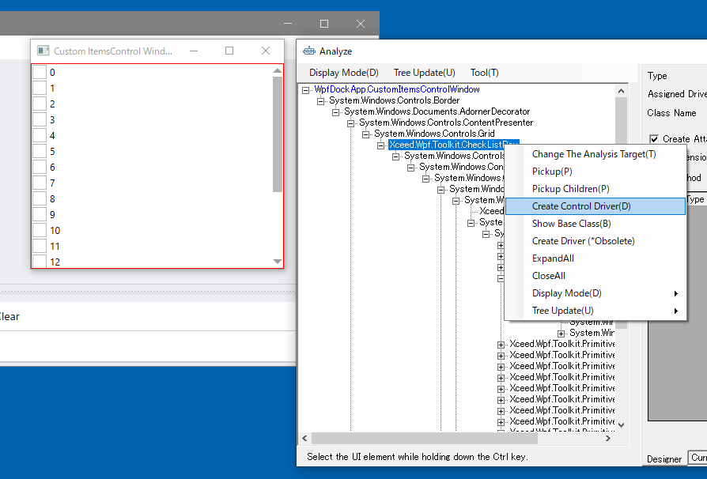
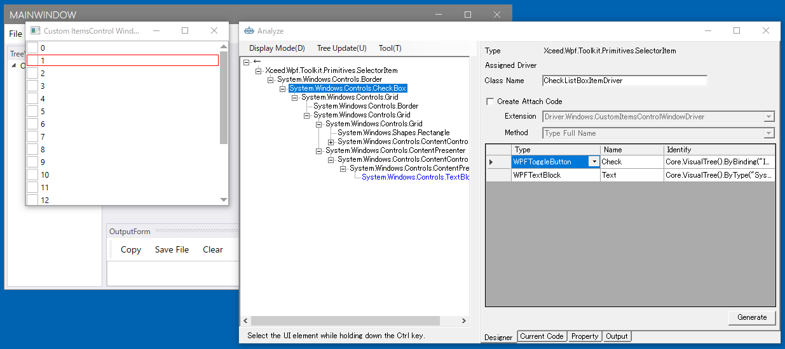
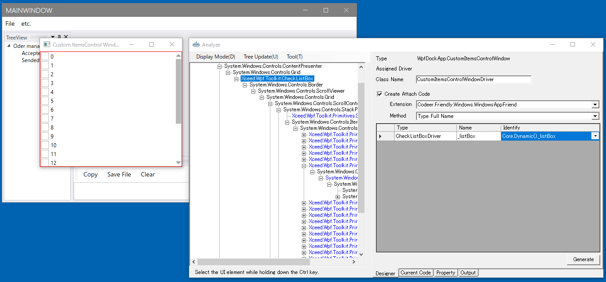
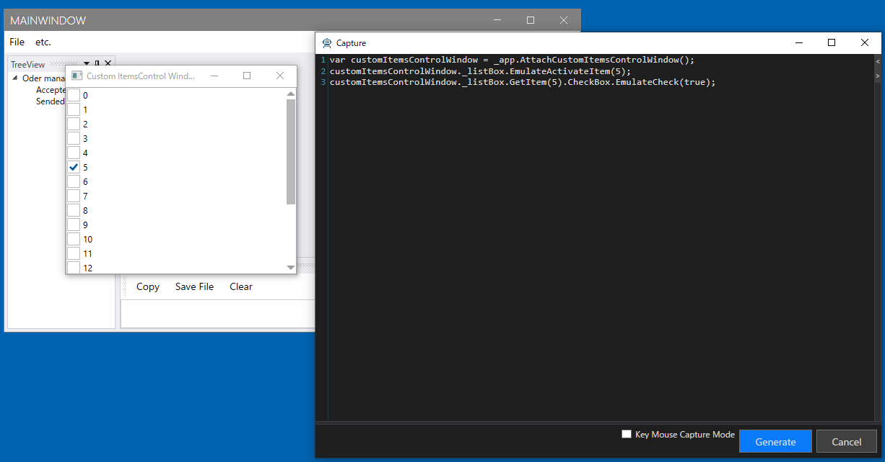

## ItemsControlのControlDriverを作る

### 雛型作成
ItemsControlのControlDriverを作ります。
これはいくつかの手法があります。
[こちら]()を参照してそれぞれのケースで最も最適な方法を選択してください。
ここではItemのDriverをUserControlDriverにする手法を使います。
まずはControlDriverのベースを作ります。



### ItemのUserControlDriver作成
次にCheckListBoxItemに対してUserControlDriverを作成します。
チェック状態の操作と文字列の取得をしたいと思うのでその二つを要素にします。
クラスの名前はCheckListBoxItemDriver、要素はそれぞれCheckとTextという名前にします。



```cs
using Codeer.Friendly;
using Codeer.Friendly.Dynamic;
using Codeer.TestAssistant.GeneratorToolKit;
using RM.Friendly.WPFStandardControls;

namespace Driver.Controls
{
    [UserControlDriver(TypeFullName = "Xceed.Wpf.Toolkit.Primitives.SelectorItem")]
    public class CheckListBoxItemDriver
    {
        public WPFUIElement Core { get; }
        public WPFToggleButton Check => Core.VisualTree().ByBinding("IsSelected").Single().Dynamic(); 
        public WPFTextBlock Text => Core.VisualTree().ByType("System.Windows.Controls.TextBlock").Single().Dynamic(); 

        public CheckListBoxItemDriver(AppVar core)
        {
            Core = new WPFUIElement(core);
        }
    }
}
```

### ControlDriver実装
次にCheckListBoxDriverを実装します。
以下のプロパティとメソッドを追加します。
+ アイテムの取得
+ アイテムにフォーカスを当てる
+ アクティブなアイテムの取得

```cs
using Codeer.Friendly;
using Codeer.Friendly.Dynamic;
using Codeer.TestAssistant.GeneratorToolKit;
using Driver.InTarget;
using RM.Friendly.WPFStandardControls;

namespace Driver.Controls
{
    [ControlDriver(TypeFullName = "Xceed.Wpf.Toolkit.CheckListBox", Priority = 2)]
    public class CheckListBoxDriver : WPFUIElement
    {
        public CheckListBoxDriver(AppVar appVar)
            : base(appVar) { }

        [ItemDriverGetter(ActiveItemKeyProperty = "ActiveItemIndex")]
        public CheckListBoxItemDriver GetItem(int index)
        {
            if (index == -1) return null;
            var item = this.Dynamic().ItemContainerGenerator.ContainerFromIndex(index);
            item.BringIntoView();
            return item;
        }

        public int ActiveItemIndex => App.Type<CheckListBoxDriverGenerator>().GetActiveIndex(this);

        public void EmulateActivateItem(int index)
        {
            this.Dynamic().Focus();
            var item = GetItem(index);
            item.Core.Dynamic().Focus();
        }
    }
}
```
ItemDriverGetterAttributeを付けることでキャプチャ時にアクティブなアイテムを取得し、そのアイテムもキャプチャできるようになります。
ActiveItemIndexの実装はプロセス越しだと大変なので対象プロセス内部で動作するようにDriver.InTargetに実装します。
今回はCheckListBoxDriverGeneratorに実装して呼び出すことにします。

### CaptureGenerator実装
CheckListBoxDriverGeneratorの実装です。
CheckListBoxDriverとしてはアクティブなアイテムが変更したときにEmulateActivateItemを出力するようにします。
```cs
using System.Linq;
using System.Windows;
using System.Windows.Controls;
using System.Windows.Input;
using Codeer.TestAssistant.GeneratorToolKit;
using RM.Friendly.WPFStandardControls;
using Xceed.Wpf.Toolkit;
using Xceed.Wpf.Toolkit.Primitives;

namespace Driver.InTarget
{
    [CaptureCodeGenerator("Driver.Controls.CheckListBoxDriver")]
    public class CheckListBoxDriverGenerator : CaptureCodeGeneratorBase
    {
        CheckListBox _list;

        protected override void Attach()
        {
            _list = (CheckListBox)ControlObject;
            _list.GotFocus += GotFocus;
        }

        protected override void Detach()
            => _list.GotFocus -= GotFocus;

        void GotFocus(object sender, RoutedEventArgs e)
        {
            var index = GetActiveIndex(_list);
            if (index == -1) return;

            AddSentence(new TokenName(), $".EmulateActivateItem({index});");
        }

        public static int GetActiveIndex(ItemsControl list)
        {
            //マウスもしくはキーボードフォーカスのある要素を取得
            DependencyObject focusedElement = null;
            if (list.IsKeyboardFocusWithin)
            {
                focusedElement = Keyboard.FocusedElement as DependencyObject;
            }
            else if (list.IsMouseCaptureWithin)
            {
                focusedElement = Mouse.Captured as DependencyObject;
            }
            if (focusedElement == null) return -1;

            //親方向にVisualTreeをたどってSelectorItemを見つける
            var focusedItem = focusedElement.VisualTree(TreeRunDirection.Ancestors).OfType<SelectorItem>().FirstOrDefault();
            if (focusedItem == null) return -1;

            //インデックスを取得
            return list.ItemContainerGenerator.IndexFromContainer(focusedItem);
        }
    }
}
```

## WindowDriver作成
WindowDriverを作成します。

```cs
using Codeer.Friendly;
using Codeer.Friendly.Dynamic;
using Codeer.Friendly.Windows;
using Codeer.Friendly.Windows.Grasp;
using Codeer.TestAssistant.GeneratorToolKit;
using Driver.Controls;

namespace Driver.Windows
{
    [WindowDriver(TypeFullName = "WpfDockApp.CustomItemsControlWindow")]
    public class CustomItemsControlWindowDriver
    {
        public WindowControl Core { get; }
        public CheckListBoxDriver _listBox => Core.Dynamic()._listBox; 

        public CustomItemsControlWindowDriver(WindowControl core)
        {
            Core = core;
        }

        public CustomItemsControlWindowDriver(AppVar core)
        {
            Core = new WindowControl(core);
        }
    }

    public static class CustomItemsControlWindowDriverExtensions
    {
        [WindowDriverIdentify(TypeFullName = "WpfDockApp.CustomItemsControlWindow")]
        public static CustomItemsControlWindowDriver AttachCustomItemsControlWindow(this WindowsAppFriend app)
            => app.WaitForIdentifyFromTypeFullName("WpfDockApp.CustomItemsControlWindow").Dynamic();
    }
}
```

## キャプチャ
キャプチャしてみます。
注意点はItemsContorlのアイテムはアクティブにならないとコードが生成されません。一度アクティブにしてから操作してください。


上手く動かない場合は[デバッグ](../feature/CaptureAndExecute.md#デバッグ)で原因を特定することができます。

## 次の手順

ここまで画面キャプチャを行うためのすべての処理が完了しました。
次は実際に画面をキャプチャしてシナリオを作成します。

[アプリケーションを操作してシナリオを作成する](Scenario.md)