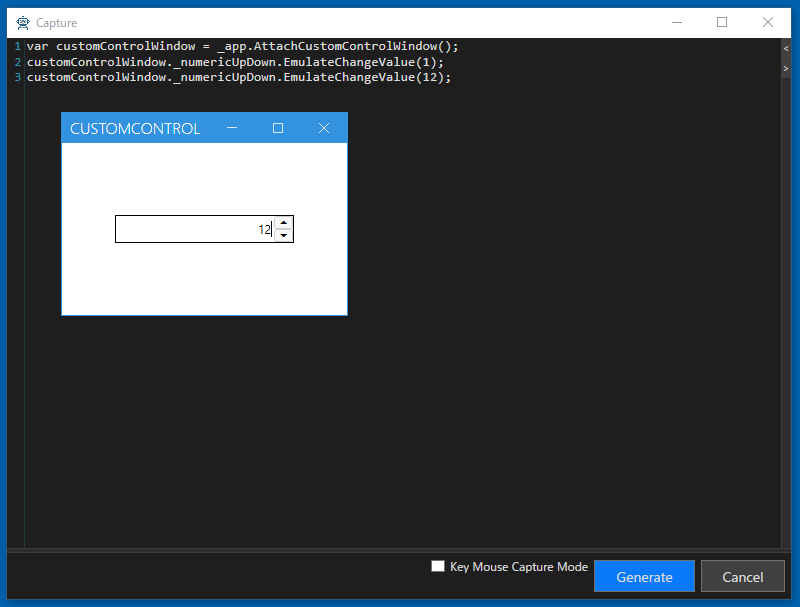

## ControlDriverとCaptureCodeGeneratorの利用

作成したControlDriverとCaptureCodeGenaratorを利用してコードを生成します。
通常の手順でWindowDriverを作成してください。UI解析ツリーからNumericUpDownControlを選択することで、グリッドに作成したNumericUpDownControlDriverを利用したプロパティが追加されることを確認できます。

WindowDriverを作成してキャプチャも行ってください。操作を行うことでCaptureCodeGeneratorを利用してコードが生成されることを確認できます。

### デバッグ

うまく動かない場合はデバッグして問題を見つけます。
Attach にブレークポイントを貼って Shift キーを押しながら Capture を実行してみてください。

## 次の手順
[ドキュメントの閉じるに反応するようにする](ControlDriver5.md)
