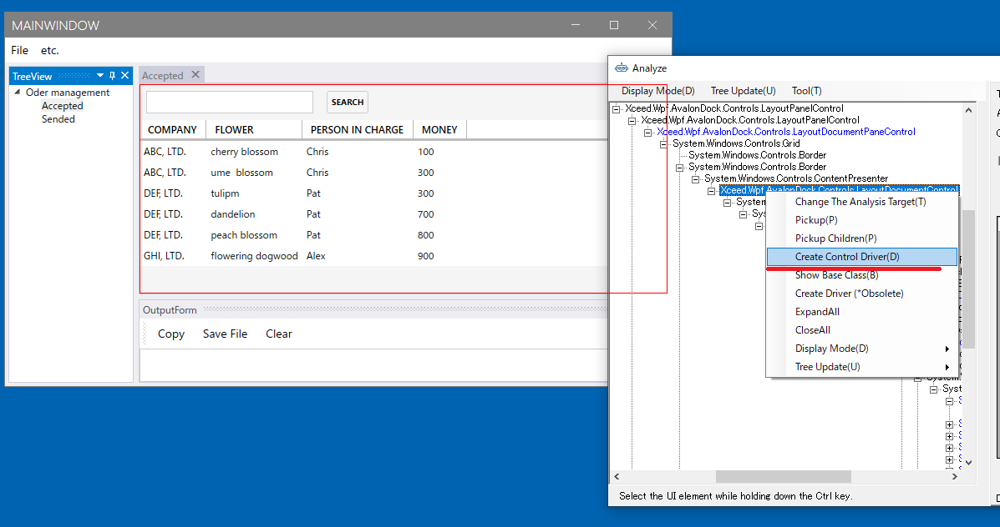
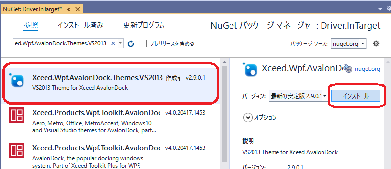

### ドキュメントの閉じるに反応するようにする

ドキュメントも標準のコントロールではないのでそのままでは対応できません。こちらも同様に作成してみます。
これはドキュメントを親方向にたどっていって存在するLayoutDocumentControlに対する操作で実現できます。
このような操作は利用しているライブラリの知識が必要です。
多くの場合、アプリケーション開発チームのメンバーなら対応可能でしょう。



```cs
using Codeer.Friendly;
using Codeer.Friendly.Dynamic;
using Codeer.TestAssistant.GeneratorToolKit;
using RM.Friendly.WPFStandardControls;

namespace Driver.Controls
{
    [ControlDriver(TypeFullName = "Xceed.Wpf.AvalonDock.Controls.LayoutDocumentControl", Priority = 2)]
    public class LayoutDocumentControlDriver : WPFUIElement
    {
        public LayoutDocumentControlDriver(AppVar appVar)
            : base(appVar) { }

        public void Close() => this.Dynamic().Model.Close();
    }
}
```

CaptureGeneratorはイベントを使うので、Xceed.Wpf.AvalonDock.Themes.VS2013をNugetからインストールします。バージョンはWpfDockAppに入っているものと合わせてください。



```cs
using Codeer.TestAssistant.GeneratorToolKit;
using Xceed.Wpf.AvalonDock.Controls;

namespace Driver.InTarget
{
    [CaptureCodeGenerator("Driver.Controls.LayoutDocumentControlDriver")]
    public class LayoutDocumentControlDriverGenerator : CaptureCodeGeneratorBase
    {
        LayoutDocumentControl _control;

        protected override void Attach()
        {
            _control = (LayoutDocumentControl)ControlObject;
            _control.Model.Closed += ModelClosed;
        }

        protected override void Detach()
        {
            _control.Model.Closed -= ModelClosed;
        }

        private void ModelClosed(object sender, System.EventArgs e)
        {
            AddSentence(new TokenName(), ".Close();");
        }
    }
}
```

LayoutDocumentControlはOrderDocumentUserControlより親方向に存在します。
これはAnalyzeWindowでは見つけることができません。
OrderDocumentUserControlDriverに手書きで加えます。
using Driver.Controls; も書き加えてください
```cs
using Codeer.Friendly;
using Codeer.Friendly.Dynamic;
using Codeer.Friendly.Windows;
using Codeer.Friendly.Windows.Grasp;
using Codeer.TestAssistant.GeneratorToolKit;
using RM.Friendly.WPFStandardControls;
using System.Linq;

//追加
using Driver.Controls;

namespace Driver.Windows
{
    [UserControlDriver(TypeFullName = "WpfDockApp.OrderDocumentUserControl")]
    public class OrderDocumentUserControlDriver
    {
        public WPFUserControl Core { get; }
        public WPFTextBox _searchText => Core.Dynamic()._searchText;
        public WPFContextMenu _searchTextContextMenu => new WPFContextMenu { Target = _searchText.AppVar };
        public WPFButtonBase _searchButton => Core.Dynamic()._searchButton;
        public WPFDataGrid _dataGrid => Core.Dynamic()._dataGrid;

        //追加
        public LayoutDocumentControlDriver LayoutDocumentControl
            //親方向に検索して最初に見つかったLayoutDocumentControl
            => Core.VisualTree(TreeRunDirection.Ancestors).ByType("Xceed.Wpf.AvalonDock.Controls.LayoutDocumentControl").First().Dynamic();


        public OrderDocumentUserControlDriver(AppVar core)
        {
            Core = new WPFUserControl(core);
        }
    }
```

## 次の手順

ここまで画面キャプチャを行うためのすべての処理が完了しました。
次は実際に画面をキャプチャしてシナリオを作成します。

[アプリケーションの操作を記録してシナリオを作成する](Scenario.md)