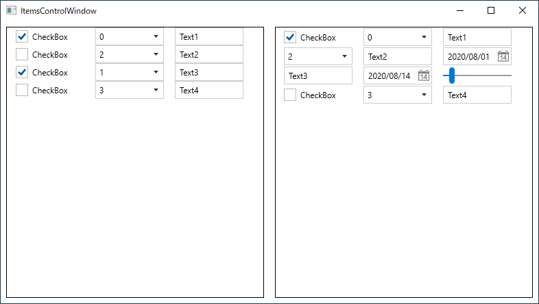

# DateTemplateでカスタマイズされたItemsControlに対応する

DataTemplateによってカスタマイズされたItemsControlに対しては、そのItemに対してUserControlを作成します。
WindowDriver、UserControlDriverについて理解できていない場合は先にこちらを参照してください。

[アプリケーションを解析してWindowDriverおよびUserControlDriverを作成する](tutorial/WindowDriver.md)

各機能の詳細な内容は次を参照してください。

- [AnalyzeWindowによるアプリケーションの解析](../feature/AnalyzeWindow.md)
- [AnalyzeWindowで生成されるコード](../feature/GeneratedCode.md)
- [Attach方法ごとのコード](../feature/Attach.md)

## 基本方針
RM.Friendly.WPFStandardControlsでは以下のItemsControlのカスタマイズに対応しています。
+ WPFListBox&lt;T>
+ WPFListView&lt;T>
+ WPFTreeView&lt;T>

Itemに対応したUserControlDriverを作り各クラスのGenerics引数に使います。
DateTemplateSelectorによる多様なItemにも対応しています。
上記以外のItemsControlに対してもControlDriverを作成することで対応可能です。

## 作成準備
ListBoxとListViewが含まれているItemsControl Windowのドライバを作成します。
対象アプリケーションのメニューから[etc] - [ItemsControl  Dialog]を選択して、ダイアログを表示します。
AnalyzeWindowは自動的にその内容を読み取りUI解析ツリーを更新します。

## 次の手順
[DateTemplateでカスタマイズしたListBoxItemのドライバを作成する](ItemsControlDriver1.md)
