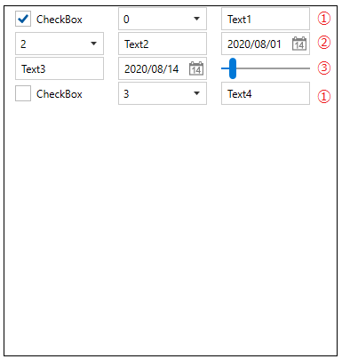
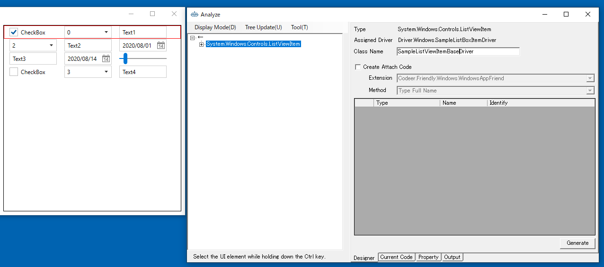
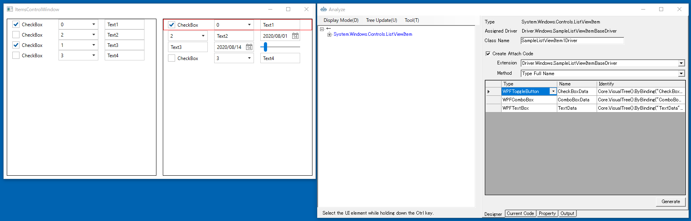
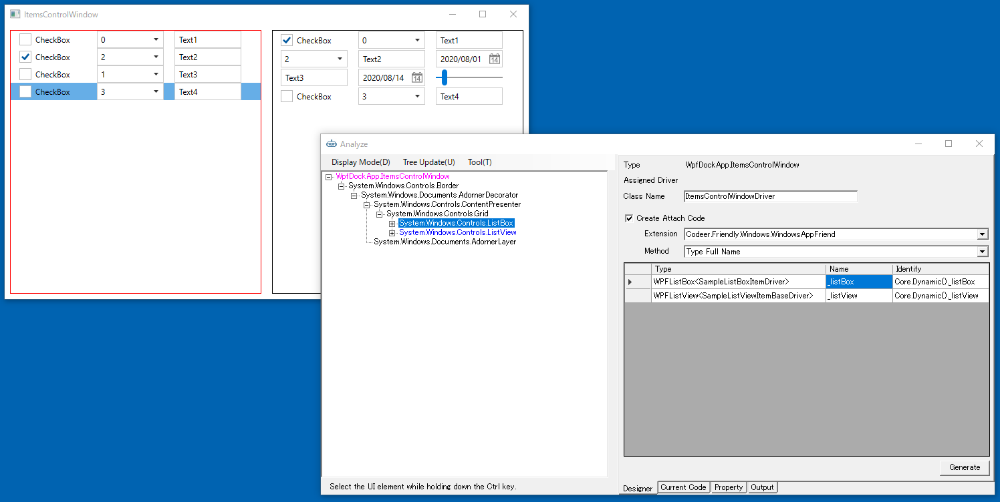

# ItemsControlに対応する

DataTemplateによってカスタマイズされたItemsControlに対しては、そのItemに対してUserControlを作成します。
WindowDriver、UserControlDriverについて理解できていない場合は先にこちらを参照してください。

[アプリケーションを解析してWindowDriverおよびUserControlDriverを作成する](tutorial/WindowDriver.md)

各機能の詳細な内容は次を参照してください。

- [AnalyzeWindowによるアプリケーションの解析](../feature/AnalyzeWindow.md)
- [AnalyzeWindowで生成されるコード](../feature/GeneratedCode.md)
- [Attach方法ごとのコード](../feature/Attach.md)

## 作成準備
ListBoxとListViewが含まれているItemsControl Windowのドライバを作成します。
対象アプリケーションのメニューから[etc] - [ItemsControl  Dialog]を選択して、ダイアログを表示します。
AnalyzeWindowは自動的にその内容を読み取りUI解析ツリーを更新します。

## シンプルなListBoxItemのドライバ作成 
最初に左側のListBoxのListBoxItemのドライバを作ります。ツリー上で[ListBoxItem]を選択し、右クリックから[Change The Analysis Target]を選択します。 解析対象が切り替わり、UI解析ツリーおよびDesignerタブの内容が[ListBoxItem]を起点にした内容で置き換わります。Class Name は ListBoxItemDriver になっていますが先頭に識別用の文字を追加して SampleListBoxItemDriver に変更し、 必要なコントロールを Designer に登録して Generate ボタンでコードを生成します。


```cs
using Codeer.Friendly;
using Codeer.Friendly.Dynamic;
using Codeer.Friendly.Windows;
using Codeer.Friendly.Windows.Grasp;
using Codeer.TestAssistant.GeneratorToolKit;
using RM.Friendly.WPFStandardControls;
using System.Linq;

namespace Driver.Windows
{
    [UserControlDriver(TypeFullName = "System.Windows.Controls.ListBoxItem")]
    public class SampleListBoxItemDriver
    {
        public WPFUserControl Core { get; }
        public WPFToggleButton CheckBox => Core.VisualTree().ByBinding("CheckBoxData").Single().Dynamic(); 
        public WPFComboBox ComboBox => Core.VisualTree().ByBinding("ComboBoxData").Single().Dynamic(); 
        public WPFTextBox TextBox => Core.VisualTree().ByBinding("TextData").Single().Dynamic(); 
        public WPFContextMenu TextBoxContextMenu => new WPFContextMenu{Target = TextBox.AppVar};

        public SampleListBoxItemDriver(AppVar core)
        {
            Core = new WPFUserControl(core);
        }
    }
}
```
そしてこのListBoxのControlDriverをListBox&lt;SampleListBoxItemDriver>にします。

[ItemsControlWindowのドライバ作成](#ItemsControlWindowのドライバ作成)

## 複数種類のアイテムへの対応(DataTemplateSelector)

右側のListViewはデータバインドしたViewModelの型をもとにDataTemplateSelectorで利用するコントロールを変更してあります。



|  VM  |  構成  |
| ---- | ---- |
|  ListView1ViewModel  |  CheckBox・ComboBox・TextBox  |
|  ListView1ViewMode2  |  ComboBox・TextBox・DatePicker  |
|  ListView1ViewMode3  |  TextBox・DatePicker・Slider  |

作成方針は以下のものです。

+ 基本となるListViewItemのドライバを作成
+ 各レイアウトに対応したUserControlDriverを作成
+ 基本となるListViewItemから変換する拡張メソッドを作成

使い方はこのようなものになります。
```cs
var item = dlg.ListView.GetItemDriver(0);
var item1 = item.AsSampleListViewItem1();
item1.TextBox.EmulateChangeText("abc");
```

### 基本となるListViewItemのドライバを作成する
まずListViewのListViewtemの基本となるドライバを作ります。ツリー上で最初の[ListViewItem]を選択し、右クリックから[Change The Analysis Target]を選択します。 解析対象が切り替わり、UI解析ツリーおよびDesignerタブの内容が[ListViewItem]を起点にした内容で置き換わります。Class Name は ListViewItemBaseDriver に変更し、 コントロールを Designer に登録せずに Generate ボタンでコードを生成します。



```cs
using Codeer.Friendly;
using Codeer.Friendly.Dynamic;
using Codeer.Friendly.Windows;
using Codeer.Friendly.Windows.Grasp;
using Codeer.TestAssistant.GeneratorToolKit;
using RM.Friendly.WPFStandardControls;
using System.Linq;

namespace Driver.Windows
{
    [UserControlDriver(TypeFullName = "System.Windows.Controls.ListViewItem")]
    public class SampleListViewItemBaseDriver
    {
        public WPFUserControl Core { get; }

        public SampleListViewItemBaseDriver(AppVar core)
        {
            Core = new WPFUserControl(core);
        }
    }
}
```

ListViewのListViewtemの一行目のドライバを作ります。ツリー上で最初の[ListViewItem]を選択し、右クリックから[Change The Analysis Target]を選択します。 解析対象が切り替わり、UI解析ツリーおよびDesignerタブの内容が[ListViewItem]を起点にした内容で置き換わります。Class Name は SampleListViewItem1Driver に変更し、必要なコントロールを Designer に登録します。 
それから Create Attach Code にチェックを入れて SampleListViewItemBaseDriver にアタッチできるようにします。Methodは Type Full Name を選択してください。
Generate ボタンでコードを生成します。
しかし、このままではSampleListViewItemBaseから無条件にSampleListViewItem1Driverに変換されてしまうので、DataContextがListView1ViewModelの時以外はnullを返すように変更します。



```cs
using Codeer.Friendly;
using Codeer.Friendly.Dynamic;
using Codeer.Friendly.Windows;
using Codeer.Friendly.Windows.Grasp;
using Codeer.TestAssistant.GeneratorToolKit;
using RM.Friendly.WPFStandardControls;
using System.Linq;

namespace Driver.Windows
{
    [UserControlDriver(TypeFullName = "System.Windows.Controls.ListViewItem")]
    public class SampleListViewItem1Driver
    {
        public WPFUserControl Core { get; }
        public WPFToggleButton CheckBox => Core.VisualTree().ByBinding("CheckBoxData").Single().Dynamic(); 
        public WPFComboBox ComboBox => Core.VisualTree().ByBinding("ComboBoxData").Single().Dynamic(); 
        public WPFTextBox TextBox => Core.VisualTree().ByBinding("TextData").Single().Dynamic(); 
        public WPFContextMenu TextBoxContextMenu => new WPFContextMenu{Target = TextBox.AppVar};

        public SampleListViewItem1Driver(AppVar core)
        {
            Core = new WPFUserControl(core);
        }
    }

    public static class SampleListViewItem1DriverExtensions
    {
        [UserControlDriverIdentify]
        public static SampleListViewItem1Driver AsSampleListViewItem1(this SampleListViewItemBaseDriver parent)
        {
            string typeName = parent.Core.Dynamic().DataContext.GetType().Name;
            if (typeName != "ListView1ViewModel") return null;
            return parent.Core.VisualTree().ByType("System.Windows.Controls.ListViewItem").FirstOrDefault()?.Dynamic();
        }
    }
}
```

同様に二行目や三行目のドライバを作ります。これでListViewのドライバは完成です。
```cs
using Codeer.Friendly;
using Codeer.Friendly.Dynamic;
using Codeer.Friendly.Windows;
using Codeer.Friendly.Windows.Grasp;
using Codeer.TestAssistant.GeneratorToolKit;
using RM.Friendly.WPFStandardControls;
using System.Linq;

namespace Driver.Windows
{
    [UserControlDriver(TypeFullName = "System.Windows.Controls.ListViewItem")]
    public class SampleListViewItem2Driver
    {
        public WPFUserControl Core { get; }
        public WPFComboBox ComboBox => Core.VisualTree().ByBinding("ComboBoxData").SingleOrDefault()?.Dynamic(); 
        public WPFTextBox TextBox => Core.VisualTree().ByBinding("TextData").Single().Dynamic(); 
        public WPFContextMenu TextBoxContextMenu => new WPFContextMenu{Target = TextBox.AppVar};
        public WPFDatePicker DatePicker => Core.VisualTree().ByBinding("DateData").Single().Dynamic(); 
        public WPFContextMenu DatePickerContextMenu => new WPFContextMenu{Target = DatePicker.AppVar};

        public SampleListViewItem2Driver(AppVar core)
        {
            Core = new WPFUserControl(core);
        }
    }

    public static class SampleListViewItem2DriverExtensions
    {
        [UserControlDriverIdentify]
        public static SampleListViewItem2Driver AsSampleListViewItem2(this SampleListViewItemBaseDriver parent)
        {
            string typeName = parent.Core.Dynamic().DataContext.GetType().Name;
            if (typeName != "ListView2ViewModel") return null;
            return parent.Core.VisualTree().ByType("System.Windows.Controls.ListViewItem").FirstOrDefault()?.Dynamic();
        }
    }
}
```

```cs
using Codeer.Friendly;
using Codeer.Friendly.Dynamic;
using Codeer.Friendly.Windows;
using Codeer.Friendly.Windows.Grasp;
using Codeer.TestAssistant.GeneratorToolKit;
using RM.Friendly.WPFStandardControls;
using System.Linq;

namespace Driver.Windows
{
    [UserControlDriver(TypeFullName = "System.Windows.Controls.ListViewItem")]
    public class SampleListViewItem3Driver
    {
        public WPFUserControl Core { get; }
        public WPFTextBox TextBox => Core.VisualTree().ByBinding("TextData").Single().Dynamic(); 
        public WPFContextMenu TextBoxContextMenu => new WPFContextMenu{Target = TextBox.AppVar};
        public WPFDatePicker DatePicker => Core.VisualTree().ByBinding("DateData").Single().Dynamic(); 
        public WPFContextMenu DatePickerContextMenu => new WPFContextMenu{Target = DatePicker.AppVar};
        public WPFSlider Slider => Core.VisualTree().ByBinding("SliderData").Single().Dynamic(); 

        public SampleListViewItem3Driver(AppVar core)
        {
            Core = new WPFUserControl(core);
        }
    }

    public static class SampleListViewItem3DriverExtensions
    {
        [UserControlDriverIdentify]
        public static SampleListViewItem3Driver AsSampleListViewItem3(this ListViewItemBaseDriver parent)
        {
            string typeName = parent.Core.Dynamic().DataContext.GetType().Name;
            if (typeName != "ListView3ViewModel") return null;
            return parent.Core.VisualTree().ByType("System.Windows.Controls.ListViewItem").FirstOrDefault()?.Dynamic();
        }
    }
}
```

## ItemsControlWindowのドライバ作成
ListBoxとListViewが含まれているItemsControl Windowのドライバを作成します。
ピックアップすると最初はWPFListBox、WPFListViewがタイプとして選択されていますので、WPFListBox&lt;SampleListBoxItem>、WPFListView&lt;SampleListViewItem>にそれぞれ変更してください。



```cs
using Codeer.Friendly;
using Codeer.Friendly.Dynamic;
using Codeer.Friendly.Windows;
using Codeer.Friendly.Windows.Grasp;
using Codeer.TestAssistant.GeneratorToolKit;
using RM.Friendly.WPFStandardControls;

namespace Driver.Windows
{
    [WindowDriver(TypeFullName = "WpfDockApp.ItemsControlWindow")]
    public class ItemsControlWindowDriver
    {
        public WindowControl Core { get; }
        public WPFListBox<SampleListBoxItemDriver> _listBox => Core.Dynamic()._listBox; 
        public WPFListView<SampleListViewItemBaseDriver> _listView => Core.Dynamic()._listView; 

        public ItemsControlWindowDriver(WindowControl core)
        {
            Core = core;
        }

        public ItemsControlWindowDriver(AppVar core)
        {
            Core = new WindowControl(core);
        }
    }

    public static class ItemsControlWindowDriverExtensions
    {
        [WindowDriverIdentify(TypeFullName = "WpfDockApp.ItemsControlWindow")]
        public static ItemsControlWindowDriver AttachItemsControlWindow(this WindowsAppFriend app)
            => app.WaitForIdentifyFromTypeFullName("WpfDockApp.ItemsControlWindow").Dynamic();
    }
}
```

## 次の手順

ここまで画面キャプチャを行うためのドライバの作成が完了しました。
次は標準ではキャプチャに対応していないコントロールに対応するためのControlDriverを作成します。

[ControlDriverとCaptureCodeGeneratorを作成する](ControlDriver.md)