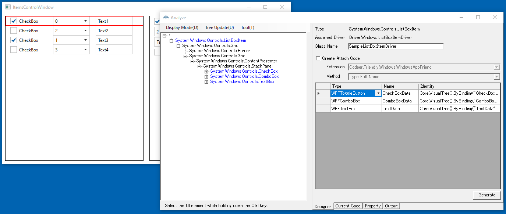

## DateTemplateでカスタマイズしたListBoxItemのドライバ作成る

最初に左側のListBoxのListBoxItemのドライバを作ります。ツリー上で[ListBoxItem]を選択し、右クリックから[Change The Analysis Target]を選択します。 
解析対象が切り替わり、UI解析ツリーおよびDesignerタブの内容が[ListBoxItem]を起点にした内容で置き換わります。
Class Name は ListBoxItemDriver になっていますが先頭に識別用の文字を追加して SampleListBoxItemDriver に変更ます。
最後に、必要なコントロールを Designer に登録して Generate ボタンでコードを生成します。



```cs
using Codeer.Friendly;
using Codeer.Friendly.Dynamic;
using Codeer.Friendly.Windows;
using Codeer.Friendly.Windows.Grasp;
using Codeer.TestAssistant.GeneratorToolKit;
using RM.Friendly.WPFStandardControls;
using System.Linq;

namespace Driver.Windows
{
    [UserControlDriver(TypeFullName = "System.Windows.Controls.ListBoxItem")]
    public class SampleListBoxItemDriver
    {
        public WPFUserControl Core { get; }
        public WPFToggleButton CheckBoxData => Core.VisualTree().ByBinding("CheckBoxData").Single().Dynamic(); 
        public WPFComboBox ComboBoxData => Core.VisualTree().ByBinding("ComboBoxData").Single().Dynamic(); 
        public WPFTextBox TextData => Core.VisualTree().ByBinding("TextData").Single().Dynamic(); 
        public WPFContextMenu TextDataContextMenu => new WPFContextMenu{Target = TextData.AppVar};

        public SampleListBoxItemDriver(AppVar core)
        {
            Core = new WPFUserControl(core);
        }
    }
}
```
そしてこのListBoxのControlDriverをListBox&lt;SampleListBoxItemDriver>にします。

使い方はこのようになります。
```cs
var itemsControlWindow = _app.AttachItemsControlWindow();
itemsControlWindow._listBox.EmulateChangeSelectedIndex(2);
itemsControlWindow._listBox.GetItemDriver(2).CheckBoxData.EmulateCheck(true);
itemsControlWindow._listBox.GetItemDriver(2).ComboBoxData.EmulateChangeSelectedIndex(2);
itemsControlWindow._listBox.GetItemDriver(2).TextData.EmulateChangeText("abc");
```

## 次の手順
[複数種類のアイテムへの対応(DataTemplateSelector)](ItemsControlDriver2.md)
