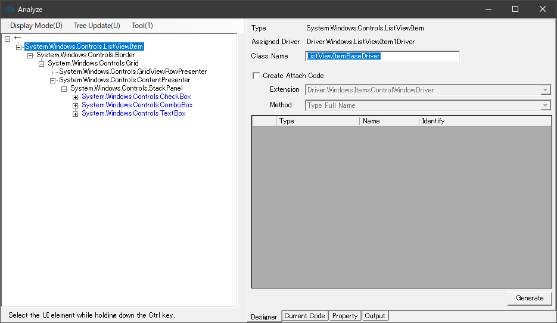
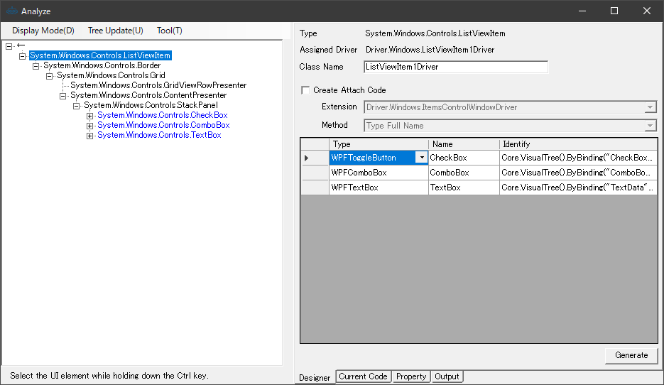

## 複数種類のアイテムへの対応(DataTemplateSelector)

右側のListViewはデータバインドしたViewModelの型をもとにDataTemplateSelectorで利用するコントロールを変更してあります。


|  VM  |  構成  |
| ---- | ---- |
|  ListView1ViewModel  |  CheckBox・ComboBox・TextBox  |
|  ListView1ViewMode2  |  ComboBox・TextBox・DatePicker  |
|  ListView1ViewMode3  |  TextBox・DatePicker・Slider  |

作成方針は以下のものです。

+ 基本となるListViewItemのドライバを作成
+ 各レイアウトに対応したUserControlDriverを作成
+ 基本となるListViewItemから変換する拡張メソッドを作成

使い方はこのようなものになります。
```cs
var item = dlg.ListView.GetItemDriver(0);
var item1 = item.AsSampleListViewItem1();
item1.TextBox.EmulateChangeText("abc");
```

### 基本となるListViewItemのドライバを作成する
まずListViewのListViewtemの基本となるドライバを作ります。ツリー上で最初の[ListViewItem]を選択し、右クリックから[Change The Analysis Target]を選択します。
解析対象が切り替わり、UI解析ツリーおよびDesignerタブの内容が[ListViewItem]を起点にした内容で置き換わります。
Class Name は SampleListViewItemBaseDriver に変更し、 コントロールを Designer に登録せず、 Generate ボタンでコードを生成します。



```cs
using Codeer.Friendly;
using Codeer.Friendly.Dynamic;
using Codeer.Friendly.Windows;
using Codeer.Friendly.Windows.Grasp;
using Codeer.TestAssistant.GeneratorToolKit;
using RM.Friendly.WPFStandardControls;
using System.Linq;

namespace Driver.Windows
{
    [UserControlDriver(TypeFullName = "System.Windows.Controls.ListViewItem")]
    public class SampleListViewItemBaseDriver
    {
        public WPFUserControl Core { get; }

        public SampleListViewItemBaseDriver(AppVar core)
        {
            Core = new WPFUserControl(core);
        }
    }
}
```

### それぞれのListViewItemのドライバを作成する
ListViewのListViewtemの一行目のドライバを作ります。ツリー上で最初の[ListViewItem]を選択し、右クリックから[Change The Analysis Target]を選択します。 解析対象が切り替わり、UI解析ツリーおよびDesignerタブの内容が[ListViewItem]を起点にした内容で置き換わります。Class Name は SampleListViewItem1Driver に変更し、必要なコントロールを Designer に登録します。 
そして SampleListViewItemBaseDriver へアタッチするために、Create Attach Code をチェックします。
Methodは Type Full Name を選択してください。
Generate ボタンでコードを生成します。
しかし、このままではSampleListViewItemBaseから無条件で、SampleListViewItem1Driverに変換されてしまいます。
そのためDataContextがListView1ViewModelの時以外はnullを返すように変更します。



```cs
using Codeer.Friendly;
using Codeer.Friendly.Dynamic;
using Codeer.Friendly.Windows;
using Codeer.Friendly.Windows.Grasp;
using Codeer.TestAssistant.GeneratorToolKit;
using RM.Friendly.WPFStandardControls;
using System.Linq;

namespace Driver.Windows
{
    [UserControlDriver(TypeFullName = "System.Windows.Controls.ListViewItem")]
    public class SampleListViewItem1Driver
    {
        public WPFUserControl Core { get; }
        public WPFToggleButton CheckBoxData => Core.VisualTree().ByBinding("CheckBoxData").Single().Dynamic(); 
        public WPFComboBox ComboBoxData => Core.VisualTree().ByBinding("ComboBoxData").Single().Dynamic(); 
        public WPFTextBox TextData => Core.VisualTree().ByBinding("TextData").Single().Dynamic(); 
        public WPFContextMenu TextDataContextMenu => new WPFContextMenu{Target = TextData.AppVar};

        public SampleListViewItem1Driver(AppVar core)
        {
            Core = new WPFUserControl(core);
        }
    }

    public static class SampleListViewItem1DriverExtensions
    {
        [UserControlDriverIdentify]
        public static SampleListViewItem1Driver AsSampleListViewItem1(this SampleListViewItemBaseDriver parent)
        {
            string typeName = parent.Core.Dynamic().DataContext.GetType().Name;
            if (typeName != "ListView1ViewModel") return null;
            return parent.Core.VisualTree().ByType("System.Windows.Controls.ListViewItem").FirstOrDefault()?.Dynamic();
        }
    }
}
```

同様に二行目や三行目のドライバを作ります。これでListViewのドライバは完成です。
```cs
using Codeer.Friendly;
using Codeer.Friendly.Dynamic;
using Codeer.Friendly.Windows;
using Codeer.Friendly.Windows.Grasp;
using Codeer.TestAssistant.GeneratorToolKit;
using RM.Friendly.WPFStandardControls;
using System.Linq;

namespace Driver.Windows
{
    [UserControlDriver(TypeFullName = "System.Windows.Controls.ListViewItem")]
    public class SampleListViewItem2Driver
    {
        public WPFUserControl Core { get; }
        public WPFComboBox ComboBoxData => Core.VisualTree().ByBinding("ComboBoxData").SingleOrDefault()?.Dynamic(); 
        public WPFTextBox TextData => Core.VisualTree().ByBinding("TextData").Single().Dynamic(); 
        public WPFContextMenu TextDataContextMenu => new WPFContextMenu{Target = TextData.AppVar};
        public WPFDatePicker DateData => Core.VisualTree().ByBinding("DateData").Single().Dynamic(); 
        public WPFContextMenu DateDataContextMenu => new WPFContextMenu{Target = DateData.AppVar};

        public SampleListViewItem2Driver(AppVar core)
        {
            Core = new WPFUserControl(core);
        }
    }

    public static class SampleListViewItem2DriverExtensions
    {
        [UserControlDriverIdentify]
        public static SampleListViewItem2Driver AsSampleListViewItem2(this SampleListViewItemBaseDriver parent)
        {
            string typeName = parent.Core.Dynamic().DataContext.GetType().Name;
            if (typeName != "ListView2ViewModel") return null;
            return parent.Core.VisualTree().ByType("System.Windows.Controls.ListViewItem").FirstOrDefault()?.Dynamic();
        }
    }
}
```

```cs
using Codeer.Friendly;
using Codeer.Friendly.Dynamic;
using Codeer.Friendly.Windows;
using Codeer.Friendly.Windows.Grasp;
using Codeer.TestAssistant.GeneratorToolKit;
using RM.Friendly.WPFStandardControls;
using System.Linq;

namespace Driver.Windows
{
    [UserControlDriver(TypeFullName = "System.Windows.Controls.ListViewItem")]
    public class SampleListViewItem3Driver
    {
        public WPFUserControl Core { get; }
        public WPFTextBox TextData => Core.VisualTree().ByBinding("TextData").Single().Dynamic(); 
        public WPFContextMenu TextDataContextMenu => new WPFContextMenu{Target = TextData.AppVar};
        public WPFDatePicker DateData => Core.VisualTree().ByBinding("DateData").Single().Dynamic(); 
        public WPFContextMenu DateDataContextMenu => new WPFContextMenu{Target = DateData.AppVar};
        public WPFSlider SliderData => Core.VisualTree().ByBinding("SliderData").Single().Dynamic(); 

        public SampleListViewItem3Driver(AppVar core)
        {
            Core = new WPFUserControl(core);
        }
    }

    public static class SampleListViewItem3DriverExtensions
    {
        [UserControlDriverIdentify]
        public static SampleListViewItem3Driver AsSampleListViewItem3(this ListViewItemBaseDriver parent)
        {
            string typeName = parent.Core.Dynamic().DataContext.GetType().Name;
            if (typeName != "ListView3ViewModel") return null;
            return parent.Core.VisualTree().ByType("System.Windows.Controls.ListViewItem").FirstOrDefault()?.Dynamic();
        }
    }
}
```

## 次の手順
[ItemsControlWindowのドライバ作成](ItemsControlDriver3.md)
