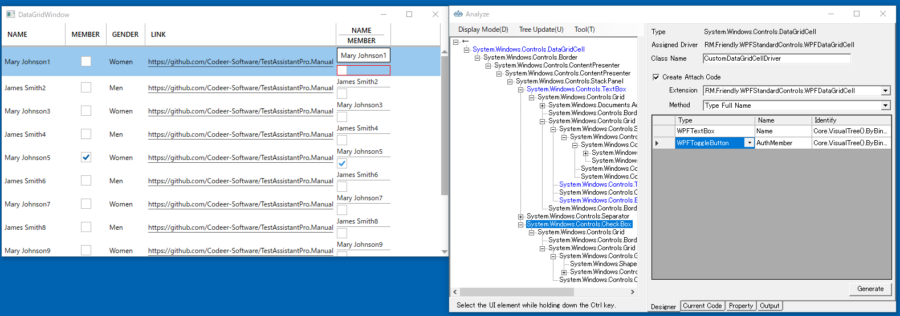

## DataGrid のカスタマイズ

DataGridはWPFDataGridを使って操作することができます。
WPFDataGridは標準では以下のものに対応しています。

- DataGridTextColumn
- DataGridHyperlinkColumn
- DataGridComboBoxColumn
- DataGridCheckBoxColumn

DataGridTemplateColumnを使ってカスタマイズしたセルに関してもセルの内容に対してUSerControlDriverを作成することで対応できます。

### ダイアログのドライバ作成
対象アプリケーションのメニューから[etc] - [DataGrid Dialog]を選択して、ダイアログを表示します。


このDataGridは標準の4種類のカラムとDataGridTemplateColumnによってカスタマイズされたカラムがあります。

最初にダイアログのドライバを作ります。
UI解析ツリーのルートで右クリックメニューを表示して[Pickup Children]を実行します。
そうするとグリッドに DataGrid の要素がピックアップされます。
必要な要素を登録したら[Generate]ボタンを押してコードを生成します。

```cs
using Codeer.Friendly;
using Codeer.Friendly.Dynamic;
using Codeer.Friendly.Windows;
using Codeer.Friendly.Windows.Grasp;
using Codeer.TestAssistant.GeneratorToolKit;
using RM.Friendly.WPFStandardControls;
using System.Linq;

namespace Driver.Windows
{
    [WindowDriver(TypeFullName = "WpfDockApp.DataGridWindow")]
    public class CustomDataGridWindowDriver
    {
        public WindowControl Core { get; }
        public WPFDataGrid dataGrid => Core.Dynamic().dataGrid; 

        public CustomDataGridWindowDriver(WindowControl core)
        {
            Core = core;
        }

        public CustomDataGridWindowDriver(AppVar core)
        {
            Core = new WindowControl(core);
        }
    }

    public static class CustomDataGridWindowDriverExtensions
    {
        [WindowDriverIdentify(TypeFullName = "WpfDockApp.DataGridWindow")]
        public static CustomDataGridWindowDriver AttachCustomDataGridWindow(this WindowsAppFriend app)
            => app.WaitForIdentifyFromTypeFullName("WpfDockApp.DataGridWindow").Dynamic();
    }
}
```

### DataGridTemplateColumnでカスタマイズされたセルのUSerControl作成
次に右側の NAME と MEMBER が2段の要素を持つ DataGridTemplateColumn のセルに対するコードを生成します。
Controlキーを押しながら最終列のセルにカーソルを持っていくとDataGridCellもしくはその子要素を選択できます。
ツリー上でDataGridCellを選択し、右クリックから[Change The Analysis Target]を選択します。
クラス名はCustomDataGridCellDriverなどの通常のDataGridCellと区別できる名前を付けてください。
Generate Attach Code にチェックをつけ Extension は WPFDataGridCell, Method は TypeFullName を選択します。
必要なコントロールを Designer に登録して Generate ボタンでコードを生成します。


このままではWPFDataGridCell全てがCustomDataGridCellDriverに変換されてしまいますので目的のセルのみ変換されるようにAsCustomDataGridCellを調整します。
Column が DataGridTemplateColumn で AuthMemberにバインディングされている要素を持つセル以外はnullを返すようにします。

```cs
using Codeer.Friendly;
using Codeer.Friendly.Dynamic;
using Codeer.Friendly.Windows;
using Codeer.Friendly.Windows.Grasp;
using Codeer.TestAssistant.GeneratorToolKit;
using RM.Friendly.WPFStandardControls;
using System.Linq;
using System.Windows.Controls;

namespace Driver.Windows
{
    [UserControlDriver(TypeFullName = "System.Windows.Controls.DataGridCell")]
    public class CustomDataGridCellDriver
    {
        public WPFUIElement Core { get; }
        public WPFTextBlock Name => Core.VisualTree().ByBinding("Name").Single().Dynamic(); 
        public WPFToggleButton AuthMember => Core.VisualTree().ByBinding("AuthMember").Single().Dynamic(); 

        public CustomDataGridCellDriver(AppVar core)
        {
            Core = new WPFUIElement(core);
        }
    }

    public static class CustomDataGridCellDriverExtensions
    {
        [UserControlDriverIdentify]
        public static CustomDataGridCellDriver AsCustomDataGridCell(this WPFDataGridCell parent)
        {
            string columnType = parent.Dynamic().Column.GetType().FullName;
            if (typeof(DataGridTemplateColumn).FullName != columnType) return null;
            if (parent.VisualTree().ByBinding("AuthMember").FirstOrDefault() == null) return null;
            return parent.Core.Dynamic();
        }
    }
}
```

## 次の手順

次は標準ではキャプチャに対応していないコントロールに対応するためのControlDriverを作成します。

[ControlDriverとCaptureCodeGeneratorを作成する](ControlDriver.md)
