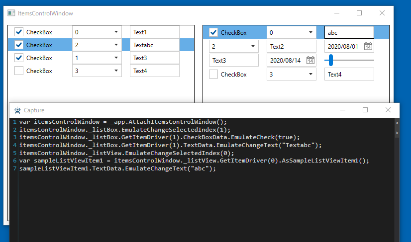

## キャプチャ
キャプチャしてみます。
注意点はItemsContorlのアイテムはアクティブにならないとコードが生成されません。一度アクティブにしてから操作してください。

## 次の手順

ここまで画面キャプチャを行うためのドライバの作成が完了しました。
次は標準ではキャプチャに対応していないコントロールに対応するためのControlDriverを作成します。

[ControlDriverとCaptureCodeGeneratorを作成する](ControlDriver.md)