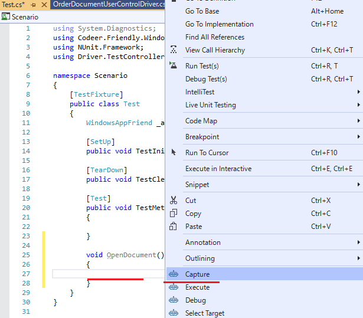
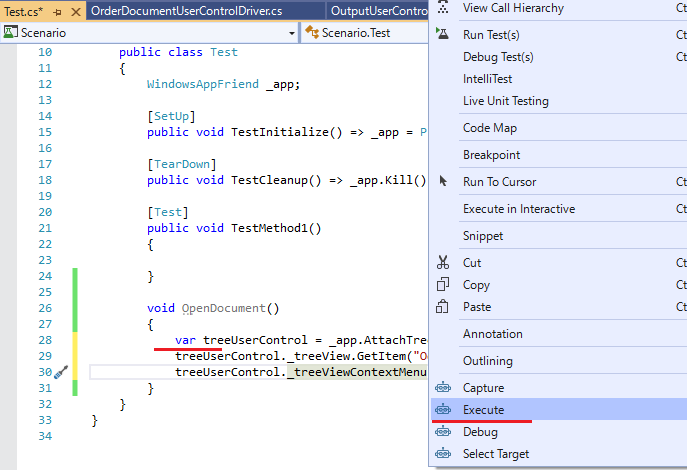
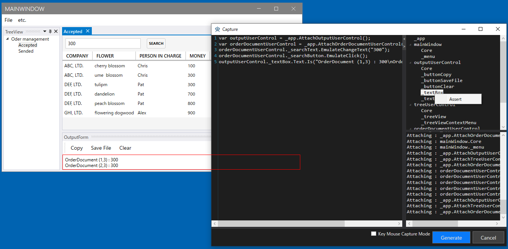
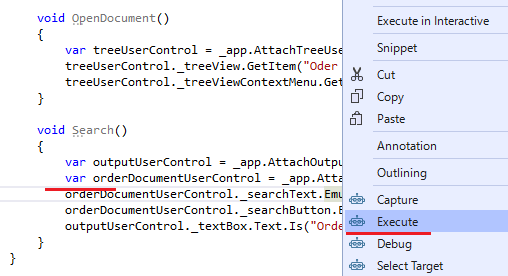

# アプリケーションを操作してシナリオを作成する

まずはドキュメントを開くシナリオを作ってみます。
OpenDocument という関数を作り、そこで右クリックから Capture を実行します。



ツリー上でドキュメントを選択して右クリックメニューから Open を実行します。
Capture ウィンドウ上に次のようにコードが出ているので Generate ボタンを押します。


先ほどの OpenDocument 関数にコードが出ているので、
一度対象プロジェクトのドキュメントを閉じてから
OpenDocument 上で右クリックから Execute を実行します。
そうすると OpenDocument のみが実行されます。



今度はドキュメント上で検索をしてみます。
同様に Search 関数を作り Capture を実行します。
今度は最後に Assert も書いてみます。
(Assert の処理は[こちら](Customize.md#Capture)を参照お願いします。)



これもまた同様に Search 関数のみ実行してみます。
実行前に OutputUserControl の Clear ボタンを押して OutputUserControl をクリアしておきます。



期待通りの動作をすると今度は一つのテスト関数から呼び出だすようにしてまとめて実行してみます。
せっかくなので NUnit から実行します。
Nunit では新しいアプリケーションが起動して処理を実行してみてください。
新しいプロセスが起動され、テストの実行が成功します。

```cs
[TestCase, Apartment(ApartmentState.STA), TimeoutEx(10000)]
public void TestMethod1()
{
    OpenDocument();
    Search();
}
```

長いシナリオを一度にキャプチャするのはたいへんです。
このように短い操作コードを作って確認しながら少しずつ進めることで結果的には高い効率で作業を進めることができ、また操作コード自体の再利用性を高めることができます。