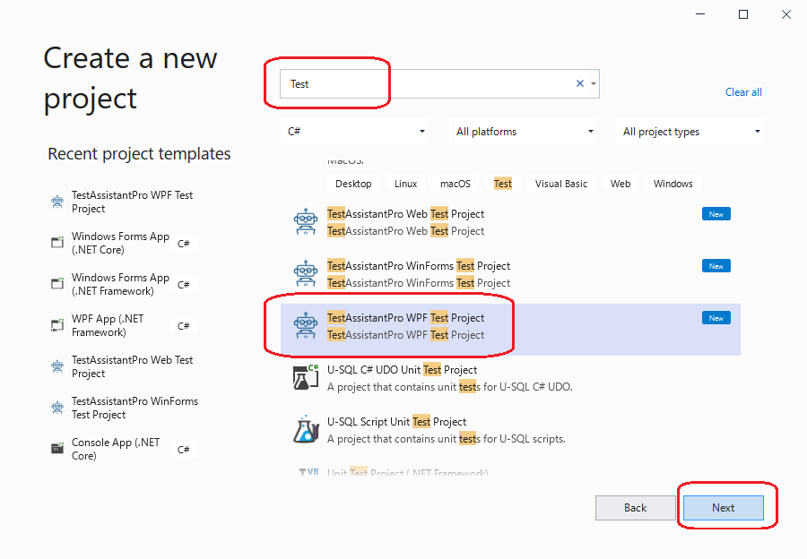
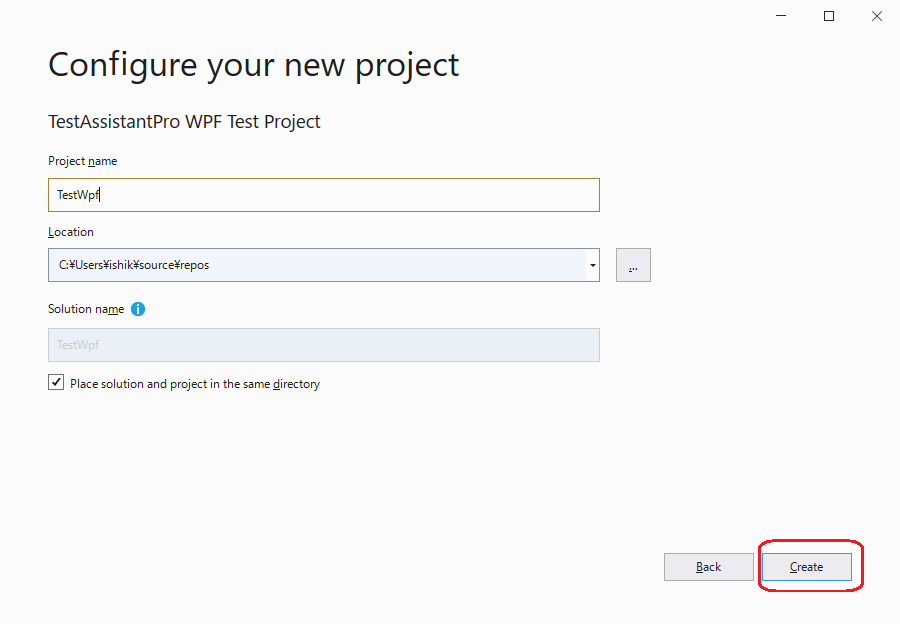
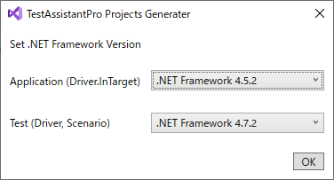
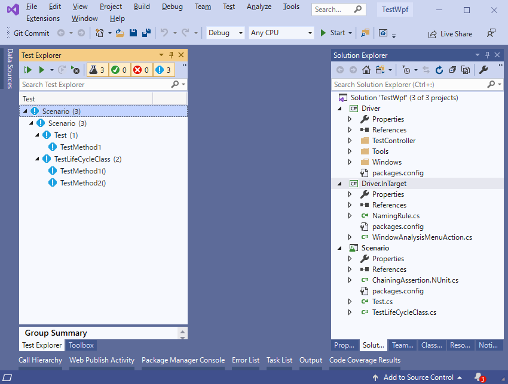

## ウィザードを利用してプロジェクトを追加する

Visual Studioを起動して「新しいプロジェクトの追加」ダイアログを表示します。「テンプレートの検索」テキストボックスに"Test"と入力してプロジェクトリストを更新します。
更新されたプロジェクトリストの中から「TestAssistantPro WPF Test Project」を選択して、「次へ」ボタンを押下します。

「新しいプロジェクトを構成します」画面表示されるため任意のプロジェクト名と場所を入力して「作成」ボタンを押下してください。

最後に利用する.netのバージョンを設定します。

「Application(Driver.InTarget)」はDriver.InTargetプロジェクトで利用するバージョンを指定します。テスト対象のアプリケーションにインジェクトションされるコードとなるため、必ずテスト対象のアプリケーションで利用されている.netのバージョン以下の値を指定する必要があります。
「Test(Driver, Schenario)」には、必ず「Application(Driver.InTarget)」のバージョン以上を指定してください。

サンプルアプリケーションは .NET Framework 4.5.2が利用されてます。そのため「Application(Driver.InTarget)」には「.NET Framework 4.5.2」を選択する必要があります。

適切なバージョンを選択し、「OK」をクリックしてください。入力した内容をもとに3つのプロジェクトが「ソリューションエクスプローラー」で確認できます。
また、「Scenario」プロジェクトにサンプルのテストが配置されていることが「テストエクスプローラー」から確認できます。

