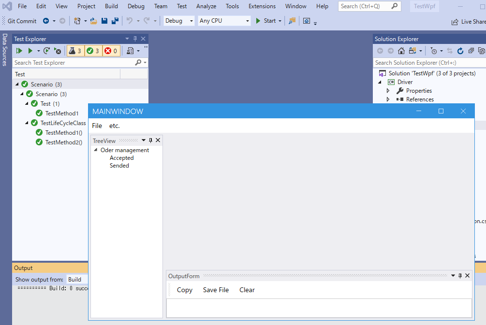

## テストを実行して動作を確認する

「テストエクスプローラー」からテストを実行して問題なくテストソリューションが作成できているかを確認してください。
テストを実行するとテスト対象アプリケーションが起動して、自動的に終了され、テストが成功することを確認できます。

## 次の手順

ここまでテストを実装するためのテストソリューションを作成できました。
次はテスト対象アプリケーションをテストシナリオから操作しやすいようにするためのドライバを作成します。

[アプリケーションをキャプチャしてWindowDriverおよびUserControlDriverを作成する](WindowDriver.md)