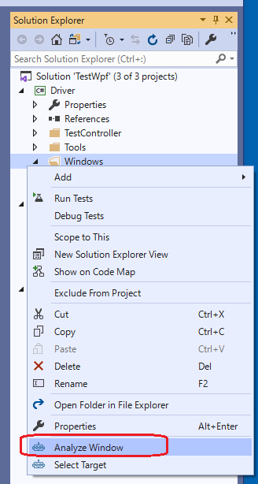
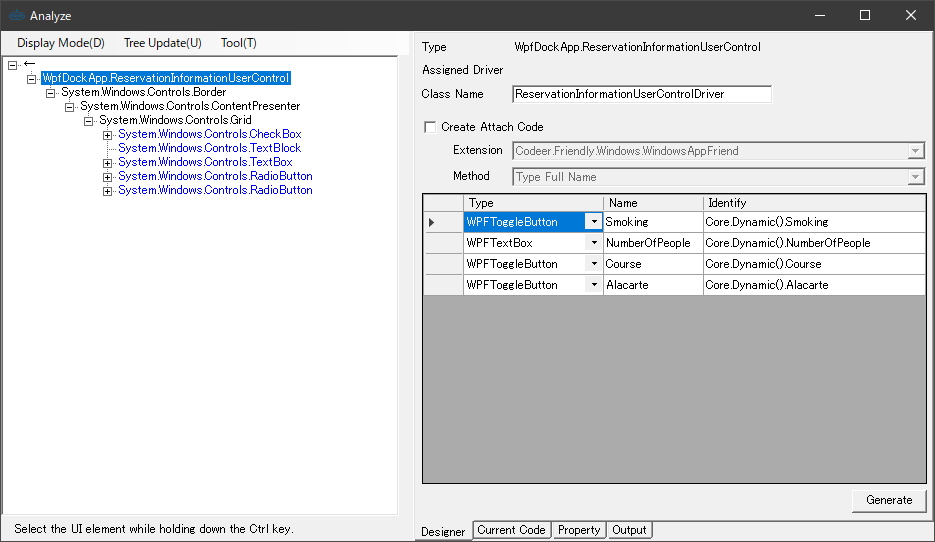
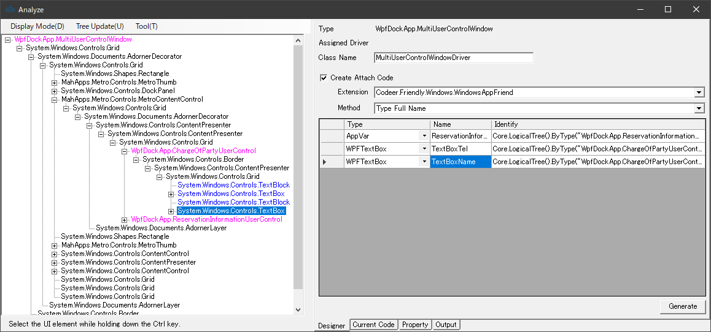
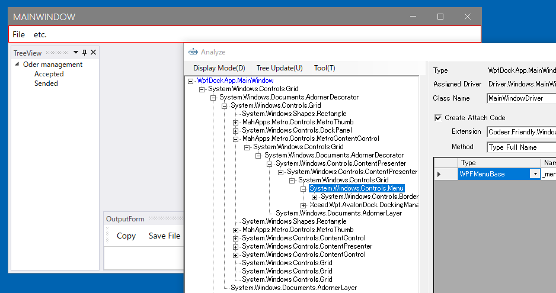
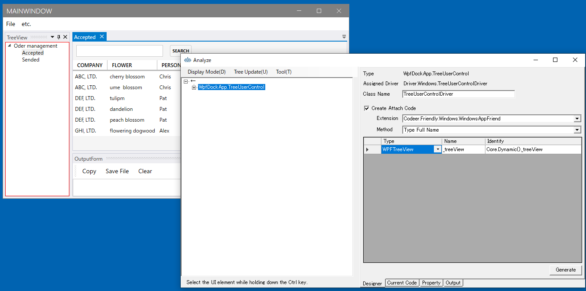
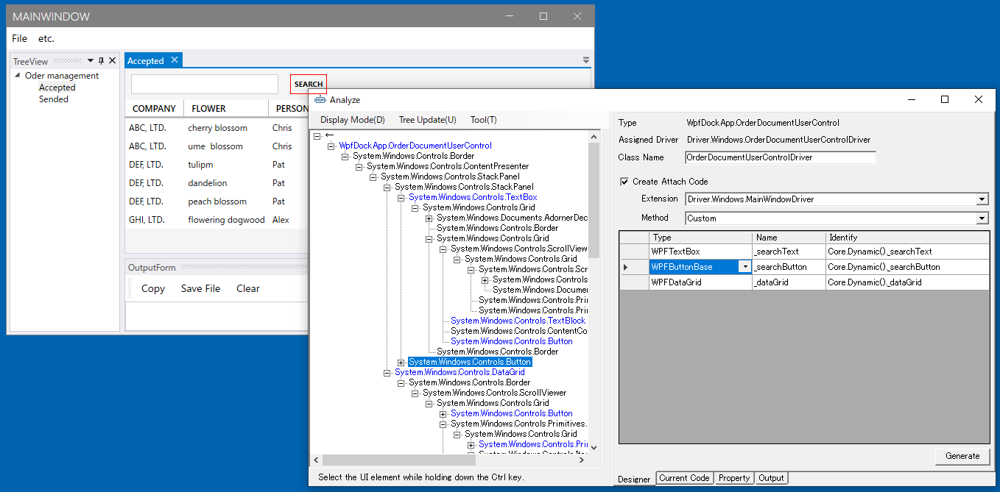

# アプリケーションを解析してWindowDriverおよびUserControlDriverを作成する

[テストソリューションを新規作成する](./Sln.md)で作成したソリューションにTestAssistantProを利用してアプリケーションのドライバを作ります。

ドライバ(WindowDriver/UserControlDriver/ControlDriver)が理解できていない場合は先に
[Driver/Scenarioパターン](https://github.com/Codeer-Software/Friendly/blob/master/TestAutomationDesign.jp.md)
を参照してください。

各機能の詳細な内容は次を参照してください。

- [AnalyzeWindowによるアプリケーションの解析](../feature/AnalyzeWindow.md)
- [AnalyzeWindowで生成されるコード](../feature/GeneratedCode.md)
- [Attach方法ごとのコード](../feature/Attach.md)

## AnalzeWindowの表示

ソリューションエクスプローラーのDriverプロジェクトのWindowsフォルダで右クリックしてAnalyze Windowを実行します。



テスト対象のアプリケーションを選択する画面が出ますので、MainFormを選択してください。


詳細は「[AnalyzeWindow/AnalyzeWindowの起動](../feature/AnalyzeWindow.md#AnalyzeWindowの起動)」を参照してください。

## Simple Dialogのドライバの作成

対象アプリケーションのMainFrameのメニューから[etc] - [Simple Dialog]を選択して、ダイアログを表示します。
ダイアログが表示されるAnalyzeWindowは自動的にその内容を読み取りUI解析ツリーを更新します。


UI解析ツリーのルートで右クリックメニューを表示して[Pickup Children]を実行します。
そうするとグリッドに ControlDriver の割り当たった要素がピックアップされます。

- 名前はデフォルトでは変数名になっていますが、変更できます。
- ラベルは Pickup Chidlren では無視されますが、必要ならツリーの要素をダブルクリックすることにより追加で登録できます。

必要な要素を登録したら[Generate]ボタンを押してコードを生成します。
[Create Attach Code]はデフォルトの状態で生成してください。


"Generated"と記載されたメッセージボックスが表示され、[Windows]フォルダの下にファイルが生成されます。
コードの詳細は[AnalyzeWindowで生成されるコード](../feature/GeneratedCode.md)と[Attach方法ごとのコード](../feature/Attach.md)を参照してください。

```cs
using Codeer.Friendly;
using Codeer.Friendly.Dynamic;
using Codeer.Friendly.Windows;
using Codeer.Friendly.Windows.Grasp;
using Codeer.TestAssistant.GeneratorToolKit;
using RM.Friendly.WPFStandardControls;
using System.Linq;

namespace Driver.Windows
{
    [WindowDriver(TypeFullName = "WpfDockApp.SimpleWindow")]
    public class SimpleWindowDriver
    {
        public WindowControl Core { get; }
        public WPFTextBox TextBox => Core.LogicalTree().ByBinding("UserName").Single().Dynamic(); 
        public WPFDatePicker DatePicker => Core.LogicalTree().ByBinding("Birthday").Single().Dynamic(); 
        public WPFComboBox ComboBox => Core.LogicalTree().ByBinding("UserLanguage").Single().Dynamic(); 
        public WPFTextBox TextBox0 => Core.LogicalTree().ByBinding("Remarks").Single().Dynamic(); 
        public WPFButtonBase OK => Core.Dynamic().OK; 
        public WPFButtonBase Cancel => Core.Dynamic().Cancel; 

        public SimpleWindowDriver(WindowControl core)
        {
            Core = core;
        }

        public SimpleWindowDriver(AppVar core)
        {
            Core = new WindowControl(core);
        }
    }

    public static class SimpleWindowDriverExtensions
    {
        [WindowDriverIdentify(TypeFullName = "WpfDockApp.SimpleWindow")]
        public static SimpleWindowDriver AttachSimpleWindow(this WindowsAppFriend app)
            => app.WaitForIdentifyFromTypeFullName("WpfDockApp.SimpleWindow").Dynamic();
    }
}
```

次に画面操作を行い、生成したドライバを使ったテストコードを生成します。
Analyze Window を閉じて Scenario/Test.csのTestMethod1で右クリックして表示されたコンテキストメニューから[Capture]を選択してください。


[Capture]ウィンドウが表示されたら、Simple Dialogを操作して、内容を記録します。最後に[Generate]ボタンをクリックして、コードを生成します。


選択していたテストメソッドにコードが挿入されていることを確認してください。

## Multi UserControl Dialogのドライバの作成

次は2つのUserContorlが含まれているMultiUserControlFormのドライバを作成します。
対象アプリケーションのMainFrameのメニューから[etc] - [Multi UserControl Dialog]を選択して、ダイアログを表示します。


最初に右側のUserControlのドライバを作りみます。
ツリー上で[ReservationInformationUserControl]を選択し、右クリックから[Change The Analysis Target]を選択します。
解析対象が切り替わり、UI解析ツリーおよびDesignerタブの内容が[ReservationInformationUserControl]を起点にした内容で置き換わります。
必要なコントロールを Designer に登録して Generate ボタンでコードを生成します。



```cs
using Codeer.Friendly;
using Codeer.Friendly.Dynamic;
using Codeer.Friendly.Windows;
using Codeer.Friendly.Windows.Grasp;
using Codeer.TestAssistant.GeneratorToolKit;
using RM.Friendly.WPFStandardControls;
using System.Linq;

namespace Driver.Windows
{
    [UserControlDriver(TypeFullName = "WpfDockApp.ReservationInformationUserControl")]
    public class ReservationInformationUserControlDriver
    {
        public WPFUserControl Core { get; }
        public WPFToggleButton Smoking => Core.Dynamic().Smoking; 
        public WPFTextBox NumberOfPeople => Core.Dynamic().NumberOfPeople; 
        public WPFToggleButton Course => Core.Dynamic().Course; 
        public WPFToggleButton Alacarte => Core.Dynamic().Alacarte; 

        public ReservationInformationUserControlDriver(AppVar core)
        {
            Core = new WPFUserControl(core);
        }
    }
}
```

次に左側のUserControlに対するコードを生成します。今回はドライバを作成せずFormに直接UserControlの要素を配置します。
UI解析ツリーの[ChangeOfPartyUserControl]の下に表示されている2つのテキストボックスをダブルクリックしてDesignerタブのグリッドに追加してください。



[Generate]ボタンをクリックしてコードを生成します。

```cs
using Codeer.Friendly;
using Codeer.Friendly.Dynamic;
using Codeer.Friendly.Windows;
using Codeer.Friendly.Windows.Grasp;
using Codeer.TestAssistant.GeneratorToolKit;
using RM.Friendly.WPFStandardControls;
using System.Linq;

namespace Driver.Windows
{
    [WindowDriver(TypeFullName = "WpfDockApp.MultiUserControlWindow")]
    public class MultiUserControlWindowDriver
    {
        public WindowControl Core { get; }
        public AppVar ReservationInformationUserControl => Core.LogicalTree().ByType("WpfDockApp.ReservationInformationUserControl").Single().Dynamic(); 
        public WPFTextBox TextBoxTel => Core.LogicalTree().ByType("WpfDockApp.ChargeOfPartyUserControl").Single().LogicalTree().ByBinding("UserName").Single().Dynamic(); 
        public WPFTextBox TextBoxName => Core.LogicalTree().ByType("WpfDockApp.ChargeOfPartyUserControl").Single().LogicalTree().ByBinding("Tel").Single().Dynamic(); 

        public MultiUserControlWindowDriver(WindowControl core)
        {
            Core = core;
        }

        public MultiUserControlWindowDriver(AppVar core)
        {
            Core = new WindowControl(core);
        }
    }

    public static class MultiUserControlWindowDriverExtensions
    {
        [WindowDriverIdentify(TypeFullName = "WpfDockApp.MultiUserControlWindow")]
        public static MultiUserControlWindowDriver AttachMultiUserControlWindow(this WindowsAppFriend app)
            => app.WaitForIdentifyFromTypeFullName("WpfDockApp.MultiUserControlWindow").Dynamic();
    }
}
```

## MainWindowのドライバの作成

<!--TODO: なぜ、メニューだけを持つウィンドウと考えるか、またそれ以外はどうするのかの概要を記述する-->
MainForm は複数のドッキングウィンドウで構成されています。ここでは MainWindowはメニューだけを持つウィンドウと考えます。
メニューだけをプロパティに追加して、ドライバを生成してください。



```cs
using Codeer.Friendly;
using Codeer.Friendly.Dynamic;
using Codeer.Friendly.Windows;
using Codeer.Friendly.Windows.Grasp;
using Codeer.TestAssistant.GeneratorToolKit;
using RM.Friendly.WPFStandardControls;
using System.Linq;

namespace Driver.Windows
{
    [WindowDriver(TypeFullName = "WpfDockApp.MainWindow")]
    public class MainWindowDriver
    {
        public WindowControl Core { get; }
        public WPFMenuBase Menu => Core.Dynamic().Menu; 

        public MainWindowDriver(WindowControl core)
        {
            Core = core;
        }

        public MainWindowDriver(AppVar core)
        {
            Core = new WindowControl(core);
        }
    }

    public static class MainWindowDriverExtensions
    {
        [WindowDriverIdentify(TypeFullName = "WpfDockApp.MainWindow")]
        public static MainWindowDriver AttachMainWindow(this WindowsAppFriend app)
            => app.WaitForIdentifyFromTypeFullName("WpfDockApp.MainWindow").Dynamic();
    }
}
```

## TreeUserControlとOutputUserControl のドライバの作成

TreeUserControl と OutputUserControl は UserControlDriver として作成します。
これはAttach方式にします。
Attach対象は MainFromDriver ではなく WindowsAppFrined (アプリケーション全体)にします。
これはフローティング状態にするなどさまざまな状態を作ることができるからです。

まずは TreeUserControl の UserControlDriver を作ります。
Ctrlキーを押しながらMainWindowのTreeにマウスオーバーすることでTreeViewがUI解析ツリーで選択状態になります。
一つ上の要素にTreeUserControlがあるので、選択してコンテキストメニューより[Change The Analysis Target]を選択します。
TreeUserControlの子要素であるTreeViewをダブルクリックしてプロパティに追加します。

Designerタブの内容を次のように変更し、[Generate]ボタンをクリックしてコードを生成します。
記載されている内容以外はデフォルトのままにしておきます。

| 項目 | 設定内容 |
|-----|--------|
| Create Attach Code | チェックをつける |
| Extension | WindowAppFriend |

このオプションの詳細は [Attach方法ごとのコード](../feature/Attach.md)を参照してください。



```cs
using Codeer.Friendly;
using Codeer.Friendly.Dynamic;
using Codeer.Friendly.Windows;
using Codeer.Friendly.Windows.Grasp;
using Codeer.TestAssistant.GeneratorToolKit;
using RM.Friendly.WPFStandardControls;
using System.Linq;

namespace Driver.Windows
{
    [UserControlDriver(TypeFullName = "WpfDockApp.TreeUserControl")]
    public class TreeUserControlDriver
    {
        public WPFUserControl Core { get; }

        public TreeUserControlDriver(AppVar core)
        {
            Core = new WPFUserControl(core);
        }
    }

    public static class TreeUserControlDriverExtensions
    {
        [UserControlDriverIdentify]
        public static TreeUserControlDriver AttachTreeUserControl(this WindowsAppFriend app)
            => app.GetTopLevelWindows().SelectMany(e => e.GetFromTypeFullName("WpfDockApp.TreeUserControl")).FirstOrDefault()?.Dynamic();
    }
}
```

OutputUserControl も同様に作成てください。

```cs
using Codeer.Friendly;
using Codeer.Friendly.Dynamic;
using Codeer.Friendly.Windows;
using Codeer.Friendly.Windows.Grasp;
using Codeer.TestAssistant.GeneratorToolKit;
using RM.Friendly.WPFStandardControls;
using System.Linq;

namespace Driver.Windows
{
    [UserControlDriver(TypeFullName = "WpfDockApp.OutputUserControl")]
    public class OutputUserControlDriver
    {
        public WPFUserControl Core { get; }
        public WPFButtonBase ButtonCopy => Core.Dynamic().ButtonCopy; 
        public WPFButtonBase ButtonSaveFile => Core.Dynamic().ButtonSaveFile; 
        public WPFButtonBase ButtonClear => Core.Dynamic().ButtonClear; 
        public WPFTextBox TextBox => Core.Dynamic().TextBox; 

        public OutputUserControlDriver(AppVar core)
        {
            Core = new WPFUserControl(core);
        }
    }

    public static class OutputUserControlDriverExtensions
    {
        [UserControlDriverIdentify]
        public static OutputUserControlDriver AttachOutputUserControl(this WindowsAppFriend app)
            => app.GetTopLevelWindows().SelectMany(e => e.GetFromTypeFullName("WpfDockApp.OutputUserControl")).FirstOrDefault()?.Dynamic();
    }
}
```

## Documentのドライバの作成

<!--TODO: Documentとはそもそもどのウィンドウ？同じタイプとは？-->

Document は同じタイプのものが複数存在します。
取得方法は Customを利用しTitleプロパティが一致するものを取得し、 WindowsAppFriend にAttachするように設定します。
Attachのオプションの詳細は [Attach方法ごとのコード](../feature/Attach.md)を参照してください。



```cs
using Codeer.Friendly;
using Codeer.Friendly.Dynamic;
using Codeer.Friendly.Windows;
using Codeer.Friendly.Windows.Grasp;
using Codeer.TestAssistant.GeneratorToolKit;
using RM.Friendly.WPFStandardControls;
using System.Linq;

namespace Driver.Windows
{
    [UserControlDriver(TypeFullName = "WpfDockApp.OrderDocumentUserControl")]
    public class OrderDocumentUserControlDriver
    {
        public WPFUserControl Core { get; }
        public WPFTextBox SearchText => Core.Dynamic().SearchText; 
        public WPFButtonBase SearchButton => Core.Dynamic().SearchButton; 
        public WPFDataGrid DataGrid => Core.Dynamic().DataGrid; 

        public OrderDocumentUserControlDriver(AppVar core)
        {
            Core = new WPFUserControl(core);
        }
    }

    public static class OrderDocumentUserControlDriverExtensions
    {
        [UserControlDriverIdentify(CustomMethod = "TryGet")]
        public static OrderDocumentUserControlDriver AttachOrderDocumentUserControl(this WindowsAppFriend app, string identifier)
            => app.GetTopLevelWindows().
                    Select(e => e.VisualTree().ByType("WpfDockApp.OrderDocumentUserControl").SingleOrDefault()).
                    Where(e => !e.IsNull).
                    Where(e => (string)e.Dynamic().Title == identifier).
                    FirstOrDefault()?.Dynamic();
        public static void TryGet(this WindowsAppFriend app, out string[] identifier)
            => identifier = app.GetTopLevelWindows().
                Select(e => e.VisualTree().ByType("WpfDockApp.OrderDocumentUserControl").SingleOrDefault()).
                Where(e => !e.IsNull).
                Select(e => (string)e.Dynamic().Title).
                ToArray();
    }
}
```

## 次の手順

ここまで画面キャプチャを行うためのドライバの作成が完了しました。
次は標準ではキャプチャに対応していないコントロールに対応するためのControlDriverを作成します。

[ControlDriverとCaptureCodeGeneratorを作成する](ControlDriver.md)