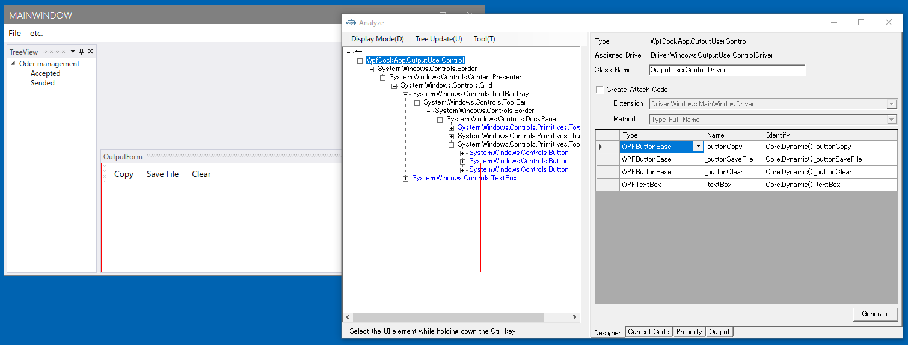

# アプリケーションを解析してWindowDriverおよびUserControlDriverを作成する

[テストソリューションを新規作成する](./Sln.md)で作成したソリューションにTestAssistantProを利用してアプリケーションのドライバを作ります。

ドライバ(WindowDriver/UserControlDriver/ControlDriver)が理解できていない場合は先に
[Driver/Scenarioパターン](https://github.com/Codeer-Software/Friendly/blob/master/TestAutomationDesign.jp.md)
を参照してください。

各機能の詳細な内容は次を参照してください。

- [AnalyzeWindowによるアプリケーションの解析](../feature/AnalyzeWindow.md)
- [AnalyzeWindowで生成されるコード](../feature/GeneratedCode.md)
- [Attach方法ごとのコード](../feature/Attach.md)

## 事前準備
WpfDockApp.exeを起動してください。ドライバの作成は操作対象のアプリケーションを解析しながら行います。

## AnalzeWindowの表示

ソリューションエクスプローラーのDriverプロジェクトのWindowsフォルダで右クリックしてAnalyze Windowを実行します。


テスト対象のアプリケーションを選択する画面が出ますので、MainWindowを選択してください。（ダブルクリックもしくは選択状態にしてからEnterキー押下で選択できます）


詳細は「[AnalyzeWindow/AnalyzeWindowの起動](../feature/AnalyzeWindow.md#AnalyzeWindowの起動)」を参照してください。

## Simple Dialogのドライバの作成

対象アプリケーションのメニューから[etc] - [Simple Dialog]を選択して、ダイアログを表示します。
ダイアログが表示されるAnalyzeWindowは自動的にその内容を読み取りUI解析ツリーを更新します。


UI解析ツリーのルートで右クリックメニューを表示して[Pickup Children]を実行します。
そうするとグリッドに ControlDriver の割り当たった要素がピックアップされます。
ピックアップされた要素をグリッド上で選択すると対応するコントロールが赤枠で囲まれます。
特に使わないものもピックアップされるので必要ないものは削除しておきます。
タイトルバーのボタン類は使わないので消しておきます。

- 名前はデフォルトでは変数名になっていますが、変更できます。
- ラベルは Pickup Chidlren では無視されますが、必要ならツリーの要素をダブルクリックすることにより追加で登録できます。
- グリッド上で要素を選択しDeleteキーを押すことで削除できます。

必要な要素を登録したら[Generate]ボタンを押してコードを生成します。
[Create Attach Code]はデフォルトの状態で生成してください。


"Generated"と記載されたメッセージボックスが表示され、[Windows]フォルダの下にファイルが生成されます。
コードの詳細は[AnalyzeWindowで生成されるコード](../feature/GeneratedCode.md)と[Attach方法ごとのコード](../feature/Attach.md)を参照してください。

```cs
using Codeer.Friendly;
using Codeer.Friendly.Dynamic;
using Codeer.Friendly.Windows;
using Codeer.Friendly.Windows.Grasp;
using Codeer.TestAssistant.GeneratorToolKit;
using RM.Friendly.WPFStandardControls;
using System.Linq;

namespace Driver.Windows
{
    [WindowDriver(TypeFullName = "WpfDockApp.SimpleWindow")]
    public class SimpleWindowDriver
    {
        public WindowControl Core { get; }
        public WPFTextBox UserName => Core.LogicalTree().ByBinding("UserName").Single().Dynamic(); 
        public WPFContextMenu UserNameContextMenu => new WPFContextMenu{Target = TextBox.AppVar};
        public WPFDatePicker Birthday => Core.LogicalTree().ByBinding("Birthday").Single().Dynamic(); 
        public WPFComboBox UserLanguage => Core.LogicalTree().ByBinding("UserLanguage").Single().Dynamic(); 
        public WPFTextBox Remarks => Core.LogicalTree().ByBinding("Remarks").Single().Dynamic(); 
        public WPFContextMenu RemarksContextMenu => new WPFContextMenu{Target = Remarks.AppVar};
        public WPFButtonBase _oK => Core.Dynamic()._oK; 
        public WPFButtonBase _cancel => Core.Dynamic()._cancel; 

        public SimpleWindowDriver(WindowControl core)
        {
            Core = core;
        }

        public SimpleWindowDriver(AppVar core)
        {
            Core = new WindowControl(core);
        }
    }

    public static class SimpleWindowDriverExtensions
    {
        [WindowDriverIdentify(TypeFullName = "WpfDockApp.SimpleWindow")]
        public static SimpleWindowDriver AttachSimpleWindow(this WindowsAppFriend app)
            => app.WaitForIdentifyFromTypeFullName("WpfDockApp.SimpleWindow").Dynamic();
    }
}
```

次に画面操作を行い、生成したドライバを使ったテストコードを生成します。
Analyze Window を閉じて Scenario/Test.csのTestMethod1で右クリックして表示されたコンテキストメニューから[Capture]を選択してください。


[Capture]ウィンドウが表示されたら、Simple Dialogを操作して、内容を記録します。最後に[Generate]ボタンをクリックして、コードを生成します。


選択していたテストメソッドにコードが挿入されていることを確認してください。

## 少しずつ確認しながら作成する
上記の例のようにドライバを作成したら、キャプチャできるか確認してください。
特に最初のうちは少しずつ作業を進めることが重要です。
問題があれば[デバッグし](../feature/CaptureAndExecute.md#デバッグ)ながらキャプチャをしてみて問題を突きとめてください。
また、CaptureウィンドウのAttachツリーも役に立ちます。現在アタッチされているWindowが表示されます。


## Multi UserControl Dialogのドライバの作成

次は2つのUserContorlが含まれているMultiUserControlWindowのドライバを作成します。
対象アプリケーションのメニューから[etc] - [Multi UserControl Dialog]を選択して、ダイアログを表示します。


最初に右側のUserControlのドライバを作ります。
ツリー上で[ReservationInformationUserControl]を選択し、右クリックから[Change The Analysis Target]を選択します。
解析対象が切り替わり、UI解析ツリーおよびDesignerタブの内容が[ReservationInformationUserControl]を起点にした内容で置き換わります。
必要なコントロールを Designer に登録して Generate ボタンでコードを生成します。


```cs
using Codeer.Friendly;
using Codeer.Friendly.Dynamic;
using Codeer.Friendly.Windows;
using Codeer.Friendly.Windows.Grasp;
using Codeer.TestAssistant.GeneratorToolKit;
using RM.Friendly.WPFStandardControls;
using System.Linq;

namespace Driver.Windows
{
    [UserControlDriver(TypeFullName = "WpfDockApp.ReservationInformationUserControl")]
    public class ReservationInformationUserControlDriver
    {
        public WPFUserControl Core { get; }
        public WPFToggleButton _smoking => Core.Dynamic()._smoking; 
        public WPFTextBox _numberOfPeople => Core.Dynamic()._numberOfPeople; 
        public WPFContextMenu _numberOfPeopleContextMenu => new WPFContextMenu{Target = NumberOfPeople.AppVar};
        public WPFToggleButton _course => Core.Dynamic()._course; 
        public WPFToggleButton _alacarte => Core.Dynamic()._alacarte; 

        public ReservationInformationUserControlDriver(AppVar core)
        {
            Core = new WPFUserControl(core);
        }
    }
}
```
解析対象を親ウィンドウ戻すにはツリーのルートの[←]をダブルクリックするか、そこを右クリックで[Change The Analysis Target]を選択します。


次に左側のUserControlに対するコードを生成します。今回はドライバを作成せずWindowに直接UserControlの要素を配置します。
UserControlDriverを作るか親のWindowDriverに直接配置するかは状況によって判断してください。
ダイアログで常に表示されているUserControlの場合は、親のWindowDriverに直接配置しても良い場合が多くあります。
UI解析ツリーの[ChangeOfPartyUserControl]の下に表示されている2つのテキストボックスをダブルクリックしてDesignerタブのグリッドに追加してください。
またReservationInformationUserControlも追加してください。先ほど作ったReservationInformationUserControlDriverが割り当たります。


[Generate]ボタンをクリックしてコードを生成します。

```cs
using Codeer.Friendly;
using Codeer.Friendly.Dynamic;
using Codeer.Friendly.Windows;
using Codeer.Friendly.Windows.Grasp;
using Codeer.TestAssistant.GeneratorToolKit;
using RM.Friendly.WPFStandardControls;
using System.Linq;

namespace Driver.Windows
{
    [WindowDriver(TypeFullName = "WpfDockApp.MultiUserControlWindow")]
    public class MultiUserControlWindowDriver
    {
        public WindowControl Core { get; }
        public AppVar ReservationInformationUserControl => Core.LogicalTree().ByType("WpfDockApp.ReservationInformationUserControl").Single().Dynamic(); 
        public WPFTextBox UserName => Core.LogicalTree().ByType("WpfDockApp.ChargeOfPartyUserControl").Single().LogicalTree().ByBinding("UserName").Single().Dynamic(); 
        public WPFContextMenu UserNameContextMenu => new WPFContextMenu{Target = UserName.AppVar};
        public WPFTextBox Tel => Core.LogicalTree().ByType("WpfDockApp.ChargeOfPartyUserControl").Single().LogicalTree().ByBinding("Tel").Single().Dynamic(); 
        public WPFContextMenu TelContextMenu => new WPFContextMenu{Target = Tel.AppVar};

        public MultiUserControlWindowDriver(WindowControl core)
        {
            Core = core;
        }

        public MultiUserControlWindowDriver(AppVar core)
        {
            Core = new WindowControl(core);
        }
    }

    public static class MultiUserControlWindowDriverExtensions
    {
        [WindowDriverIdentify(TypeFullName = "WpfDockApp.MultiUserControlWindow")]
        public static MultiUserControlWindowDriver AttachMultiUserControlWindow(this WindowsAppFriend app)
            => app.WaitForIdentifyFromTypeFullName("WpfDockApp.MultiUserControlWindow").Dynamic();
    }
}
```

## MainWindowのドライバの作成
MainWindow は複数のドッキングウィンドウで構成されています。ここでは MainWindow はメニューだけを持つウィンドウと考えます。
残りのTreeViewやOutputViewはUserControlとしてAttach形式で作成します。（のちほど説明します）
メニューだけをプロパティに追加して、ドライバを生成してください。
Controlキーを押しながらメニューのあたりにカーソルを持っていくとメニューもしくはその子要素を選択できます。
その後にAnalyzeWindowのTreeでメニューを選択します。ドライバが割り当たっている要素は文字色が青になっています。


```cs
using Codeer.Friendly;
using Codeer.Friendly.Dynamic;
using Codeer.Friendly.Windows;
using Codeer.Friendly.Windows.Grasp;
using Codeer.TestAssistant.GeneratorToolKit;
using RM.Friendly.WPFStandardControls;
using System.Linq;

namespace Driver.Windows
{
    [WindowDriver(TypeFullName = "WpfDockApp.MainWindow")]
    public class MainWindowDriver
    {
        public WindowControl Core { get; }
        public WPFMenuBase Menu => Core.Dynamic()._menu; 

        public MainWindowDriver(WindowControl core)
        {
            Core = core;
        }

        public MainWindowDriver(AppVar core)
        {
            Core = new WindowControl(core);
        }
    }

    public static class MainWindowDriverExtensions
    {
        [WindowDriverIdentify(TypeFullName = "WpfDockApp.MainWindow")]
        public static MainWindowDriver AttachMainWindow(this WindowsAppFriend app)
            => app.WaitForIdentifyFromTypeFullName("WpfDockApp.MainWindow").Dynamic();
    }
}
```

## TreeUserControlとOutputUserControl のドライバの作成

TreeUserControl と OutputUserControl は UserControlDriver として作成します。
これはAttach方式にします。
Attach対象は MainFromDriver ではなく WindowsAppFrined (アプリケーション全体)にします。
これはフローティング状態にするなどさまざまな状態を作ることができるからです。

まずは TreeUserControl の UserControlDriver を作ります。
Ctrlキーを押しながらMainWindowのTreeにマウスオーバーすることでTreeUserControlの子要素がUI解析ツリーで選択状態になります。
AnalyzeWindowのTree上でいくつか上の要素にTreeUserControlがあるので、選択してコンテキストメニューより[Change The Analysis Target]を選択します。
TreeUserControlの子要素であるTreeViewをダブルクリックしてプロパティに追加します。

Designerタブの内容を次のように変更し、[Generate]ボタンをクリックしてコードを生成します。
記載されている内容以外はデフォルトのままにしておきます。

| 項目 | 設定内容 |
|-----|--------|
| Create Attach Code | チェックをつける |
| Extension | WindowAppFriend |

このオプションの詳細は [Attach方法ごとのコード](../feature/Attach.md)を参照してください。


```cs
using Codeer.Friendly.Dynamic;
using Codeer.Friendly.Windows;
using Codeer.Friendly.Windows.Grasp;
using Codeer.TestAssistant.GeneratorToolKit;
using RM.Friendly.WPFStandardControls;
using System.Linq;

namespace Driver.Windows
{
    [UserControlDriver(TypeFullName = "WpfDockApp.TreeUserControl")]
    public class TreeUserControlDriver
    {
        public WPFUserControl Core { get; }
        public WPFTreeView TreeView => Core.Dynamic()._treeView; 

        public TreeUserControlDriver(AppVar core)
        {
            Core = new WPFUserControl(core);
        }
    }
}
```

OutputUserControl も同様に作成してください。



```cs
using Codeer.Friendly;
using Codeer.Friendly.Dynamic;
using Codeer.Friendly.Windows;
using Codeer.Friendly.Windows.Grasp;
using Codeer.TestAssistant.GeneratorToolKit;
using RM.Friendly.WPFStandardControls;
using System.Linq;

namespace Driver.Windows
{
    [UserControlDriver(TypeFullName = "WpfDockApp.OutputUserControl")]
    public class OutputUserControlDriver
    {
        public WPFUserControl Core { get; }
        public WPFButtonBase _buttonCopy => Core.Dynamic()._buttonCopy; 
        public WPFButtonBase _buttonSaveFile => Core.Dynamic()._buttonSaveFile; 
        public WPFButtonBase _buttonClear => Core.Dynamic()._buttonClear; 
        public WPFTextBox _textBox => Core.Dynamic()._textBox; 
        public WPFContextMenu _textBoxContextMenu => new WPFContextMenu{Target = _textBox.AppVar};

        public OutputUserControlDriver(AppVar core)
        {
            Core = new WPFUserControl(core);
        }
    }

    public static class OutputUserControlDriverExtensions
    {
        [UserControlDriverIdentify]
        public static OutputUserControlDriver AttachOutputUserControl(this WindowsAppFriend app)
            => app.GetTopLevelWindows().SelectMany(e => e.GetFromTypeFullName("WpfDockApp.OutputUserControl")).FirstOrDefault()?.Dynamic();
    }
}
```

## Documentのドライバの作成
Document は TreeView の AcceptedもしくはSendedから開くことができます。これは同じクラスで表示するデータが異なっているだけです。一般的にドキュメントは同じタイプのものが複数存在します。
このような場合は Attach で Custom の取得方法を利用します。それぞれの特定方法はものによって異なるのでコードで実装する必要があります。
今回はTitleプロパティで判断するようにします。AnalyzeWindowではAttachを下記のように設定します。
またPickupChildrenで要素を取得してからGenerateを実行します。

| 項目 | 設定内容 |
|-----|--------|
| Create Attach Code | チェックをつける |
| Extension | WindowAppFriend |
| Method | Custom |

生成されたコードを以下のように書き換えます。
Titleの取得はドキュメントを親方向にたどっていって存在するLayoutDocumentControlに対する操作で実現できます。
この作業には利用しているライブラリの知識が必要です。
多くの場合、アプリケーション開発チームのメンバーは対応可能でしょう。
Attachのオプションの詳細は [Attach方法ごとのコード](../feature/Attach.md)を参照してください。


```cs
using Codeer.Friendly;
using Codeer.Friendly.Dynamic;
using Codeer.Friendly.Windows;
using Codeer.Friendly.Windows.Grasp;
using Codeer.TestAssistant.GeneratorToolKit;
using RM.Friendly.WPFStandardControls;
using System.Linq;

namespace Driver.Windows
{
    [UserControlDriver(TypeFullName = "WpfDockApp.OrderDocumentUserControl")]
    public class OrderDocumentUserControlDriver
    {
        public WPFUserControl Core { get; }
        public WPFTextBox _searchText => Core.Dynamic()._searchText; 
        public WPFContextMenu _searchTextContextMenu => new WPFContextMenu{Target = _searchText.AppVar};
        public WPFButtonBase _searchButton => Core.Dynamic()._searchButton; 
        public WPFDataGrid _dataGrid => Core.Dynamic()._dataGrid; 

        public OrderDocumentUserControlDriver(AppVar core)
        {
            Core = new WPFUserControl(core);
        }
    }

    public static class OrderDocumentUserControlDriverExtensions
    {
        //ここに特定のためのカスタムコードを入れる
        //キャプチャ時にTestAssistantProが使うCustomMethod名を指定します。
        [UserControlDriverIdentify(CustomMethod = "TryGet")]
        public static OrderDocumentUserControlDriver AttachOrderDocumentUserControl(this WindowsAppFriend app, string identifier)
            //アプリの全てのウィンドウからTypeが一致するものを取得
            => app.GetTopLevelWindows().
                    SelectMany(e => e.GetFromTypeFullName("WpfDockApp.OrderDocumentUserControl")).
                    //その中でタイトルが一致するものを取得
                    Where(e => GetTitle(e) == identifier).
                    FirstOrDefault()?.Dynamic();

        //キャプチャ時にTestAssisatntProが使います。
        //発見した目的のUserControlの識別子をout引数に入れます。
        public static void TryGet(this WindowsAppFriend app, out string[] identifiers)
            //アプリの全てのウィンドウからTypeが一致するものを取得
             => identifiers = app.GetTopLevelWindows().
                    SelectMany(e => e.GetFromTypeFullName("WpfDockApp.OrderDocumentUserControl")).
                    //識別子にタイトルを使う
                    Select(e => GetTitle(e)).
                    ToArray();

        static string GetTitle(AppVar e)
            //タイトルを取得します。
            //UserContorlから親方向にたどって見つかるLayoutDocumentControlが持っています。
            //これは利用しているライブラリ(今回はXceed)の知識が必要です。
            => e.VisualTree(TreeRunDirection.Ancestors).ByType("Xceed.Wpf.AvalonDock.Controls.LayoutDocumentControl").First().Dynamic().Model.Title;
    }
}
```

## 次の手順

ここまで画面キャプチャを行うためのドライバの作成が完了しました。
次はItemsControlでDataTemplateによってカスタマイズしたものへ対応します。

[カスタマイズされたItemsControlに対応する](ItemsControlDriver.md)