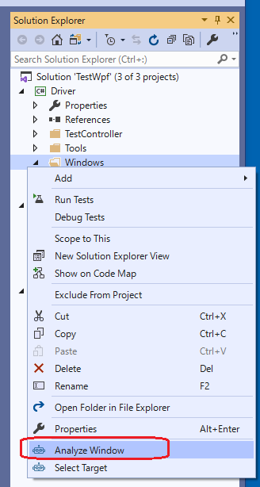
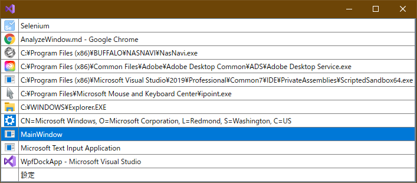

## AnalzeWindowの表示

ソリューションエクスプローラーのDriverプロジェクトのWindowsフォルダで右クリックしてAnalyze Windowを実行します。

テスト対象のアプリケーションを選択する画面が出ますので、MainWindowを選択してください。（ダブルクリックもしくは選択状態にしてからEnterキー押下で選択できます）

詳細は「[AnalyzeWindow/AnalyzeWindowの起動](../feature/AnalyzeWindow.md#AnalyzeWindowの起動)」を参照してください。
