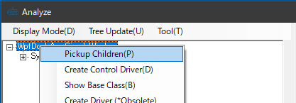
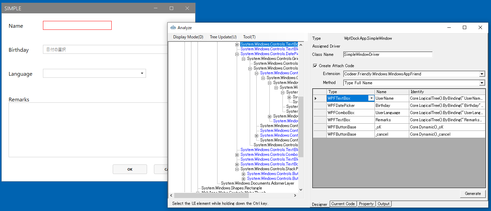

## Simple Dialogのドライバの作成

対象アプリケーションのメニューから[etc] - [Simple Dialog]を選択して、ダイアログを表示します。
ダイアログが表示されるAnalyzeWindowは自動的にその内容を読み取りUI解析ツリーを更新します。



UI解析ツリーのルートで右クリックメニューを表示して[Pickup Children]を実行します。
そうするとグリッドに ControlDriver の割り当たった要素がピックアップされます。

- 名前はデフォルトでは変数名になっていますが、変更できます。
- ラベルは Pickup Chidlren では無視されますが、必要ならツリーの要素をダブルクリックすることにより追加で登録できます。

必要な要素を登録したら[Generate]ボタンを押してコードを生成します。
[Create Attach Code]はデフォルトの状態で生成してください。



"Generated"と記載されたメッセージボックスが表示され、[Windows]フォルダの下にファイルが生成されます。
コードの詳細は[AnalyzeWindowで生成されるコード](../feature/GeneratedCode.md)と[Attach方法ごとのコード](../feature/Attach.md)を参照してください。

```cs
using Codeer.Friendly;
using Codeer.Friendly.Dynamic;
using Codeer.Friendly.Windows;
using Codeer.Friendly.Windows.Grasp;
using Codeer.TestAssistant.GeneratorToolKit;
using RM.Friendly.WPFStandardControls;
using System.Linq;

namespace Driver.Windows
{
    [WindowDriver(TypeFullName = "WpfDockApp.SimpleWindow")]
    public class SimpleWindowDriver
    {
        public WindowControl Core { get; }
        public WPFTextBox TextBox => Core.LogicalTree().ByBinding("UserName").Single().Dynamic(); 
        public WPFContextMenu TextBoxContextMenu => new WPFContextMenu{Target = TextBox.AppVar};
        public WPFDatePicker DatePicker => Core.LogicalTree().ByBinding("Birthday").Single().Dynamic(); 
        public WPFComboBox ComboBox => Core.LogicalTree().ByBinding("UserLanguage").Single().Dynamic(); 
        public WPFTextBox TextBox0 => Core.LogicalTree().ByBinding("Remarks").Single().Dynamic(); 
        public WPFContextMenu TextBoxContextMenu0 => new WPFContextMenu{Target = TextBox0.AppVar};
        public WPFButtonBase OK => Core.Dynamic().OK; 
        public WPFButtonBase Cancel => Core.Dynamic().Cancel; 

        public SimpleWindowDriver(WindowControl core)
        {
            Core = core;
        }

        public SimpleWindowDriver(AppVar core)
        {
            Core = new WindowControl(core);
        }
    }

    public static class SimpleWindowDriverExtensions
    {
        [WindowDriverIdentify(TypeFullName = "WpfDockApp.SimpleWindow")]
        public static SimpleWindowDriver AttachSimpleWindow(this WindowsAppFriend app)
            => app.WaitForIdentifyFromTypeFullName("WpfDockApp.SimpleWindow").Dynamic();
    }
}
```

次に画面操作を行い、生成したドライバを使ったテストコードを生成します。
Analyze Window を閉じて Scenario/Test.csのTestMethod1で右クリックして表示されたコンテキストメニューから[Capture]を選択してください。


[Capture]ウィンドウが表示されたら、Simple Dialogを操作して、内容を記録します。最後に[Generate]ボタンをクリックして、コードを生成します。


選択していたテストメソッドにコードが挿入されていることを確認してください。

上手く動かない場合は[デバッグ](../feature/CaptureAndExecute.md#デバッグ)で原因を特定することができます。

## 次の手順
[Multi UserControl Dialogのドライバの作成](WindowDriver3.md)