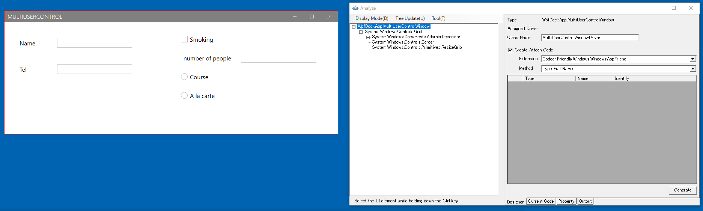
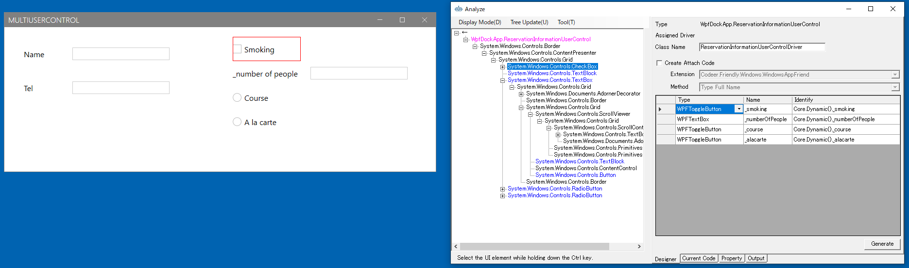
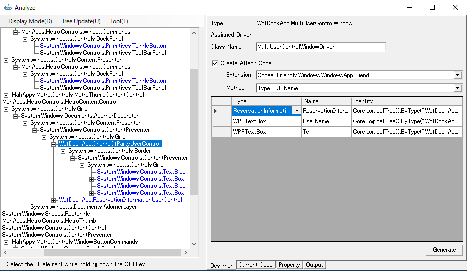

## Multi UserControl Dialogのドライバの作成

次は2つのUserContorlが含まれているMultiUserControlWindowのドライバを作成します。
対象アプリケーションのメニューから[etc] - [Multi UserControl Dialog]を選択して、ダイアログを表示します。


最初に右側のUserControlのドライバを作ります。
ツリー上で[ReservationInformationUserControl]を選択し、右クリックから[Change The Analysis Target]を選択します。
解析対象が切り替わり、UI解析ツリーおよびDesignerタブの内容が[ReservationInformationUserControl]を起点にした内容で置き換わります。
必要なコントロールを Designer に登録して Generate ボタンでコードを生成します。



```cs
using Codeer.Friendly;
using Codeer.Friendly.Dynamic;
using Codeer.Friendly.Windows;
using Codeer.Friendly.Windows.Grasp;
using Codeer.TestAssistant.GeneratorToolKit;
using RM.Friendly.WPFStandardControls;
using System.Linq;

namespace Driver.Windows
{
    [UserControlDriver(TypeFullName = "WpfDockApp.ReservationInformationUserControl")]
    public class ReservationInformationUserControlDriver
    {
        public WPFUserControl Core { get; }
        public WPFToggleButton _smoking => Core.Dynamic()._smoking; 
        public WPFTextBox _numberOfPeople => Core.Dynamic()._numberOfPeople; 
        public WPFContextMenu _numberOfPeopleContextMenu => new WPFContextMenu{Target = NumberOfPeople.AppVar};
        public WPFToggleButton _course => Core.Dynamic()._course; 
        public WPFToggleButton _alacarte => Core.Dynamic()._alacarte; 

        public ReservationInformationUserControlDriver(AppVar core)
        {
            Core = new WPFUserControl(core);
        }
    }
}
```
解析対象を親ウィンドウ戻すにはツリーのルートの[←]をダブルクリックするか、そこを右クリックで[Change The Analysis Target]を選択します。


次に左側のUserControlに対するコードを生成します。今回はドライバを作成せずWindowに直接UserControlの要素を配置します。
UserControlDriverを作るか親のWindowDriverに直接配置するかは状況によって判断してください。
ダイアログで常に表示されているUserControlの場合は、親のWindowDriverに直接配置しても良い場合が多くあります。
UI解析ツリーの[ChangeOfPartyUserControl]の下に表示されている2つのテキストボックスをダブルクリックしてDesignerタブのグリッドに追加してください。
またReservationInformationUserControlも追加してください。先ほど作ったReservationInformationUserControlDriverが割り当たります。


[Generate]ボタンをクリックしてコードを生成します。

```cs
using Codeer.Friendly;
using Codeer.Friendly.Dynamic;
using Codeer.Friendly.Windows;
using Codeer.Friendly.Windows.Grasp;
using Codeer.TestAssistant.GeneratorToolKit;
using RM.Friendly.WPFStandardControls;
using System.Linq;

namespace Driver.Windows
{
    [WindowDriver(TypeFullName = "WpfDockApp.MultiUserControlWindow")]
    public class MultiUserControlWindowDriver
    {
        public WindowControl Core { get; }
        public ReservationInformationUserControlDriver ReservationInformationUserControl => Core.LogicalTree().ByType("WpfDockApp.ReservationInformationUserControl").Single().Dynamic(); 
        public WPFTextBox UserName => Core.LogicalTree().ByType("WpfDockApp.ChargeOfPartyUserControl").Single().LogicalTree().ByBinding("UserName").Single().Dynamic(); 
        public WPFContextMenu UserNameContextMenu => new WPFContextMenu{Target = UserName.AppVar};
        public WPFTextBox Tel => Core.LogicalTree().ByType("WpfDockApp.ChargeOfPartyUserControl").Single().LogicalTree().ByBinding("Tel").Single().Dynamic(); 
        public WPFContextMenu TelContextMenu => new WPFContextMenu{Target = Tel.AppVar};

        public MultiUserControlWindowDriver(WindowControl core)
        {
            Core = core;
        }

        public MultiUserControlWindowDriver(AppVar core)
        {
            Core = new WindowControl(core);
        }
    }

    public static class MultiUserControlWindowDriverExtensions
    {
        [WindowDriverIdentify(TypeFullName = "WpfDockApp.MultiUserControlWindow")]
        public static MultiUserControlWindowDriver AttachMultiUserControlWindow(this WindowsAppFriend app)
            => app.WaitForIdentifyFromTypeFullName("WpfDockApp.MultiUserControlWindow").Dynamic();
    }
}
```

一通り作成できたらキャプチャできるか確認します。


上手く動かない場合は[デバッグ](../feature/CaptureAndExecute.md#デバッグ)で原因を特定することができます。

## 次の手順
[MainWindowのドライバの作成](WindowDriver4.md)