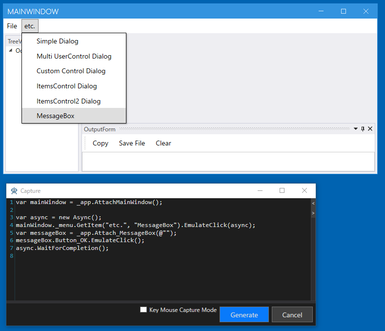

## MainWindowのドライバの作成
MainWindow は複数のドッキングウィンドウで構成されています。ここでは MainWindow はメニューだけを持つウィンドウと考えます。
残りのTreeViewやOutputViewはUserControlとしてAttach形式で作成します。（のちほど説明します）
メニューだけをプロパティに追加して、ドライバを生成してください。
Controlキーを押しながらメニューのあたりにカーソルを持っていくとメニューもしくはその子要素を選択できます。
その後にAnalyzeWindowのTreeでメニューを選択します。ドライバが割り当たっている要素は文字色が青になっています。


```cs
using Codeer.Friendly;
using Codeer.Friendly.Dynamic;
using Codeer.Friendly.Windows;
using Codeer.Friendly.Windows.Grasp;
using Codeer.TestAssistant.GeneratorToolKit;
using RM.Friendly.WPFStandardControls;
using System.Linq;

namespace Driver.Windows
{
    [WindowDriver(TypeFullName = "WpfDockApp.MainWindow")]
    public class MainWindowDriver
    {
        public WindowControl Core { get; }
        public WPFMenuBase Menu => Core.Dynamic()._menu; 

        public MainWindowDriver(WindowControl core)
        {
            Core = core;
        }

        public MainWindowDriver(AppVar core)
        {
            Core = new WindowControl(core);
        }
    }

    public static class MainWindowDriverExtensions
    {
        [WindowDriverIdentify(TypeFullName = "WpfDockApp.MainWindow")]
        public static MainWindowDriver AttachMainWindow(this WindowsAppFriend app)
            => app.WaitForIdentifyFromTypeFullName("WpfDockApp.MainWindow").Dynamic();
    }
}
```

メニューを操作してキャプチャできるか確認します。



上手く動かない場合は[デバッグ](../feature/CaptureAndExecute.md#デバッグ)で原因を特定することができます。

## 次の手順
[TreeUserControlとOutputUserControl のドライバの作成](WindowDriver6.md)