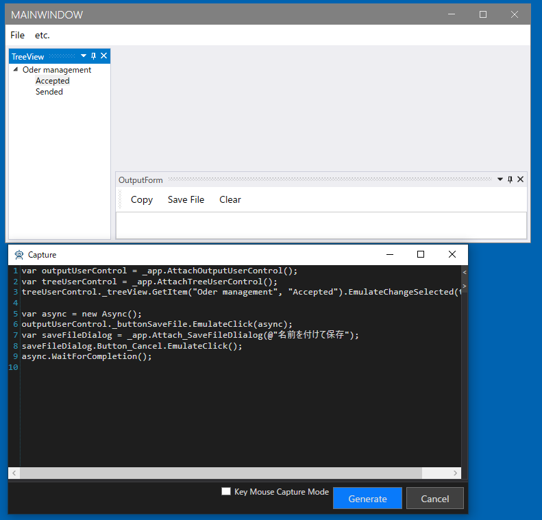

## TreeUserControlとOutputUserControl のドライバの作成

TreeUserControl と OutputUserControl は UserControlDriver として作成します。
これはAttach方式にします。
Attach対象は MainFromDriver ではなく WindowsAppFrined (アプリケーション全体)にします。
これはフローティング状態にするなどさまざまな状態を作ることができるからです。

まずは TreeUserControl の UserControlDriver を作ります。
Ctrlキーを押しながらMainWindowのTreeにマウスオーバーすることでTreeUserControlの子要素がUI解析ツリーで選択状態になります。
AnalyzeWindowのTree上でいくつか上の要素にTreeUserControlがあるので、選択してコンテキストメニューより[Change The Analysis Target]を選択します。
TreeUserControlの子要素であるTreeViewをダブルクリックしてプロパティに追加します。

Designerタブの内容を次のように変更し、[Generate]ボタンをクリックしてコードを生成します。
記載されている内容以外はデフォルトのままにしておきます。

| 項目 | 設定内容 |
|-----|--------|
| Create Attach Code | チェックをつける |
| Extension | WindowAppFriend |

このオプションの詳細は [Attach方法ごとのコード](../feature/Attach.md)を参照してください。


```cs
using Codeer.Friendly.Dynamic;
using Codeer.Friendly.Windows;
using Codeer.Friendly.Windows.Grasp;
using Codeer.TestAssistant.GeneratorToolKit;
using RM.Friendly.WPFStandardControls;
using System.Linq;

namespace Driver.Windows
{
    [UserControlDriver(TypeFullName = "WpfDockApp.TreeUserControl")]
    public class TreeUserControlDriver
    {
        public WPFUIElement Core { get; }
        public WPFTreeView TreeView => Core.Dynamic()._treeView; 

        public TreeUserControlDriver(AppVar core)
        {
            Core = new WPFUIElement(core);
        }
    }
}
```

OutputUserControl も同様に作成してください。


```cs
using Codeer.Friendly;
using Codeer.Friendly.Dynamic;
using Codeer.Friendly.Windows;
using Codeer.Friendly.Windows.Grasp;
using Codeer.TestAssistant.GeneratorToolKit;
using RM.Friendly.WPFStandardControls;
using System.Linq;

namespace Driver.Windows
{
    [UserControlDriver(TypeFullName = "WpfDockApp.OutputUserControl")]
    public class OutputUserControlDriver
    {
        public WPFUIElement Core { get; }
        public WPFButtonBase _buttonCopy => Core.Dynamic()._buttonCopy; 
        public WPFButtonBase _buttonSaveFile => Core.Dynamic()._buttonSaveFile; 
        public WPFButtonBase _buttonClear => Core.Dynamic()._buttonClear; 
        public WPFTextBox _textBox => Core.Dynamic()._textBox; 
        public WPFContextMenu _textBoxContextMenu => new WPFContextMenu{Target = _textBox.AppVar};

        public OutputUserControlDriver(AppVar core)
        {
            Core = new WPFUIElement(core);
        }
    }

    public static class OutputUserControlDriverExtensions
    {
        [UserControlDriverIdentify]
        public static OutputUserControlDriver AttachOutputUserControl(this WindowsAppFriend app)
            => app.GetTopLevelWindows().SelectMany(e => e.GetFromTypeFullName("WpfDockApp.OutputUserControl")).FirstOrDefault()?.Dynamic();
    }
}
```

それぞれ操作してキャプチャできるか確認します。



上手く動かない場合は[デバッグ](../feature/CaptureAndExecute.md#デバッグ)で原因を特定することができます。

## 次の手順
[Documentのドライバの作成](WindowDriver6.md)