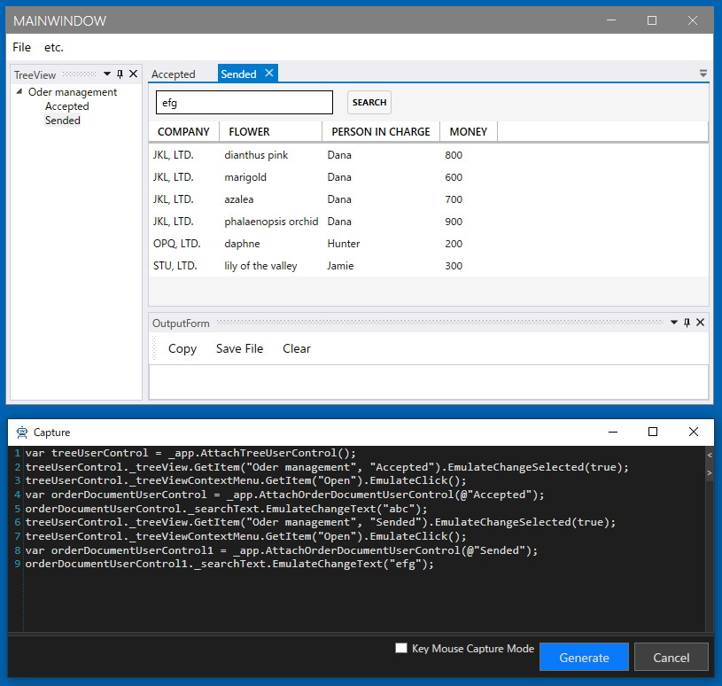

## Documentのドライバの作成
Document は TreeView の AcceptedもしくはSendedから開くことができます。これは同じクラスで表示するデータが異なっているだけです。一般的にドキュメントは同じタイプのものが複数存在します。
このような場合は Attach で Custom の取得方法を利用します。それぞれの特定方法はものによって異なるのでコードで実装する必要があります。
今回はTitleプロパティで判断するようにします。AnalyzeWindowではAttachを下記のように設定します。
またPickupChildrenで要素を取得してからGenerateを実行します。

| 項目 | 設定内容 |
|-----|--------|
| Create Attach Code | チェックをつける |
| Extension | WindowAppFriend |
| Method | Custom |

生成されたコードを以下のように書き換えます。
Titleの取得はドキュメントを親方向にたどっていって存在するLayoutDocumentControlに対する操作で実現できます。
この作業には利用しているライブラリの知識が必要です。
多くの場合、アプリケーション開発チームのメンバーは対応可能でしょう。
Attachのオプションの詳細は [Attach方法ごとのコード](../feature/Attach.md)を参照してください。


```cs
using Codeer.Friendly;
using Codeer.Friendly.Dynamic;
using Codeer.Friendly.Windows;
using Codeer.Friendly.Windows.Grasp;
using Codeer.TestAssistant.GeneratorToolKit;
using RM.Friendly.WPFStandardControls;
using System.Linq;

namespace Driver.Windows
{
    [UserControlDriver(TypeFullName = "WpfDockApp.OrderDocumentUserControl")]
    public class OrderDocumentUserControlDriver
    {
        public WPFUserControl Core { get; }
        public WPFTextBox _searchText => Core.Dynamic()._searchText;
        public WPFContextMenu _searchTextContextMenu => new WPFContextMenu { Target = _searchText.AppVar };
        public WPFButtonBase _searchButton => Core.Dynamic()._searchButton;
        public WPFDataGrid _dataGrid => Core.Dynamic()._dataGrid;

        public OrderDocumentUserControlDriver(AppVar core)
        {
            Core = new WPFUserControl(core);
        }
    }

    public static class OrderDocumentUserControlDriverExtensions
    {
        //ここに特定のためのカスタムコードを入れる
        //キャプチャ時にTestAssistantProが使うCustomMethod名を指定します。
        [UserControlDriverIdentify(CustomMethod = "TryGet")]
        public static OrderDocumentUserControlDriver AttachOrderDocumentUserControl(this WindowsAppFriend app, string identifier)
            //アプリの全てのウィンドウからTypeが一致するものを取得
            => app.GetTopLevelWindows().
                    SelectMany(e => e.GetFromTypeFullName("WpfDockApp.OrderDocumentUserControl")).
                    //その中でタイトルが一致するものを取得
                    Where(e => GetTitle(e) == identifier).
                    FirstOrDefault()?.Dynamic();

        //キャプチャ時にTestAssisatntProが使います。
        //発見した目的のUserControlの識別子をout引数に入れます。
        public static void TryGet(this WindowsAppFriend app, out string[] identifiers)
             //アプリの全てのウィンドウからTypeが一致するものを取得
             => identifiers = app.GetTopLevelWindows().
                    SelectMany(e => e.GetFromTypeFullName("WpfDockApp.OrderDocumentUserControl")).
                    //識別子にタイトルを使う
                    Select(e => GetTitle(e)).
                    Where(e => e != null).
                    ToArray();

        static string GetTitle(AppVar e)
        {
            //タイトルを取得します。
            //UserContorlから親方向にたどって見つかるLayoutDocumentControlが持っています。
            //これは利用しているライブラリ(今回はXceed)の知識が必要です。
            var layoutDocumentControl = e.VisualTree(TreeRunDirection.Ancestors).ByType("Xceed.Wpf.AvalonDock.Controls.LayoutDocumentControl").FirstOrDefault();
            if (layoutDocumentControl == null) return null;
            return layoutDocumentControl.Dynamic().Model.Title;
        }
    }
}
```

AcceptedとSendedを両方操作してキャプチャできるか確認します。



上手く動かない場合は[デバッグ](../feature/CaptureAndExecute.md#デバッグ)で原因を特定することができます。

## 次の手順

ここまで画面キャプチャを行うためのドライバの作成が完了しました。
次はItemsControlでDataTemplateによってカスタマイズしたものへ対応します。

[カスタマイズされたItemsControlに対応する](ItemsControlDriver.md)