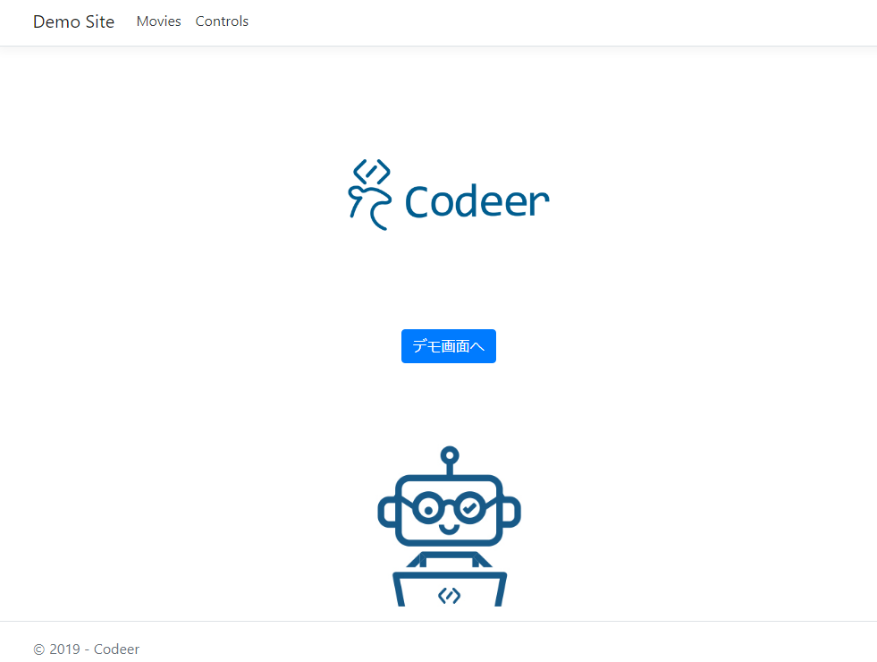

# TestAssistantProを利用してWebアプリケーションのテストを構築する

## 前提知識

TestAssistantProを使って`Selenium WebDriver`での`Pageオブジェクトパターン`に沿ったテストを実装します。`Selenium WebDriver`と`Pageオブジェクトパターン`の詳細については次を参照してください。

- [Seleniumブラウザー自動化プロジェクト](https://www.selenium.dev/documentation/ja/)
- [ページオブジェクトモデル](https://www.selenium.dev/documentation/ja/guidelines_and_recommendations/page_object_models/)

## 目次

初めてTestAssistantProを使う場合はチュートリアルからよんでください。チュートリアルの中には各機能説明へのリンクがはいっているため、効率よく使用方法を学習できます。

- チュートリアル
  1. テストソリューションを作成する
  2. アプリケーションを解析してPageObjectを作成する
  3. 繰り返し要素を操作するためのComponen Objectを作成する

## 利用するサンプルアプリケーション

利用するサンプルアプリケーションは次のURLで公開されているでもアプリケーションを利用します。

http://testassistantpro-demo.azurewebsites.net/

基本的なデータの検索、追加・更新・削除の操作を通して、TestAssistantProを利用したWebアプリケーションのテスト構築を学べます。

