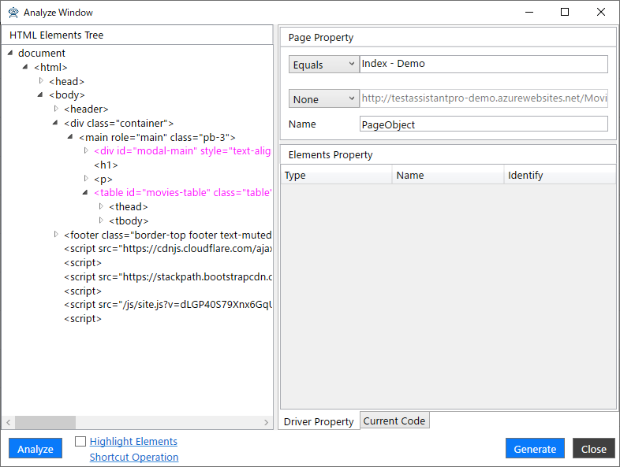
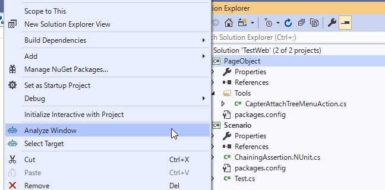
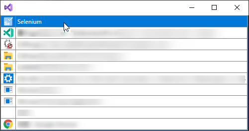
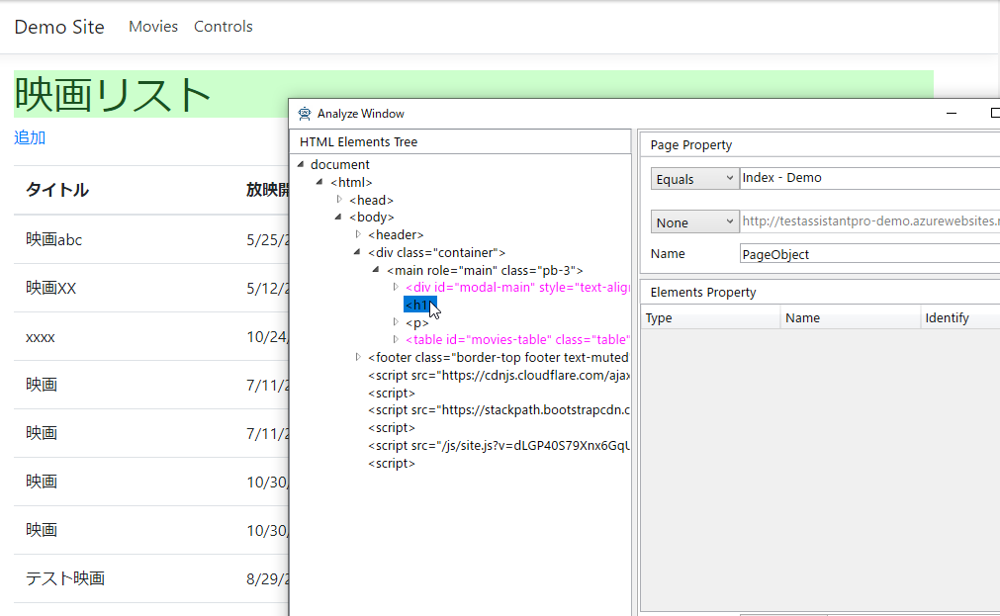
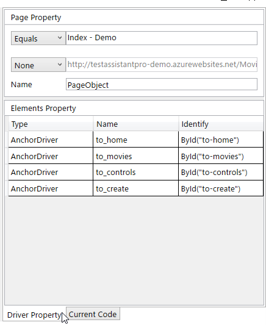
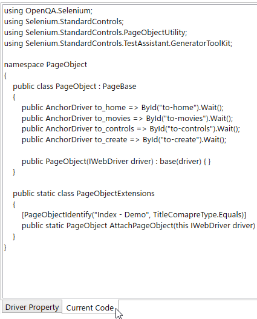

# AnalyzeWindowの使い方

AnalyzeWindow は対象の画面を解析してツリーのルートのコントロールに対してPageObjectおよびComponentObjectを作成するものです。
Designer タブの設定をもとにコードを生成します。生成されるコードは Current Code タブでプレビューできます。

PageObjectについては、次のURLを参照してください。

https://www.selenium.dev/documentation/ja/guidelines_and_recommendations/page_object_models/

## AnalyzeWindowの起動

AnalyzeWindow を起動するにはPageObjectプロジェクトで生成するコードを配置したいフォルダで右クリックをします。表示されたコンテキストメニューより「Analyze Window」を選択してください。

テスト対象のアプリケーションを選択する画面が出ますので、一覧の先頭にある「Selenium」を選択してください。この選択はVisual Studioが立ち上がっている期間中は保持されます。

## HTML要素ツリー

AnalyzeWindowの左ペインに表示される画面のHTML要素がツリー上に表示されているエリアです。 このHTML要素ツリーを選択して、PageObject/ComponentObjectのプロパティにする対象を決定します。 ツリーで要素を選択することで画面の対応する要素が緑背景に変わります。また、Ctrlキーを押しながら画面の要素にマウスオーバーすることでツリーの対応するノードを選択することもできます。

要素をダブルクリックすることで、PageObject/ComponentObjectのプロパティとして登録されます。 登録されたコントロールは右ペインのグリッドに追加されます。また、要素を右クリックすることで次のメニューが表示され、操作を行えます。

<!--TODO: Monitoringメニューの内容が不明-->

| メニュー | 説明 |
|--------|-----|
| Pickup Element| 選択している要素が右側のグリッドに登録されます。 |
| Design Component Object | 指定した要素以下をComponent Objectとして構築します。 |
| Monitoring |  |

## Driver Propertyタブ

右ペインの下段に「Driver Property」タブを選択することで表示されます。 作成するPageObject/ComponentObjectの構成を設定します。

| 項目 | 説明 |
|-----|-----|
| 1つ目のドロップダウン | ページタイトルでPageObjectを特定させる場合に、一致方法を指定します。2つ目のドロップダウンで`None`以外が設定された場合は、`None`に自動的に設定されます。  |
| 1つ目のドロップダウン横のテキストボックス | ページタイトルと一致させる値を指定します。 |
| 2つ目のドロップダウン | URLでPageObjectを特定させる場合に、一致方法を指定します。1つ目のドロップダウンで`None`以外が設定された場合は、`None`に自動的に設定されます。  |
| 2つ目のドロップダウン横のテキストボックス | URLと一致させる値を指定します。 |
| グリッド | PageObject/ComponentObject の子要素です。Tree から選択します。 |

## CurrentCodeタブ

右ペインの下段にある「Current Code」タブを選択することで表示されます。 Designer タブでの設定によって出力されるコードが表示されます。

