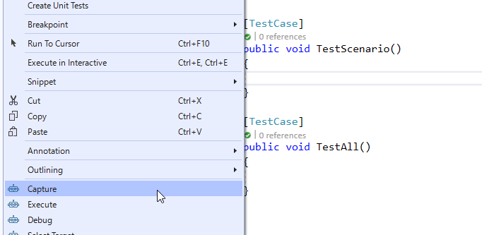
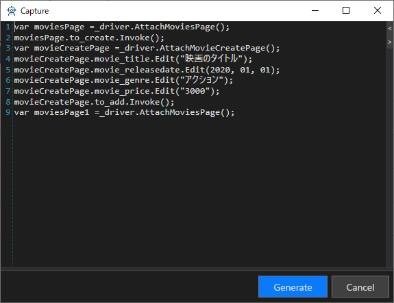
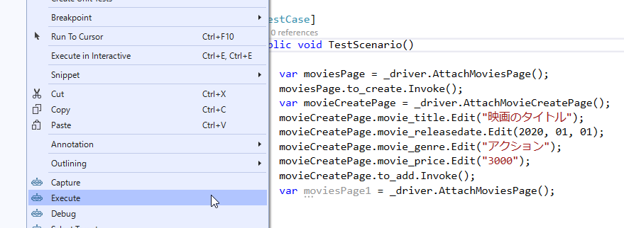

# 画面操作のキャプチャと再生

TestAssistantProには、対になるCaptureとExecuteという機能があります。

- Capture機能は、アプリケーションの操作をプログラムコードとして記録します。
- Execute機能は、記録したプログラムコードを実行して対象アプリケーション上で操作を再現します。

## Capture

アプリケーションの操作をプログラムコードとして記録します。 Captureでプログラムコードを生成するためには、PageObjectおよびComponentObjectが作成されている必要があります。詳細な内容は[AnalyzeWindow](AnalyzeWindow.md)を参照してください。

Capture機能を実行するには、プログラムコードを記録したいメソッドを右クリックして、[Capture]を選択してください。Captureウィンドウが表示され、画面操作の記録が開始されます。

この状態で画面操作を行うことで、Captureウィンドウにプログラムコードが追加されていきます。標準の状態では、ControlDriverおよびCaptureCodeGeneratorを利用して、追加するプログラムコードが生成されます。

最後に、[Captureウィンドウ]の[Generate]ボタンをクリックすることで選択したメソッドに生成されたコードが追加されます。

## Execute

記録したプログラムコードを実行して操作を再現します。
実行したいメソッドを右クリックして、[Execute]を選択してください。プログラムコードが実行され、操作が再生されます。

