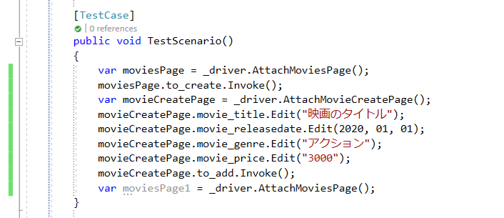

# 画面操作によるコードの生成と実行

TestAssistantProには、対になるCaptureとExecuteという機能があります。

- Capture機能は、アプリケーションの操作からプログラムコードを作成します。
- Execute機能は、関数単位で処理を実行します。

## Capture

アプリケーションの操作することでプログラムコードを作成します。 Captureでプログラムコードを生成するためには、PageObjectおよびComponentObjectが作成されている必要があります。詳細な内容は[AnalyzeWindow](AnalyzeWindow.md)を参照してください。

Capture機能を実行するには、プログラムコードを作成したいメソッドを右クリックして、[Capture]を選択してください。Captureウィンドウが表示されます。

この状態で画面操作を行うことで、Captureウィンドウにプログラムコードが追加されていきます。標準の状態では、ControlDriverおよびCaptureCodeGeneratorを利用して、追加するプログラムコードが生成されます。

最後に、[Captureウィンドウ]の[Generate]ボタンをクリックすることで選択したメソッドに生成されたコードが追加されます。

## Execute

プログラムコードを作成した関数を実行します。
実行したいメソッドを右クリックして、[Execute]を選択してください。プログラムコードが実行されます。

