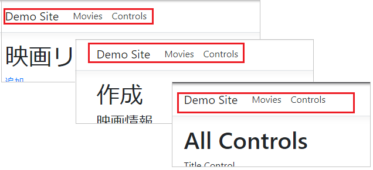
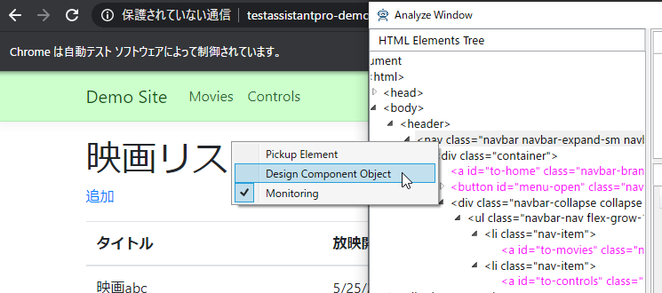
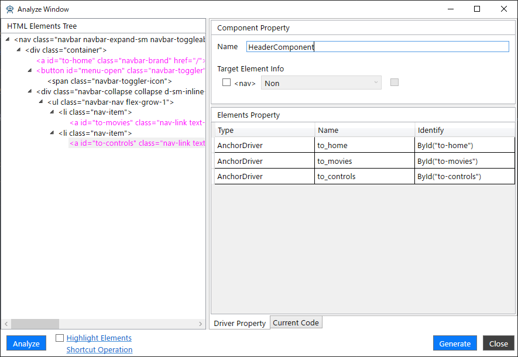
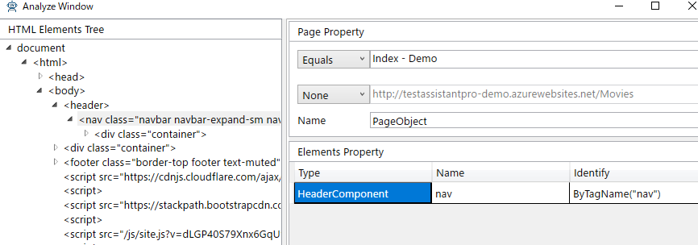

# ComponentObject

画面内にある一連の要素を意味のある単位で切り出して定義したものを画面コンポーネントと言い、ComponentObjcet は画面コンポーネントをオブジェクト化したもののこと指します。
たとえば、複数の画面で利用される画面のヘッダやメニュー、また表形式の各行がそれにあたります。

## ComponentObject を定義する

ComponentObject は「AnalyzeWindow」から作成します。
「AnalyzeWindow」の左ペインの HTML 要素ツリーで切り出したい要素を選択し、右クリックすることでコンテキストメニューが表示され、[Design Component Object] を選択します。

[Design Component Object] を選択すると、HTML 要素ツリーで選択した要素をルートとして ComponentObject を作成する状態に更新されます。
基本的な操作は通常の状態と同じで、HTMLの要素をプロパティとして追加していきます。

右ペインの上部にあるプロパティの設定は次のとおりです。

| 項目 | 説明 |
|-----|-----|
| Name | ComponentObject の名前を指定します。 |
| Target Element Info | チェックをつけることで要素が ComponentObject 側で指定されます。チェックを付けないでおくと PageObject 側で指定された要素を利用します。|
| Target Element Info(Dropdown) | Non を指定すると要素名が利用されます。 Class を指定すると設定されている Class の値が利用されます。 |

## ComponentObject を利用する

作成した ComponentObject は要素をプロパティとして追加したときの Type で指定します。

