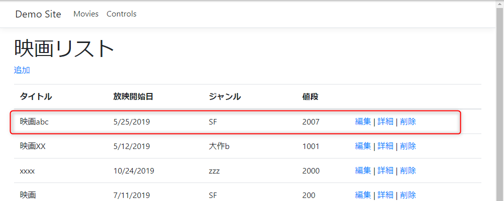
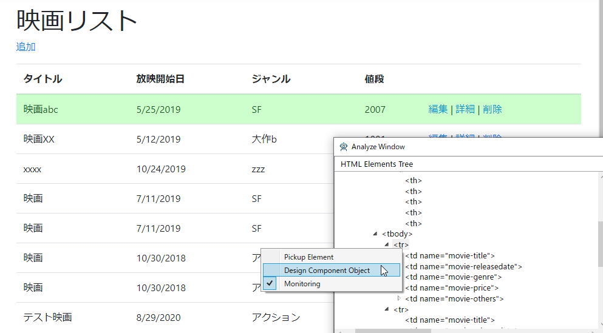
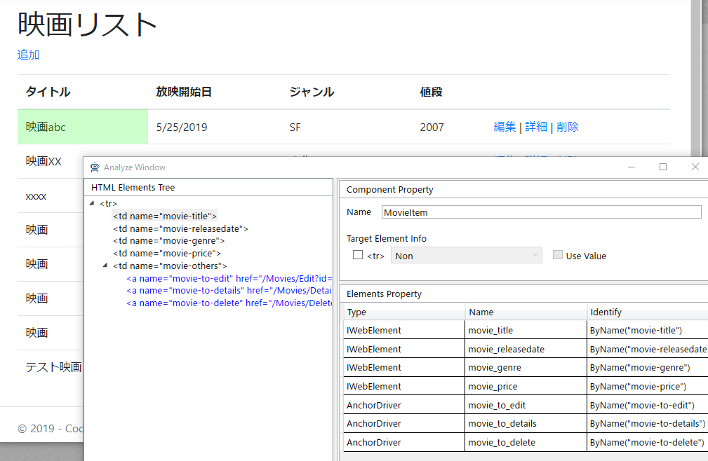
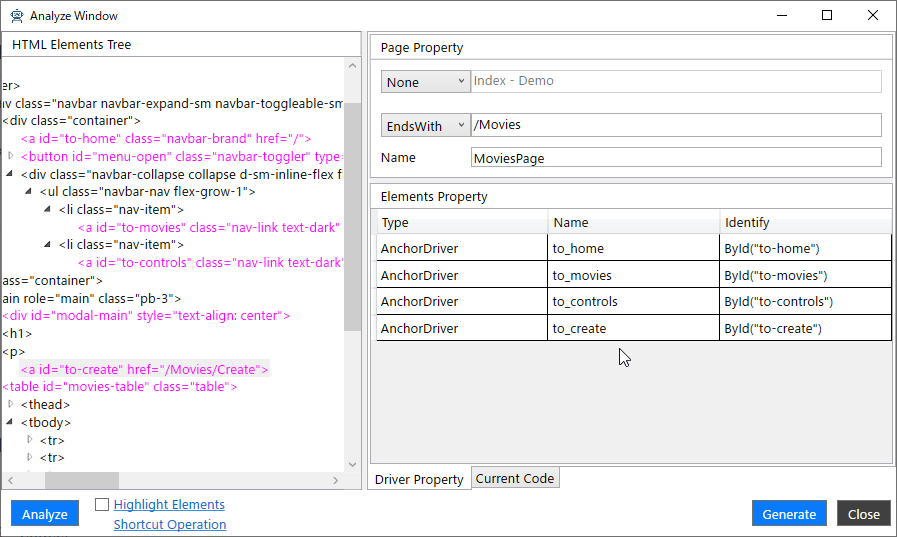
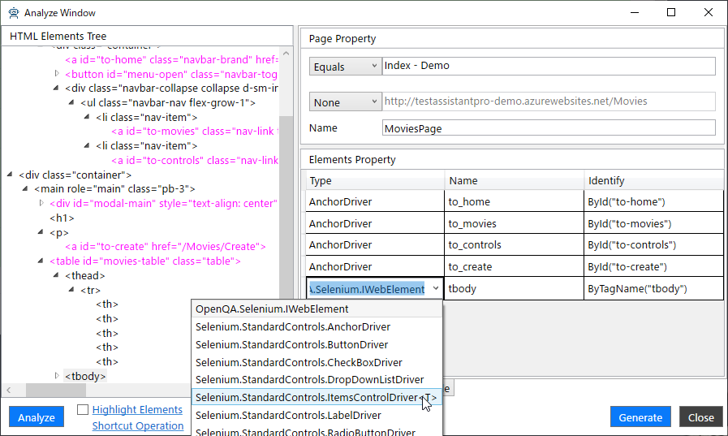
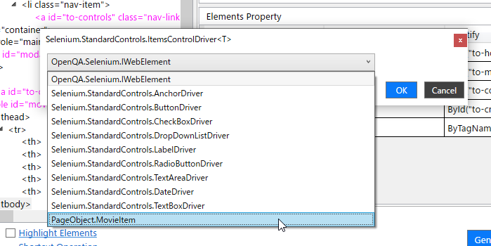

# 画面コンポーネントのプロパティを追加する

ここからはテーブルなど繰り返しのデータを表示する要素を画面コンポーネントとしてComponentObjectを作成し、プロパティに追加します。

## 映画一覧のComponentObjectを追加する

映画リストページには映画の一覧がテーブルで各行に表示されています。この一行をComponentObjectとして抜き出します。



[Analyze window]のHTML要素ツリーから表の行である`tr`要素を選択し、右クリックしてコンテキストメニューより[Design Component Object]を選択してください。



[Analyze window]が再描画されHTML要素ツリーには選択した`tr`要素だけが表示されます。HTML要素ツリーから次の各項目をプロパティとして追加してください。

- タイトルが表示されている`td`
- 放映開始日が表示されている`td`
- ジャンルが表示されている`td`
- 値段が表示されている`td`
- 編集リンク
- 詳細リンク
- 削除リンク

[Analyze window]の右ペイン上にある[Component Property]の[Name]には"MovieItem"という値を設定します。



[Generate]ボタンをクリックすることで次のようなComponentObjectのコードが生成され、[Analyze Window]の表示は元の画面の内容で再描画されます。

```cs
using OpenQA.Selenium;
using Selenium.StandardControls;
using Selenium.StandardControls.PageObjectUtility;
using Selenium.StandardControls.TestAssistant.GeneratorToolKit;

namespace PageObject
{
    public class MovieItem : ComponentBase
    {
        public IWebElement movie_title => ByName("movie-title").Wait().Find();
        public IWebElement movie_releasedate => ByName("movie-releasedate").Wait().Find();
        public IWebElement movie_genre => ByName("movie-genre").Wait().Find();
        public IWebElement movie_price => ByName("movie-price").Wait().Find();
        public AnchorDriver movie_to_edit => ByName("movie-to-edit").Wait();
        public AnchorDriver movie_to_details => ByName("movie-to-details").Wait();
        public AnchorDriver movie_to_delete => ByName("movie-to-delete").Wait();

        public MovieItem(IWebElement element) : base(element) { }
        public static implicit operator MovieItem(ElementFinder finder) => finder.Find<MovieItem>();
    }
}
```

## 映画リストページのページオブジェクトを作成する

まずは、映画リストページのページオブジェクトを作成するために、次のように[Page Property]を設定してください。

- 上から2つ目のドロップダウンで[EndsWith]を選択し、対応するテキストボックスの値を"/Movies"に設定します。
- [Name]の値を"MoviesPage"に設定します。

また、[Elements Property]に次の要素を追加してください。TypeやNameなどは追加した状態から変更しないでください。

- 画面ヘッダにある3つのリンク
- "映画リスト"という画面タイトルの下にある[追加]リンク



## 作成したComponentObjectをページオブジェクトのプロパティに追加する

最後に一覧表の各行を表すMovieItemと名付けたComponentObjectのリストをプロパティとして追加します。ComponentObjectにした`tr`要素の親要素である`tbody`要素をプロパティとして追加してください。
追加した`tbody`要素のプロパティの[Type]の値をドロップダウンから[Selenium.StandardControls.ItemsControlDriver<T>]を選択してください。



ジェネリック型を選択するダイアログが表示されるため、ドロップダウンから[PageObject.MovieItem]を選択して[OK]をクリックします。



最後に[Generate]ボタンをクリックしてコードを生成します。次のようなコードが生成されます。

```cs
using OpenQA.Selenium;
using Selenium.StandardControls;
using Selenium.StandardControls.PageObjectUtility;
using Selenium.StandardControls.TestAssistant.GeneratorToolKit;
using PageObject;

namespace PageObject
{
    public class MoviesPage : PageBase
    {
        public AnchorDriver to_home => ById("to-home").Wait();
        public AnchorDriver to_movies => ById("to-movies").Wait();
        public AnchorDriver to_controls => ById("to-controls").Wait();
        public AnchorDriver to_create => ById("to-create").Wait();
        public ItemsControlDriver<MovieItem> tbody => ByTagName("tbody").Wait();

        public MoviesPage(IWebDriver driver) : base(driver) { }
    }

    public static class MoviesPageExtensions
    {
        [PageObjectIdentify("/Movies", UrlComapreType.EndsWith)]
        public static MoviesPage AttachMoviesPage(this IWebDriver driver) => new MoviesPage(driver);
    }
}
```

## 次の手順

ここまで画面キャプチャを行うためのすべての処理が完了しました。
次は実際に画面をキャプチャしてシナリオを作成します。

[アプリケーションの操作を記録してシナリオを作成する](Scenario.md)