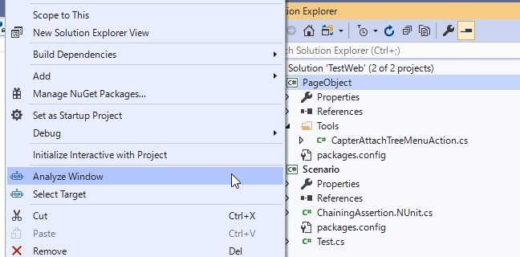
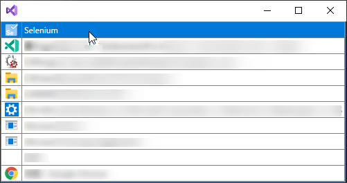
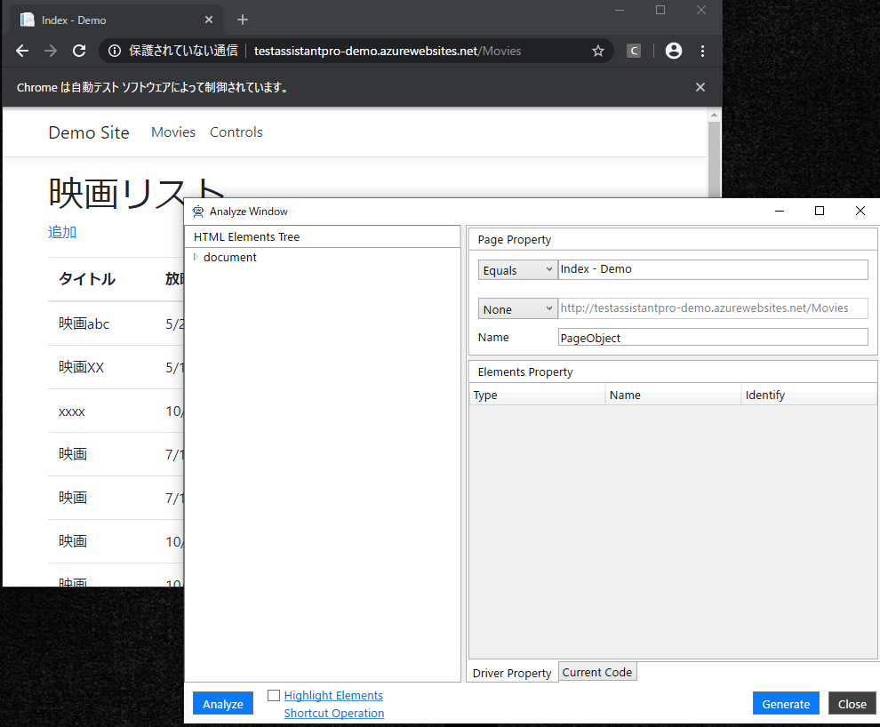
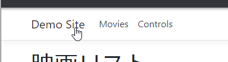
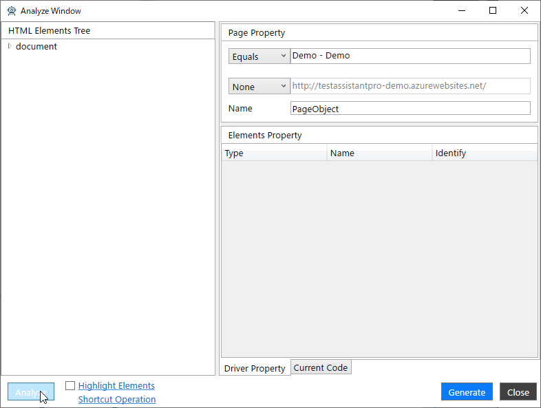
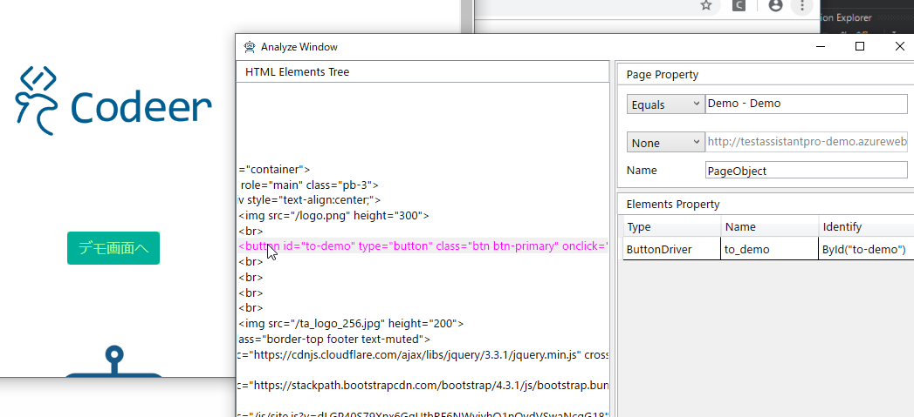
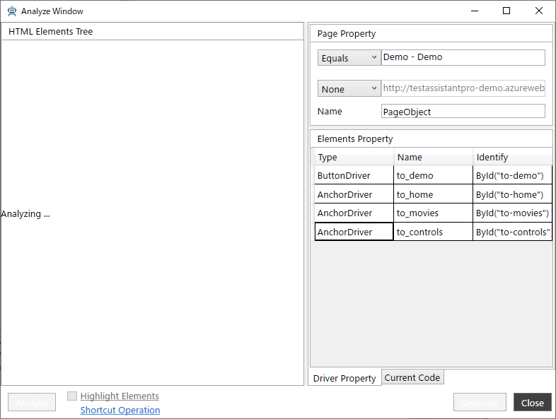
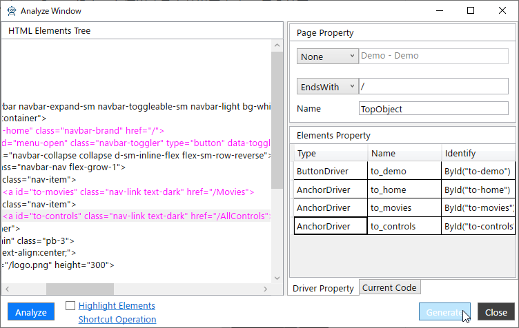
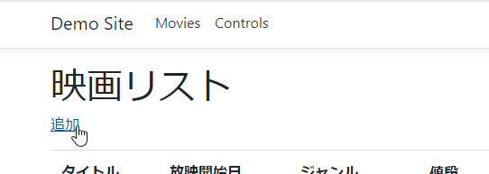
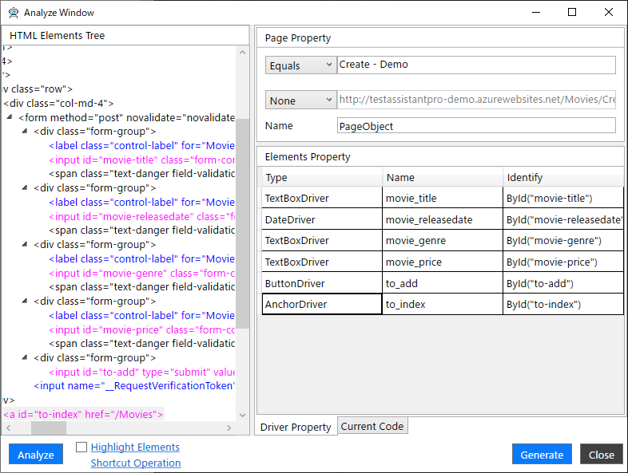

# アプリケーションを解析してPageObjectを作成する

[テストソリューションを新規作成する](./Sln.md)で作成したソリューションにTestAssistantProを利用してPageObjectを作ります。

## AnalzeWindowの表示

ソリューションエクスプローラーで`PageObject`プロジェクトのルートまたは任意のフォルダを右クリックして[Analyze Window]を選択します。



[Select Target]ダイアログが表示されるため[Selenium]をダブルクリックして選択してください。



ブラウザが自動的に表示されTestAssistantProの[デモサイト](http://testassistantpro-demo.azurewebsites.net/Movies)が表示されます。通常はアドレスバーにテスト対象のWebサイトのURLを入力し遷移を行います。このチュートリアルではこのデモサイトをそのまま利用します。



## トップページのページオブジェクトの作成

ここではトップページのPageObjectを作成します。ブラウザで表示されている画面の右上にある、「Demo Site」のタイトルロゴをクリックしてトップページに遷移してください。



トップページに遷移したら、[Analyze Window]の左下にある[Analyze]ボタンをクリックします。そうすることで表示されている画面を再解析し、内容が更新されます。



### HTML要素ツリーからプロパティを追加する

[Analyze Window]の左ペインにあるHTML要素ツリーからWebページ中央にある「デモ画面へ」ボタンの要素を選択して、ダブルクリックすることでプロパティに追加されます。要素を選択したときに画面側で背景が緑色に反転するため、選択した要素が目的の要素であっているかを確認できます。



### 画面で要素を選択し、プロパティを追加する

HTML要素ツリーから対象の要素を探し出すのはネストが深くなるなどすると難しくなってしまいます。そのため、TestAssistantProではブラウザの画面で要素を選択できるようになっています。これを行うには次の手順で操作を行います。

1. コントロールキーを押したままにします。
2. ブラウザにフォーカスを当てるめに、画面のアクションが発生しない任意の場所をクリックします。
3. プロパティとして追加した対象の要素にマウスのカーソルを合わせます。
4. 反転している要素をダブルクリックします。

上記を実行することで、ダブルクリックした要素がプロパティに追加されます。そのままコントロールキーを離さないまま、別の要素に移動してダブルクリックすることで連続してプロパティを追加できます。

ここでは、画面のヘッダにある次の3つのリンクをプロパティに追加してください。

- 「Demo Site」タイトルロゴのリンク
- 「Movies」リンク
- 「Controls」リンク



### PageObjectの特定方法と名前の指定

[Analyze Window]の右ペイン上部にある[Page Property]で次の設定を行います。

- 上から2つ目のドロップダウンで[EndsWith]を選択し、対応するテキストボックスの値を"/"に設定します。
- [Name]の値を"TopPage"に設定します。

### コードの生成

[Analyze Window]の右下にある[Generate]ボタンをクリックすると指定した内容でコードが生成されます。



```cs
using OpenQA.Selenium;
using Selenium.StandardControls;
using Selenium.StandardControls.PageObjectUtility;
using Selenium.StandardControls.TestAssistant.GeneratorToolKit;

namespace PageObject
{
    public class TopObject : PageBase
    {
        public ButtonDriver to_demo => ById("to-demo").Wait();
        public AnchorDriver to_home => ById("to-home").Wait();
        public AnchorDriver to_movies => ById("to-movies").Wait();
        public AnchorDriver to_controls => ById("to-controls").Wait();

        public TopObject(IWebDriver driver) : base(driver) { }
    }

    public static class TopObjectExtensions
    {
        [PageObjectIdentify("/", UrlComapreType.EndsWith)]
        public static TopObject AttachTopObject(this IWebDriver driver) => new TopObject(driver);
    }
}
```

## 映画追加ページのページオブジェクトの追加

[Analyze Window]を閉じずに複数のページオブジェクトを追加できます。ここでは映画追加ページのページオブジェクトを追加します。画面上部にあるヘッダの[Movies]というリンクをクリックして、映画リストページに遷移し、画面タイトルの下にある[追加]リンクをクリックして遷移してください。



画面遷移が完了したら[Analyze Window]の[Analyze]ボタンをクリックして再解析を行います。再解析が完了したら次のようになるように[Page Property]を設定してください。

- 上から2つ目のドロップダウンで[EndsWith]を選択し、対応するテキストボックスの値を"/Movies/Create"に設定します。
- [Name]の値を"MovieCreatePage"に設定します。

また、[Elements Property]に次の要素を追加してください。TypeやNameなどは追加した状態から変更しないでください。

- 画面ヘッダにある3つのリンク
- 画面内にある各テキストボックス
- [追加]ボタン
- [追加]ボタンの下にある[リストへ戻る]リンク



[Generate]ボタンをクリックすることで次のようなコードが生成されます。

```cs
using OpenQA.Selenium;
using Selenium.StandardControls;
using Selenium.StandardControls.PageObjectUtility;
using Selenium.StandardControls.TestAssistant.GeneratorToolKit;

namespace PageObject
{
    public class MovieCreatePage : PageBase
    {
        public AnchorDriver to_home => ById("to-home").Wait();
        public AnchorDriver to_movies => ById("to-movies").Wait();
        public AnchorDriver to_controls => ById("to-controls").Wait();
        public TextBoxDriver movie_title => ById("movie-title").Wait();
        public DateDriver movie_releasedate => ById("movie-releasedate").Wait();
        public TextBoxDriver movie_genre => ById("movie-genre").Wait();
        public TextBoxDriver movie_price => ById("movie-price").Wait();
        public ButtonDriver to_add => ById("to-add").Wait();
        public AnchorDriver to_index => ById("to-index").Wait();

        public MovieCreatePage(IWebDriver driver) : base(driver) { }
    }

    public static class MovieCreatePageExtensions
    {
        [PageObjectIdentify("/Movies/Create", UrlComapreType.EndsWith)]
        public static MovieCreatePage AttachMovieCreatePage(this IWebDriver driver) => new MovieCreatePage(driver);
    }
}
```

## 次の手順

ここまで基本的なページオブジェクトを作成できました。
次はテーブルなど繰り返しのデータを表示する要素を操作するための、Component Objectを作成します。

[繰り返し要素のプロパティを追加する](ComponentObject.md)
