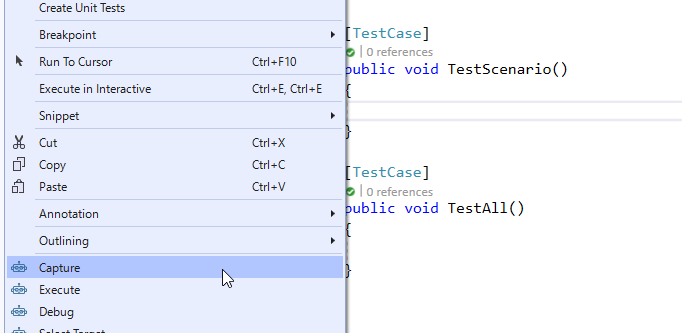
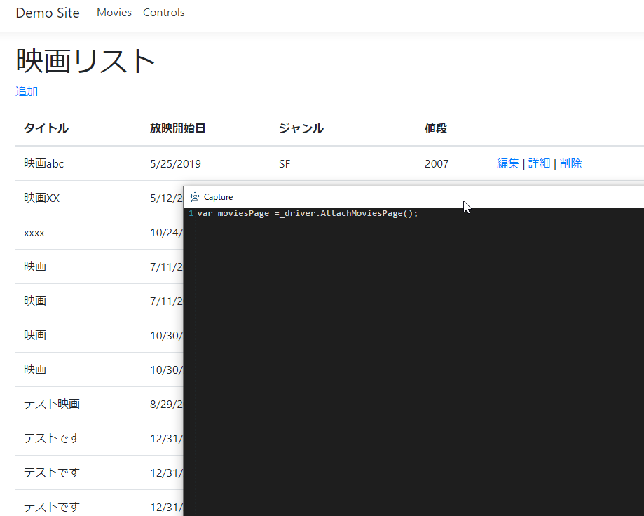
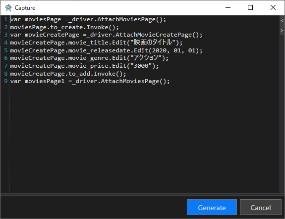

# アプリケーションの操作を記録してシナリオを作成する

画面の操作を記録し、ここまでのチュートリアルで作成していたページオブジェクトを使ってコードを生成します。
ここではデータを追加する操作を記録してコードを生成します。

## Captureを開始する

コードを生成するメソッドにキャレットを合わせて、右クリックして表示されるコンテキストメニューより[Capture]を選択します。



ブラウザが立ち上がり、映画リストページが表示されます。

> 映画リストページが表示されていない場合があります。その場合は、ブラウザを操作して映画リストページを表示させ、一度ブラウザを閉じてキャプチャ処理を終了してください。
> その後、再びキャプチャを開始することで映画リストページが表示されます。



## 画面を操作してコードを生成する

次の手順に従って画面を操作してください。画面を操作するたび[Capture]画面にコードが追加されていくことを確認できます。

1. 映画リストページのタイトルの下の[追加]リンクをクリック
2. 映画追加ページの各入力項目に任意の値を入力
3. [追加]ボタンをクリック



[Generate]ボタンをクリックしてコードを生成してください。次のようなコードが生成されます。

```cs
var moviesPage = _driver.AttachMoviesPage();
moviesPage.to_create.Invoke();
var movieCreatePage = _driver.AttachMovieCreatePage();
movieCreatePage.movie_title.Edit("映画のタイトル");
movieCreatePage.movie_releasedate.Edit(2020, 01, 01);
movieCreatePage.movie_genre.Edit("アクション");
movieCreatePage.movie_price.Edit("3000");
movieCreatePage.to_add.Invoke();
var moviesPage1 = _driver.AttachMoviesPage();
```

## テストを実行して動作させる

テストを実行してキャプチャしたコードを動作させるには、あらかじめテストを開始させるURLを指定しておく必要があります。
テストクラスの`SetUp`メソッドにある`ChromeDriver`インスタンスの`Url`プロパティに値を設定してください。

```cs
[SetUp]
public void SetUp()
{
    _driver = new ChromeDriver();
    // 次のコードを追加
    _driver.Url = "http://testassistantpro-demo.azurewebsites.net/Movies";
}
```

上記を設定したうえでテストを動作せることで、記録した内容が再生されます。