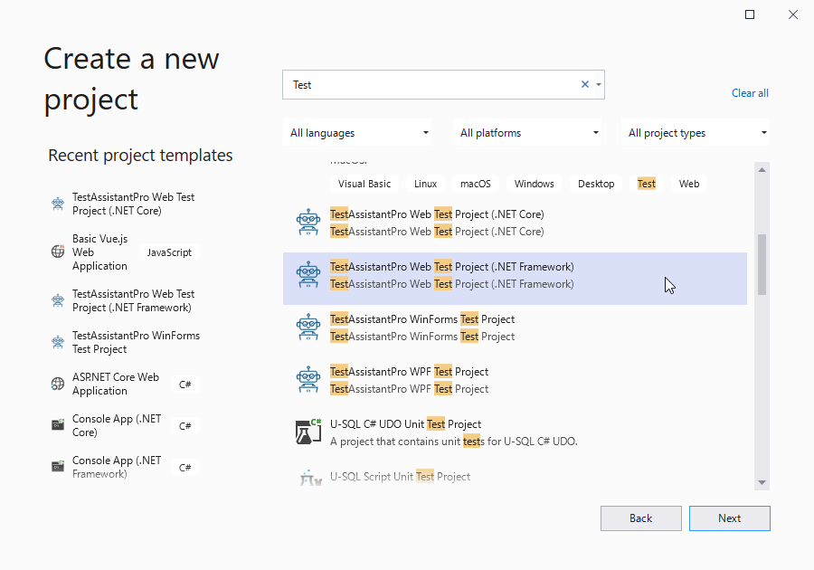

# テストソリューションを作成する

TestAssistantProではWebアプリケーションの自動テストに最適なVisual Studioソリューションを作成するためのテンプレートウィザードが提供されています。
ウィザードに従ってプロジェクトを作成すると自動的に次の2つのプロジェクトが作成されます。

プロジェクト       | 説明
----------------|---------------
PageObject      | テスト対象アプリケーションの画面やコントロールの操作をカプセル化するためのコードをここに記述します。
Scenario        | 実際のテストを実行するテストコードを記述します。テストシナリオに沿ってテストコードを記述してください。

この2つのプロジェクトは基本構成です。作業を進めることでボリュームが大きくなってきた場合、
それぞれの役割を持つプロジェクトを複数に分割していくことも可能です。

## ウィザードを利用してプロジェクトを追加する

Visual Studioを起動して「新しいプロジェクトの追加」ダイアログを表示します。「テンプレートの検索」テキストボックスに"Test"と入力してプロジェクトリストを更新します。 更新されたプロジェクトリストの中から「TestAssistantPro Web Test Project」を選択して、「次へ」ボタンを押下します。

「新しいプロジェクトを構成します」画面が表示されるため任意のプロジェクト名と場所を入力して「作成」ボタンを押下してください。

最後に利用する.NETのバージョンを指定して[OK]ボタンを押下してください。

入力した内容をもとに2つのプロジェクトが「ソリューションエクスプローラー」で確認できます。 また、「Scenario」プロジェクトにサンプルのテストが配置されていることが「テストエクスプローラー」から確認できます。

## テストを実行して動作を確認する

「テストエクスプローラー」からテストを実行して問題なくテストソリューションが作成できているかを確認してください。
テストを実行するとブラウザが起動して、自動的に終了され、テストが成功することを確認できます。

## 次の手順

ここまでテストを実装するためのテストソリューションを作成できました。
次はテスト対象アプリケーションをテストシナリオから操作しやすいようにするためのPageObjectを作成します。

[アプリケーションをキャプチャしてPageObjectを作成する](PageObject.md)
