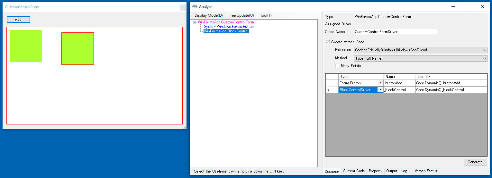
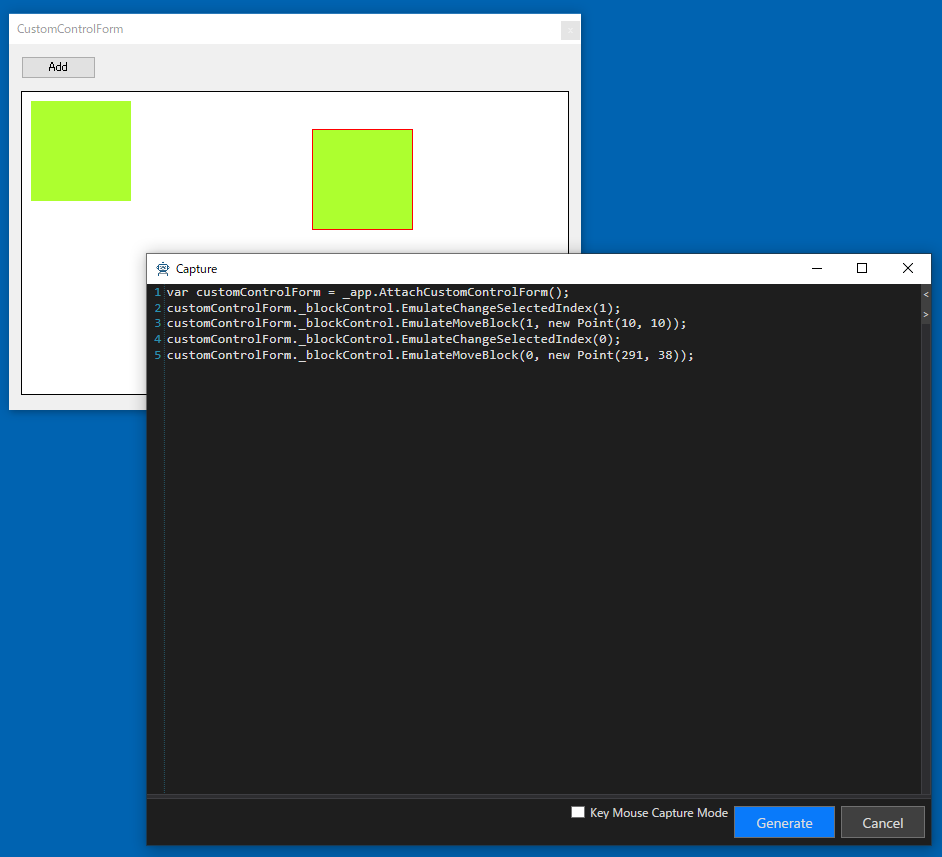

# ControlDriver

ControlDriver はその名の通り、Button や TextBox など Control に対応するドライバです。
多くの物は使いまわすことができます。
TestAssistantPro を使って WinForms のテストプロジェクトを作成すると次のパッケージがインストールされます。

+ [Ong.Frinedly.FormsStandardControls](https://github.com/ShinichiIshizuka/Ong.Friendly.FormsStandardControls)
+ [Codeer.Friendly.Windows.NativeStandardControls](https://github.com/Codeer-Software/Friendly.Windows.NativeStandardControls)

これによりそれぞれに定義されているコントロールドライバとキャプチャジェネレータが使えます。
コントロールドライバの種類はそれぞれのリンクを参照してください。


また、WinFormsのサードパーティ製のコントロールで
GrapeCity社のC1FlexGridとSpreadに対するドライバもOSSで公開しています。
+ [Friendly.C1.Win](https://github.com/Codeer-Software/Friendly.C1.Win)
+ [Friendly.FarPoint](https://github.com/Codeer-Software/Friendly.FarPoint)

しかし、世の中には大量の3rdパーティ製のコントロールがあり、さらには各プロジェクト固有のコントロールも存在します。
TestAssistantPro はそのような場合でもそれぞれに対する ControlDriver と CaptureGenerator を実装することで対応できます。
ControlDriverはFriendlyの基本機能を使うことで簡単に実装できます。
[こちら](https://github.com/Codeer-Software/Friendly/blob/master/TestAutomationDesign.jp.md#controldriver)でも説明していますので参照お願いします。
TestAssistantPro で AnalyzeWindow に認識させて WindowDriver を作るときに表示する場合は ControlDriverAttribute 属性を付けます。
Ong.Friendly.FormsStandardControls の FormsCheckBox を例にすると以下のようになっています。
```cs
//対応するコントロールを指定することでTestAssistantProでCheckBoxを選択したときにこのクラスが割り当たります
[ControlDriver(TypeFullName = "System.Windows.Forms.CheckBox")]
public class FormsCheckBox : FormsControlBase
{

```
また同一のコントロールに対して複数の ControlDriver を割り当てることも可能です。その場合 Priority を指定すると高い方が優先的に選択されます。
```cs
[ControlDriver(TypeFullName = "System.Windows.Forms.CheckBox", Priority = 1)]
public class FormsCheckBoxEx : FormsCheckBox
{

```

# Capture Code Generator
ControlDriver は手動で Friendly を使ったテストを書く時にも作成するもです。
しかし、キャプチャジェネレータは TestAssistantPro を使うときだけ出てくるユーティリティクラスです。
ControlDriver に対応する CaptureCodeGenerator を作っておくと TestAssistantPro でキャプチャ時に操作からコードを作成できます。
ControlDriver との紐づけは CaptureCodeGeneratorAttribute で行います。
また CaptureCodeGeneratorBase を継承しておく必要があります。
CaptureCodeGenerator は Capture 時に対象プロセス内に生成され、最初に Attach() が呼び出されます。
そこでイベントに接続してイベントが発生したときに生成したコードを AddSentense で追加します。
たとえば CheckBox の CaptureCode の実装は以下のようなものです。

```cs
using System;
using System.Windows.Forms;
using Codeer.TestAssistant.GeneratorToolKit;

namespace Ong.Friendly.FormsStandardControls.Generator
{
    [CaptureCodeGenerator("Ong.Friendly.FormsStandardControls.FormsCheckBox")]
    public class FormsCheckBoxGenerator : CaptureCodeGeneratorBase
    {
        CheckBox _control;
        
        protected override void Attach()
        {
            _control = (CheckBox)ControlObject;
            _control.CheckStateChanged += CheckStateChanged;
        }
        
        protected override void Detach()
        {
            _control.CheckStateChanged -= CheckStateChanged;
        }
        
        void CheckStateChanged(object sender, EventArgs e)
        {
            //フォーカスがあるときだけコードを生成する
            if (!_control.Focused) return;

            //追加で必要なネームスペースを登録
            AddUsingNamespace(typeof(CheckState).Namespace);
            //コードを追加
            AddSentence(new TokenName(), ".EmulateCheck(CheckState." + _control.CheckState, new TokenAsync(CommaType.Before), ");");
        }
    }
}
```
AddSentence は引数で渡されたオブジェクトを接続したコードを登録します。
通常のオブジェクトは ToString() を利用した文字列になりますが、一部特殊な置換が行わるクラスもあります。

|  Token  |  説明  |
| ---- | ---- |
|  TokenName  |  現在選択されている名前になります。  |
|  TokenSeparator  |  空行になります。複数個連続で登録されている場合は一行にまとめられます。  |
|  TokenAsync  |  その操作によりモーダルダイアログが表示された場合はAsyncのオブジェクトが入ります。引数なのでカンマの挿入に関して前後もしくはなしが引数で設定できます。  |

# 演習
## AnalyzeWindow から ControlDriver と CaptureGenerator を作成する
ここではサンプルとして BlockControl の ControlDriver と CaptureGenerator を作ってみます。
MainFrameのメニュー -> etc -> Custom Control Dialog を実行すると表示されます。
Addボタンを押すとブロックが追加されます。
BlockControl の機能としてはブロックをドラッグで移動させることができます。


まずは AnalyzeWindow を使ってテンプレートを作成します。
作らいたいコントロールをツリーで選んで右クリックから Create Control Driver を実行してください。


ダイアログから ControlDriver を選択し Driver プロジェクトの任意のフォルダにドロップします。
どこでも良いのですが、今回は Controls というフォルダを作ってそこにドロップしました。
次に CaptureGenerator を選択し Driver.InTarget の任意のフォルダにドロップします。


### ControlDriver 実装
これは [BlockControl]() と [Frinedly]()の知識があれば簡単に実装できます。
BlockCotrol はプロダクトのコードなのでその開発チームなら知っているはずです。
この実装は基本的には開発チームに行ってもらうのが費用対効果の面で良いでしょう。
BlockControlDriver の公開APIの仕様は自由に決定してかまいません。
Ong.Friendly.FormsStandardControl の設計に合す並ば
変更を及ぼす操作はメソッドで作り Emulate 接頭辞を付けます。
今回はこのようにします。

```cs
using Codeer.Friendly;
using Codeer.Friendly.Dynamic;
using Codeer.TestAssistant.GeneratorToolKit;
using Ong.Friendly.FormsStandardControls;
using System.Drawing;

namespace Driver.Controls
{
    //実装するにはBlockControlのAPIを知っている必要がある
    [ControlDriver(TypeFullName = "WinFormsApp.BlockControl", Priority = 2)]
    public class BlockControlDriver : FormsControlBase
    {
        public BlockControlDriver(AppVar appVar)
            : base(appVar) { }

        //選択インデックス
        public int SelectedIndex => this.Dynamic().SelectedIndex;

        //選択変更
        public void EmulateChangeSelectedIndex(int index) => this.Dynamic().SelectedIndex = index;

        //移動
        public void EmulateMoveBlock(int index, Point location) => this.Dynamic().MoveBlock(index, location);
    }
}
```

### キャプチャジェネレータの実装
イベントを受ける必要があるので BlockControl が定義されているアセンブリを参照します。具体的には WinFormApp.exe を参照します。
リフレクションを駆使すれば参照なしでも可能ですが、難易度があがるので説明を省きます。
必要でしたら Friendly.XamControls で実装していますので[こちら](https://github.com/Codeer-Software/Friendly.XamControls/blob/master/Project/Friendly.XamControls.Generator/XamComboEditorDriverGenerator.cs)を参照お願いします。

```cs
using System;
using System.Drawing;
using Codeer.TestAssistant.GeneratorToolKit;
using WinFormsApp;

namespace Driver.InTarget
{
    [CaptureCodeGenerator("Driver.Controls.BlockControlDriver")]
    public class BlockControlDriverGenerator : CaptureCodeGeneratorBase
    {
        BlockControl _control;

        protected override void Attach()
        {
            _control = (BlockControl)ControlObject;
            _control.SelectChanged += SelectChanged;
            _control.BlockMoved += BlockMoved;
        }

        protected override void Detach()
        {
            _control.SelectChanged -= SelectChanged;
            _control.BlockMoved -= BlockMoved;
        }

        void SelectChanged(object sender, EventArgs e)
        {
            if (!_control.Focused) return;
            AddSentence(new TokenName(), ".EmulateChangeSelectedIndex(" + _control.SelectedIndex, new TokenAsync(CommaType.Before), ");");
        }

        void BlockMoved(object sender, BlockMoveEventArgs e)
        {
            if (!_control.Focused) return;
            AddUsingNamespace(typeof(Point).Namespace);
            AddSentence(new TokenName(), ".EmulateMoveBlock(" + _control.SelectedIndex, $", new Point({e.MoveLocation.X}, {e.MoveLocation.Y})", new TokenAsync(CommaType.Before), ");");
        }
    }
}
```
### 使ってみる
ウィンドウドライバを作成します。
すると PickupChildren でコントロールドライバが割り当たります。



キャプチャしてみます。



### デバッグする
うまく動かない場合はデバッグして問題を見つけます。
対象プロセス内で動いているので対象プロセスをデバッグする必要があります。
Attach にブレークポイントを貼って Shift キーを押しながら Capture を実行してみてください。

### DockContentの閉じるに反応するようにする
DockContentも標準のコントロールではないのでそのままでは対応できません。
こちらも同様に作成してみます。
作成後にDockContentを継承したウィンドウに対してドライバを作るとCoreの部分がDockContentDriverになります。
演習の順番的に先ほどすでに作っている場合は、手動でWindowControlの部分を書き換えてください。


```cs
using Codeer.Friendly;
using Codeer.TestAssistant.GeneratorToolKit;
using Ong.Friendly.FormsStandardControls;

namespace Driver.Controls
{
    [ControlDriver(TypeFullName = "WeifenLuo.WinFormsUI.Docking.DockContent", Priority = 2)]
    public class DockContentDriver : FormsControlBase
    {
        public DockContentDriver(AppVar appVar)
            : base(appVar) { }
    }
}
```

```cs
using System.Windows.Forms;
using Codeer.TestAssistant.GeneratorToolKit;

namespace Driver.InTarget
{
    [CaptureCodeGenerator("Driver.Controls.DockContentDriver")]
    public class DockContentDriverGenerator : CaptureCodeGeneratorBase
    {
        Form _control;

        protected override void Attach()
        {
            _control = (Form)ControlObject;
            _control.FormClosed += FormClosed;
        }

        protected override void Detach()
        {
            _control.FormClosed -= FormClosed;
        }

        void FormClosed(object sender, FormClosedEventArgs e)
        {
            AddSentence(new TokenName(), ".Close();");
        }
    }
}
```

```cs
[UserControlDriver(TypeFullName = "WinFormsApp.OrderDocumentForm")]
public class OrderDocumentFormDriver
{
    //WindowControl -> DockContentDriver
    public DockContentDriver Core { get; }

    public FormsButton _searchButton => Core.Dynamic()._searchButton;
    public FormsTextBox _searchTextBox => Core.Dynamic()._searchTextBox;
    public FormsDataGridView _grid => Core.Dynamic()._grid;

    public OrderDocumentFormDriver(WindowControl core)
    {
        Core = new DockContentDriver(core.AppVar);
    }

    public OrderDocumentFormDriver(AppVar core)
    {
        Core = new DockContentDriver(core);
    }
}
```