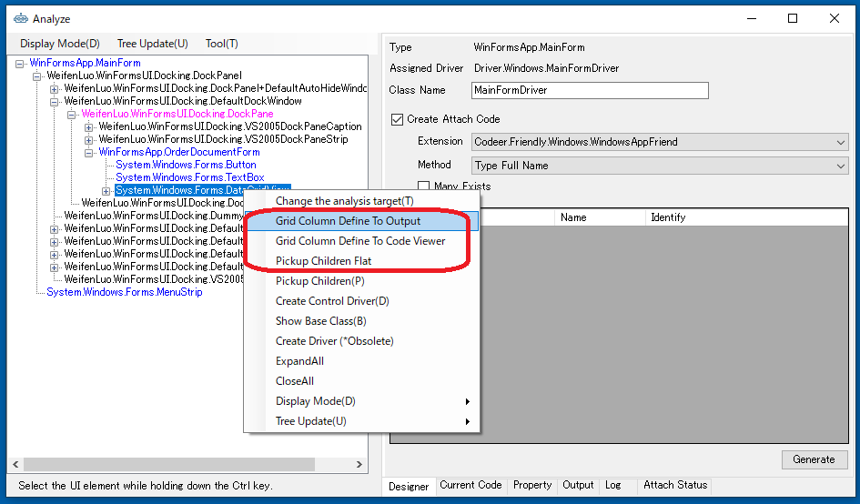
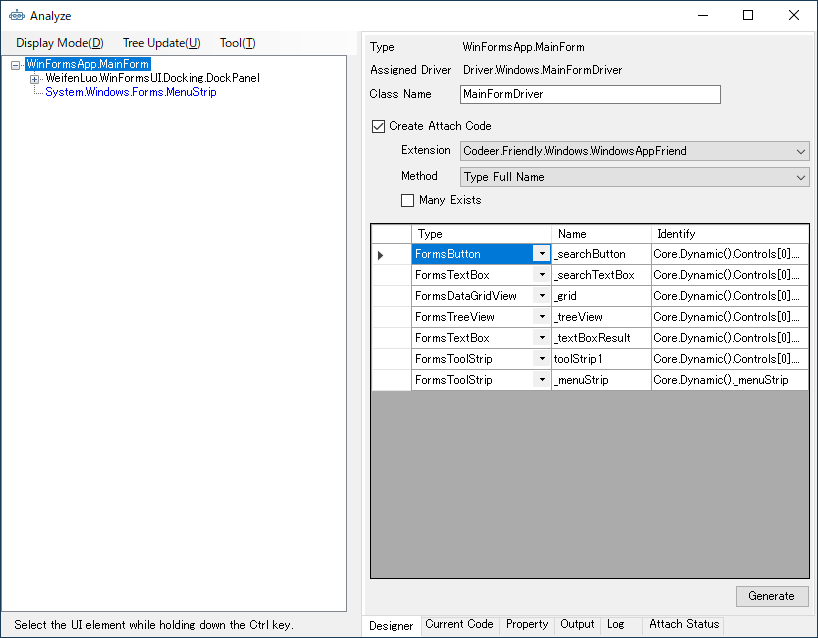
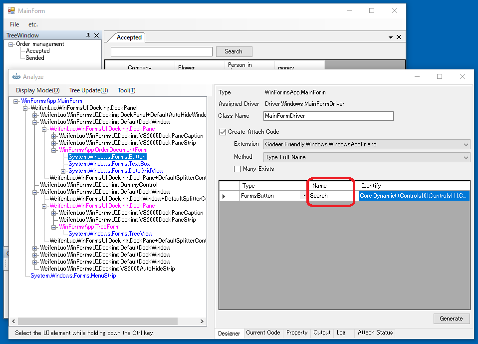

# カスタマイズ

TestAssitantProはCodeer.TestAssistant.GeneratorToolkitに定義されているインターフェイスを実装することでその挙動をカスタマイズすることができます。<br>
ソリューション内で実装してもよいですし、実装されているdllを参照するでも構いません。<br>
Analyze,Capture,Execute時に使われる機能です。これらは実装中にデバッグすることも可能です。<br>

# AnalyzeWindow
## Treeのコンテキストメニューの拡張
IWindowAnalysisMenuActionを実装することで AnalyzeWindow のツリーに表示されるメニューを拡張できます。<br>
新規作成時にテンプレートがDriver.InTargetに作成されています。<br>
これは対象プロセス内部で実行されます。<br>
デバッグする場合はShiftキーを押しながらAnalyzeを実行してください<br>
ツリーで選択されているコントロールのオブジェクトを元にコードを生成したりデザイナへのコントロールの登録を実行したりできます。<br>
プロジェクトでドライバを使っていて定型作業のようなものが見つかればメニューとして追加することで作業の効率を上げることができます。<br>

```cs
using Codeer.TestAssistant.GeneratorToolKit;
using System.Collections.Generic;
using System.Text;
using System.Windows.Forms;

namespace Driver.InTarget
{
    public class WindowAnalysisMenuAction : IWindowAnalysisMenuAction
    {
        //ツリーを右クリックしたときに呼び出されます。
        public Dictionary<string, MenuAction> GetAction(object target, WindowAnalysisTreeInfo info)
        {
            //コンテキストメニューに表示する文字列と実行したときのアクションのDictionaryです。
            var dic = new Dictionary<string, MenuAction>();

            //選択されているオブジェクトがグリッドの場合にメニューを登録します。
            if (target is DataGridView grid)
            {
                dic["グリッドのカラム定義をアウトプットに出力"] = 
                    () => GridColumnDefineToOutput(grid);

                dic["グリッドのカラム定義をコードビューワーに出力"] = 
                    () => GridColumnDefineToCodeViewer(target, grid);
            }

            //Controlの時の追加メニュー
            if (target is Control control)
            {
                //カスタマイズされた子要素のピックアップ
                dic["Pickup Children Flat"] =
                    () => PickupChildrenFlat(control);
            }
            return dic;
        }
    }
}
```


### Outputへの出力
任意のテキストをOutputに出力することができます。
GridColumnDefineToOutputではグリッドのカラム定義をアウトプットに出力しています。
```cs
static void GridColumnDefineToOutput(DataGridView grid)
{
    //アウトプットタブを表示状態にする
    AnalyzeWindow.Output.Show();

    //アウトプットタブに一行出力
    AnalyzeWindow.Output.WriteLine("public class GridColumns");
    AnalyzeWindow.Output.WriteLine("{");
    int i = 0;
    foreach (DataGridViewColumn e in grid.Columns)
    {
        AnalyzeWindow.Output.WriteLine("    const int " + e.HeaderText.Replace(" ", "") + " = " + i++ + ";");
    }
    AnalyzeWindow.Output.WriteLine("}");
}
```


### コードビューワーへの出力
任意のコードをコードビューワーに出力することができます。
```cs
static void GridColumnDefineToCodeViewer(object target, DataGridView grid)
{
    var code = new StringBuilder();
    code.AppendLine("namespace " + DriverCreatorAdapter.SelectedNamespace);
    code.AppendLine("{");
    code.AppendLine("    public class GridColumns");
    code.AppendLine("    {");
    int i = 0;
    foreach (DataGridViewColumn e in grid.Columns)
    {
        code.AppendLine("        const int " + e.HeaderText.Replace(" ", "") + " = " + i++ + ";");
    }
    code.AppendLine("    }");
    code.AppendLine("}");

    //作成したコードをGridColumns.csという名前で登録する
    DriverCreatorAdapter.AddCode("GridColumns.cs", code.ToString(), target);
}
```


### デザイナへコントロールの登録
任意のコントロールをデザイナへ登録することができます。<br>
通常のPickupChildrenはUserControl以下は登録しないのでUserControlも関係なく最後まで検索して登録するメソッドなども作れます。<br>
```cs
void PickupChildrenFlat(Control control)
{
    foreach (Control e in control.Controls)
    {
        var type = e.GetType();
        bool hit = false;
        while (type != null)
        {
            if (DriverCreatorAdapter.TypeFullNameAndControlDriver.ContainsKey(type.FullName) ||
                DriverCreatorAdapter.TypeFullNameAndUserControlDriver.ContainsKey(type.FullName) ||
                DriverCreatorAdapter.TypeFullNameAndWindowDriver.ContainsKey(type.FullName))
            {
                //ドライバが割り当たっていたらデザイナに登録する
                DriverCreatorAdapter.AddDriverElements(e);
                hit = true;
                break;
            }
            type = type.BaseType;
        }
        if (!hit)
        {
            PickupChildrenFlat(e);
        }
    }
}
```


### デザイナへの登録時のデフォルトの名前のカスタマイズ
IDriverElementNameGeneratorを実装すると名前をカスタマイズすることができます。<br>
実装次第では近くのラベルのテキストを利用するなどもできます。<br>

```cs
using Codeer.TestAssistant.GeneratorToolKit;
using Microsoft.CSharp;
using System.Windows.Forms;

namespace Driver.InTarget
{
    public class NamingRule : IDriverElementNameGenerator
    {
        //プライオリティ
        //IDriverElementNameGeneratorを実装したクラスが複数存在する場合は
        //この数値が大きいものが採用されます
        public int Priority => 1;

        public string GenerateName(object target)
        {
            //例 : ボタンの場合だけテキストを使った名前にする
            if (target is Button)
            {
                return ((Button)target).Text.Replace(" ", string.Empty);
            }
            //カスタマイズしない場合は空文字を返す
            return string.Empty;
        }
    }
}
```


### DriverCreatorAdapter
DriverCreatorAdapterはIWindowAnalysisMenuAction, IDriverElementNameGeneratorの実装中に使うことができます。<br>
前述の例にあるようにコードの追加、デザイナへのコントロールの登録に使る他、現在ソリューションに保持してるドライバの情報を使うことができます。<br>
| Property/Method | 説明 |
| ---- | ---- |
| Dictionary<string, ControlDriverInfo> TypeFullNameAndControlDriver | コントロールドライバ情報です。.Netのオブジェクトのタイプフルネームがキーになります。複数存在する場合はPriorityが一番高いものが取得されます。 |
| Dictionary<string, ControlDriverInfo> WindowClassNameAndControlDriver | コントロールドライバ情報です。Win32のWindowクラス名がキーになります。複数存在する場合はPriorityが一番高いものが取得されます。 |
| Dictionary<string, WindowDriverInfo> TypeFullNameAndWindowDriver | ウィンドウドライバ情報です。.Netのオブジェクトのタイプフルネームがキーになります。複数存在する場合はPriorityが一番高いものが取得されます。 |
| Dictionary<string, WindowDriverInfo> WindowClassNameAndWindowDriver | ウィンドウドライバ情報です。Win32のWindowクラス名がキーになります。複数存在する場合はPriorityが一番高いものが取得されます。 |
| Dictionary<string, WindowDriverInfo> WindowTextAndWindowDriver | ウィンドウドライバ情報です。Win32のWindowTextがキーになります。複数存在する場合はPriorityが一番高いものが取得されます。 |
| Dictionary<string, UserControlDriverInfo> TypeFullNameAndUserControlDriver | UserControlに割り当たっているウィンドウドライバ情報です。.Netのオブジェクトのタイプフルネームがキーになります。複数存在する場合はPriorityが一番高いものが取得されます。 |
| Dictionary<string, List&lt;ControlDriverInfo>> MultiWindowClassNameAndControlDriver | コントロールドライバ情報です。.Netのオブジェクトのタイプフルネームがキーになります。リストはPriorityの高い順に並んでいます。 |
| Dictionary<string, List&lt;ControlDriverInfo>> MultiTypeFullNameAndControlDriver | コントロールドライバ情報です。Win32のWindowクラス名がキーになります。リストはPriorityの高い順に並んでいます。  |
| Dictionary<string, List&lt;WindowDriverInfo>> MultiTypeFullNameAndWindowDriver | ウィンドウドライバ情報です。.Netのオブジェクトのタイプフルネームがキーになります。リストはPriorityの高い順に並んでいます。  |
| Dictionary<string, List&lt;WindowDriverInfo>> MultiWindowClassNameAndWindowDriver | ウィンドウドライバ情報です。Win32のWindowクラス名がキーになります。リストはPriorityの高い順に並んでいます。  |
| Dictionary<string, List&lt;WindowDriverInfo>> MultiWindowTextAndWindowDriver | ウィンドウドライバ情報です。Win32のWindowTextがキーになります。リストはPriorityの高い順に並んでいます。  |
| Dictionary<string, List&lt;UserControlDriverInfo>> MultiTypeFullNameAndUserControlDriver | UserControlに割り当たっているウィンドウドライバ情報です。.Netのオブジェクトのタイプフルネームがキーになります。リストはPriorityの高い順に並んでいます。  |
| void AddDriverElements(object driverElement) | デザイナにコントロールを追加します。 |
| void AddCode(string fileName, string code, object target)  | コードを追加します。 |
| void AddCodeLineSelectInfo(string fileName, string key, object target)  | コードに含まれるキーワードに対応するオブジェクトを設定します。例えばプロパティ名に対応するコントロールを設定しておけば、コードビューワー上で行が選択されたときに対象アプリ上でそのコントロールが強調表示されます。 |

# Capture
キャプチャ時のドライバツリーでも同様にコンテキストメニューをカスタマイズできます。<br>
新規したときにAssertが仕込まれています。<br>
このコードを元に解説します。<br>
CapterAttachTreeMenuActionを実装中はCtrlキーを押しながらCapture実行でデバッグできます。<br>
またここでも[Logger]()を使うことができます。<br>

```cs
using System;
using System.Collections.Generic;
using Codeer.Friendly.Windows;
using Codeer.TestAssistant.GeneratorToolKit;
using Ong.Friendly.FormsStandardControls;

namespace Driver.Tools
{
    public class CapterAttachTreeMenuAction : ICaptureAttachTreeMenuAction
    {
        public Dictionary<string, MenuAction> GetAction(string accessPath, object driver)
        {
            var dic = new Dictionary<string, MenuAction>();

            if (driver is FormsCheckBox checkBox) dic["Assert"] = () => Assert(accessPath, checkBox);
            else if (driver is FormsCheckedListBox checkedListBox) dic["Assert"] = () => Assert(accessPath, checkedListBox);
            else if (driver is FormsComboBox comboBox) dic["Assert"] = () => Assert(accessPath, comboBox);
            else if (driver is FormsDataGridView dataGridView) dic["Assert"] = () => Assert(accessPath, dataGridView);
            else if (driver is FormsDateTimePicker dateTimePicker) dic["Assert"] = () => Assert(accessPath, dateTimePicker);
            else if (driver is FormsLinkLabel linkLable) dic["Assert"] = () => Assert(accessPath, linkLable);
            else if (driver is FormsListBox listBox) dic["Assert"] = () => Assert(accessPath, listBox);
            else if (driver is FormsListView listView) dic["Assert"] = () => Assert(accessPath, listView);
            else if (driver is FormsMaskedTextBox maskedTextBox) dic["Assert"] = () => Assert(accessPath, maskedTextBox);
            else if (driver is FormsMonthCalendar monthCalendar) dic["Assert"] = () => Assert(accessPath, monthCalendar);
            else if (driver is FormsNumericUpDown numericUpDown) dic["Assert"] = () => Assert(accessPath, numericUpDown);
            else if (driver is FormsProgressBar progressBar) dic["Assert"] = () => Assert(accessPath, progressBar);
            else if (driver is FormsRadioButton radioButton) dic["Assert"] = () => Assert(accessPath, radioButton);
            else if (driver is FormsRichTextBox richTextBox) dic["Assert"] = () => Assert(accessPath, richTextBox);
            else if (driver is FormsTabControl tabControl) dic["Assert"] = () => Assert(accessPath, tabControl);
            else if (driver is FormsTextBox textBox) dic["Assert"] = () => Assert(accessPath, textBox);
            else if (driver is FormsToolStrip toolStrip) dic["Assert"] = () => Assert(accessPath, toolStrip);
            else if (driver is FormsToolStripButton toolStripStripButton) dic["Assert"] = () => Assert(accessPath, toolStripStripButton);
            else if (driver is FormsToolStripComboBox toolStripComboBox) dic["Assert"] = () => Assert(accessPath, toolStripComboBox);
            else if (driver is FormsToolStripTextBox toolStripTextBox) dic["Assert"] = () => Assert(accessPath, toolStripTextBox);
            else if (driver is FormsTrackBar trackBar) dic["Assert"] = () => Assert(accessPath, trackBar);
            else if (driver is FormsTreeView treeView) dic["Assert"] = () => Assert(accessPath, treeView);
            else if (!(driver is WindowsAppFriend)) dic["Assert"] = () => AssertAll(accessPath, driver);

            return dic;
        }

        static void Assert(string accessPath, FormsCheckBox checkBox)
        {
            //現在のCheckStateを期待値とするコードを作成
            CaptureAdaptor.AddCode($"{accessPath}.CheckState.Is(CheckState.{checkBox.CheckState});");
            //CheckStateをネームスペース修飾無しで使うのでコード生成後にusingも追加されるようにする
            CaptureAdaptor.AddUsing(typeof(CheckState).Namespace);
        }
```


