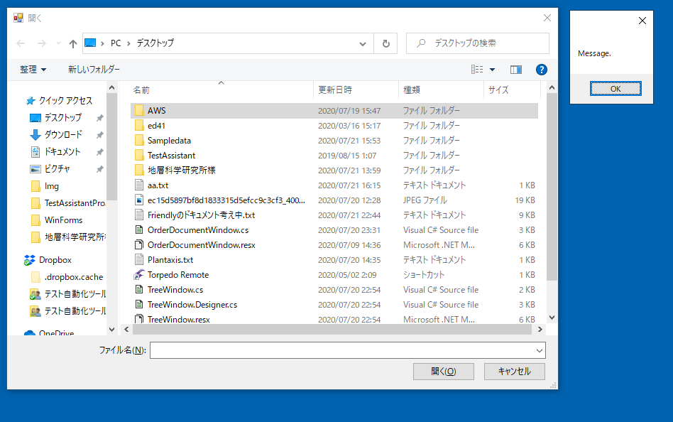

# TestAssistantProを利用してWinFormsアプリケーションのテストを構築する

TestAssistantProを使ってFriendlyでの`Driver/Scenarioパターン`に沿ったテストを実装します。
Friendlyと`Driver/Scenarioパターン`は次のリンクを参照してください。

+ [Friendly](https://github.com/Codeer-Software/Friendly/blob/master/README.jp.md)
+ [Driver/Scenarioパターン](https://github.com/Codeer-Software/Friendly/blob/master/TestAutomationDesign.jp.md)

## 目次

- 機能
  - [AnalyzeWindow](feature/AnalyzeWindow.md)
  - [AnalyzeWindowで生成されるコード](feature/GeneratedCode.md)
  - [Attach方法ごとのコード](feature/Attach.md)
- チュートリアル
  1. [テストソリューションを新規作成する](tutorial/Sln.md)
  2. [アプリケーションを解析してWindowDriverおよびUserControlDriverを作成する](tutorial/WindowDriver.md)
  3. [ControlDriverを実装する](tutorial/ControlDriver.md)
  4. [アプリケーションの操作を記録してシナリオを作成する](tutorial/Scenario.md)
  5. [AnalyzeWindowをカスタマイズする](tutorial/Customize.md)

## 利用するサンプルアプリケーション

サンプルには WinForms でよくあるドッキングウィンドウタイプのアプリケーションを用意しました。
Friendly を使って自動テストを作成しようとするときに多くの場合最初に表示されるメインウィンドウでつまずきます。
ドッキングウィンドウはドライバ作成にコツが必要で前提知識なしに作成するのは困難です。
そのほか、シンプルなダイアログ、ネイティブのダイアログ、プロジェクト固有のコントロールもあり
一般的な WinForms のアプリケーションの操作方法が一通り学べるようにしています。

## サンプルアプリケーションの準備

> **コメント**
> 
> サンプルアプリケーション用のリポジトリを作ってクローンさせたほうが良い。
> もしくはリリースに exe をおいておくか。

サンプルアプリケーションのソースコードを[こちら](WinFormsApp)から取得してビルドしてください。
ダウンロード後には「ブロックの解除」を行ってください。
