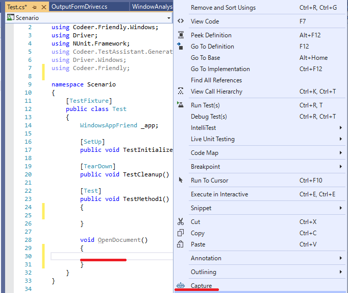
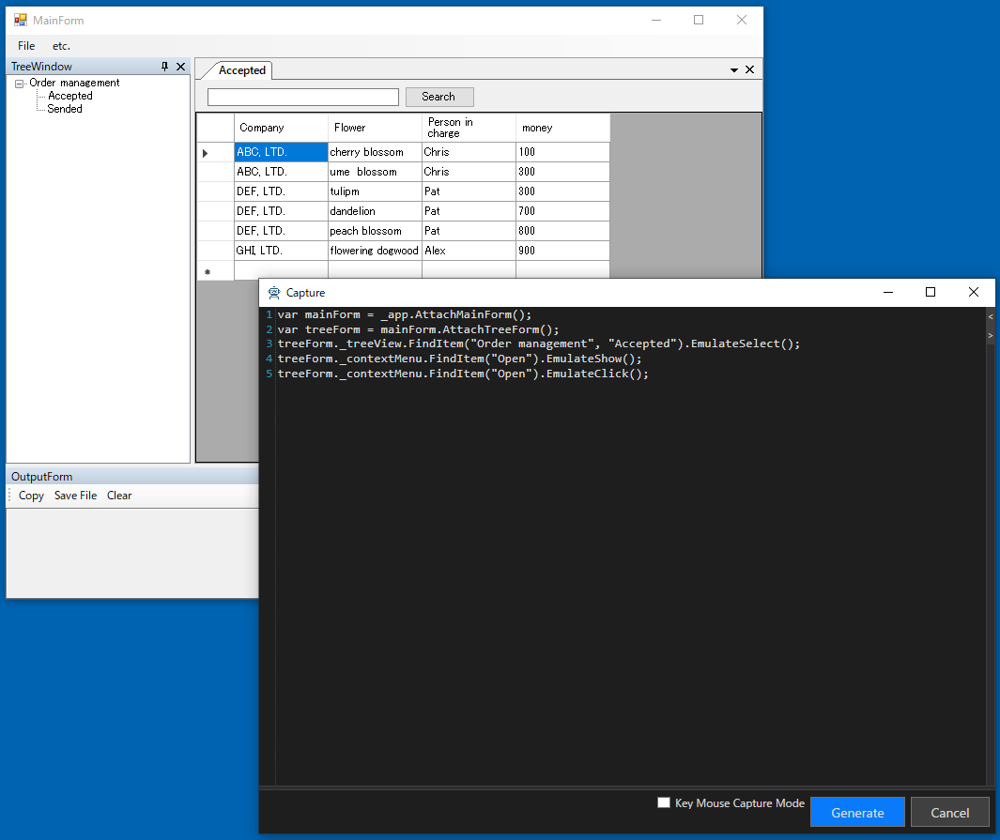
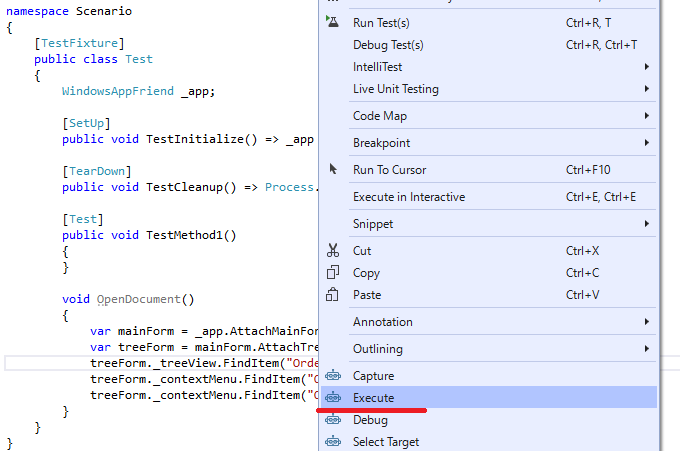
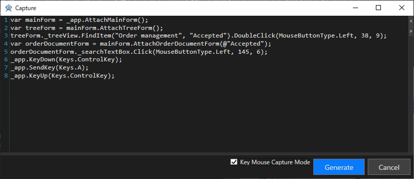

# シナリオ作成

ここではシナリオの作成方法を説明します。<br>
シナリオ作成時に使われる機能はCaptureとExecuteです。<br>
どちらもシンプルな機能です。<br>
シナリオ作成はテスト担当者に任せることを想定していますので本職のプログラマでなくても直感的に操作できるようにしています。<br>

* Caputer
    * 対象プロセスを操作することでコードを作成します。
* Execute
    * 関数単位で処理を実行します。この時 _appには現在TestAssistantProでアタッチしているアプリケーションが割り当てられます。

## WindowDriverを使います
シナリオの作成にはWindowDriverを使います。<br>
これは手でシナリオを書くときと同様です。<br>
質の高いWindowDriverができていればシナリオ作成は簡単です。<br>
WindowDriverに関しては[こちら](WindowDriver.md)を参照してください。<br>

## 少しづつ作成することで効率を高める
TestAssisntaProのシナリオ作成の特徴は少しづつ進めて行くことで質の高いコードを効率的に作成できることです。<br>
長いシナリオを一度に作成するのは大変です。<br>
ミスがあった時にどこを修正すれば良いのか調査する必要もあります。<br>
そのためTestAssistantProでは少しづつ操作コードを作成/確認できるようにしています。<br>
これにより作成効率を高めることに成功して言います。<br>

# 演習
まずはドキュメントを開くシナリオを作ってみます。<br>
OpenDocumentという関数を作り、そこで右クリックからCaptureを実行します。<br>


ツリー上でドキュメントを選択して右クリックメニューから Open Document を実行します。<br>
Captureウィンドウ上に次のようにコードが出ているのでGenerateボタンを押します。<br>


先ほどのOpenDocument関数にコードが出ているので、<br>
一度対象プロジェクトのドキュメントを閉じてから<br>
OpenDocument上で右クリックからExecuteを実行します。<br>
そうするとOpenDocumentのみが実行されます。<br>


今度はドキュメント上で検索をしてみます。<br>
同様にSearch関数を作りCaptureを実行します。<br>
今度は最後にAssertも書いてみます。<br>
(Assertの処理は[こちら]()を参照お願いします。)<br>


これもまた同様にSearch関数のみ実行してみます。<br>
実行前にOutputFormのClearボタンを押してOutputFormをクリアしておきます。<br>


期待通りの動作をすると今度は一つのテスト関数から呼び出だすようにして纏めて実行してみます。<br>
折角なのでNUnitから実行します。<br>
Nunitでは新しいアプリが起動して処理を実行してみてください。<br>
新しいプロセスが起動しテストが実行され成功します。<br>
<br>
長いシナリオを一度にキャプチャするのは大変です。<br>
このように短い操作コードを作って確認しながら少しづつ進めることで結果的には高い効率で作業を進めることができます。<br>
また短いコードであれば再利用可能となることが多いです。<br>
もう一つ重要なのは当然ですが、これらのコードは手動でも書くことができるということです。<br>
もちろん手動で書いたコードでもExecuteで実行可能で、後述のデバッグ機能も使えます。<br>

### デバッグ
Ctrlキーを押しながらExecuteを実行するとテストプロセスをデバッグできます。<br>
(これはDebugメニューと同じ動作になります)<br>
Shiftキーを押しながらExcecuteを実行すると対象プロセスをデバッグできます。<br>
Dllインジェクションで対象プロセスにロードさせる処理を作っている時に便利です。<br>
Ctrl+Shiftを押しながらExecuteを実行すると両方を同時にデバッグできます。<br>

### Asyncに関して
モーダルダイアログが出る関数に関しては非同期処理が出力されます。<br>
例えば メニューの Simple Dialog を実行してダイアログを閉じる処理をキャプチャすると以下のようになります。<br>
Asyncの詳細は[こちら]()を参照お願いします。<br>
```cs
void AsyncTest()
{
    var mainForm = _app.AttachMainForm();

    var async = new Async();
    mainForm._menuStrip.FindItem("etc.", "Simple Dialog").EmulateClick(async);
    var simpleForm = _app.AttachSimpleForm();
    simpleForm._buttonCancel.EmulateClick();
    async.WaitForCompletion();
}
```
### キーマウス
Friendlyの操作は一般的に最適な操作方法を提供していますが、API呼び出しが基本ですので人の操作とは異なります。
場合によってはより人の操作に近い方が良い場合もあります。
そのような場合は Key Mouse Capture Mode にチェックを入れてください。
その間はより低レベルなキーマウス操作のコードを作成するようになります。
これはFriendly.Windows.KeyMouseを利用したコードになります。
一般的なキーマウス処理よりはタイミングの面で有利です。
詳細はこちらを参照お願いします。


## 複数のアプリを操作する場合
WindowsAppFriendを複数持つ場合はAppInfoAttributeでアプリの名前を指定できます。<br>
これによってCapture時に変数を使い分けることができます。<br>
ただし複数同時にキャプチャすることはできないので、一つづつキャプチャして処理を作成してください。<br>

```cs
using System.Diagnostics;
using Codeer.Friendly.Windows;
using Driver;
using NUnit.Framework;
using Codeer.TestAssistant.GeneratorToolKit;

namespace Scenario
{
    [TestFixture]
    public class Test
    {
        [AppInfo(Name = "WinFormsApp")]
        WindowsAppFriend _winFormsApp;

        [AppInfo(Name = "WpfApp")]
        WindowsAppFriend _wpfApp;
```