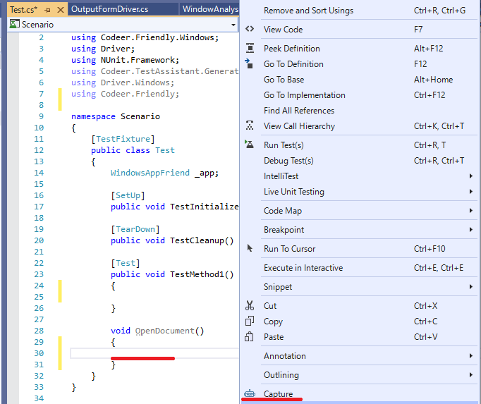
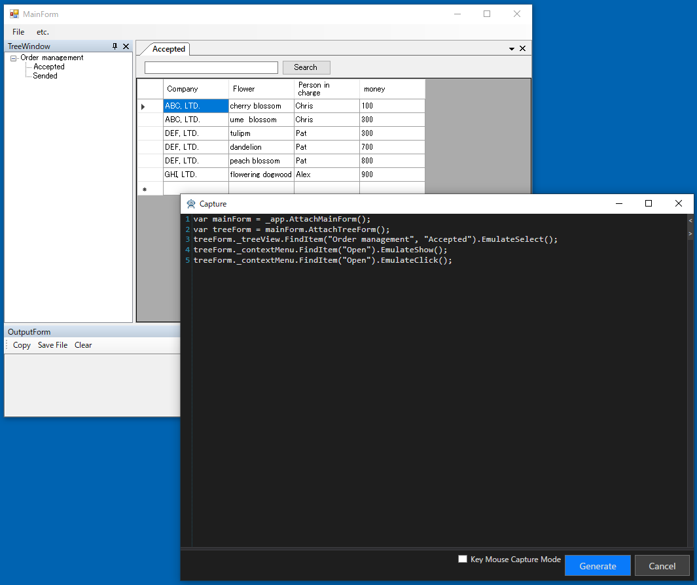
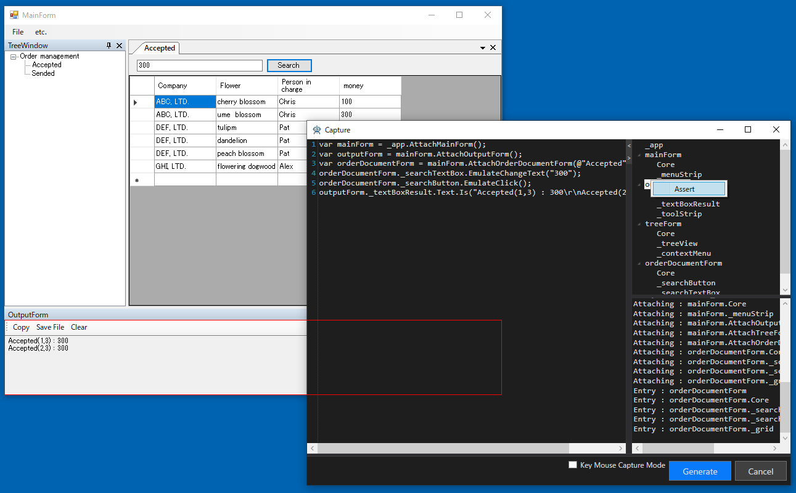
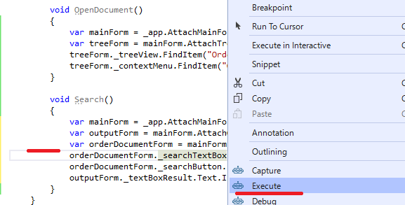
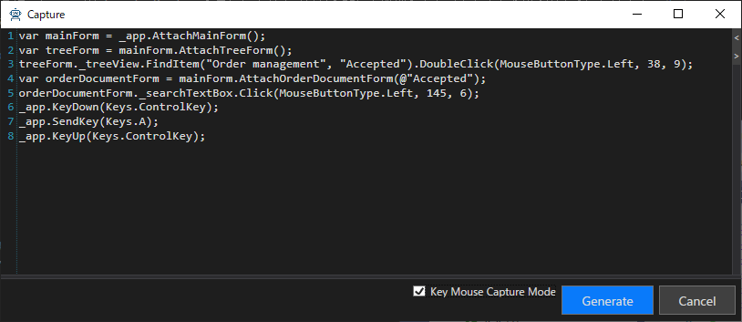

# アプリケーションの操作を記録してシナリオを作成する

ここではシナリオの作成方法を説明します。
シナリオ作成時に使われる機能は Capture と Execute です。
どちらもシンプルな機能です。
シナリオ作成はテスト担当者に任せることを想定していますので本職のプログラマーでなくても直感的に操作できるようにしています。

* Caputer
    * 対象プロセスを操作することでコードを作成します。
* Execute
    * 関数単位で処理を実行します。この時 _app には現在 TestAssistantPro でアタッチしているアプリケーションが割り当てられます。

## WindowDriverを使います
シナリオの作成には WindowDriver を使います。
これは手でシナリオを書くときと同様です。
質の高い WindowDriver ができていればシナリオ作成は簡単です。
WindowDriver に関しては[こちら](WindowDriver.md)を参照してください。

## 少しずつ作成することで効率を高める
TestAssisntaPro のシナリオ作成の特徴は少しずつ進めて行くことで質の高いコードを効率的に作成できることです。
長いシナリオを一度に作成するのはたいへんです。
ミスがあった時にどこを修正すれば良いのか調査する必要もあります。
そのため TestAssistantPro では少しずつ操作コードを作成/確認できるようにしています。
これにより作成効率を高めることに成功して言います。

# 演習
この演習はWindowDriverができていることが前提です。
WindowDriverは[こちらの演習](WindowDriver.md#演習)で作成しています。
まずはドキュメントを開くシナリオを作ってみます。
OpenDocument という関数を作り、そこで右クリックから Capture を実行します。



ツリー上でドキュメントを選択して右クリックメニューから Open Document を実行します。
Capture ウィンドウ上に次のようにコードが出ているので Generate ボタンを押します。



先ほどの OpenDocument 関数にコードが出ているので、
一度対象プロジェクトのドキュメントを閉じてから
OpenDocument 上で右クリックから Execute を実行します。
そうすると OpenDocument のみが実行されます。


今度はドキュメント上で検索をしてみます。
同様に Search 関数を作り Capture を実行します。
今度は最後に Assert も書いてみます。
(Assert の処理は[こちら](Customize.md#Capture)を参照お願いします。)



これもまた同様に Search 関数のみ実行してみます。
実行前に OutputForm の Clear ボタンを押して OutputForm をクリアしておきます。



期待通りの動作をすると今度は一つのテスト関数から呼び出だすようにしてまとめて実行してみます。
せっかくなので NUnit から実行します。
Nunit では新しいアプリケーションが起動して処理を実行してみてください。
新しいプロセスが起動され、テストの実行が成功します。
```cs
[TestCase, Apartment(ApartmentState.STA), TimeoutEx(10000)]
public void TestMethod1()
{
    OpenDcument();
    Search();
}
```
長いシナリオを一度にキャプチャするのはたいへんです。
このように短い操作コードを作って確認しながら少しずつ進めることで結果的には高い効率で作業を進めることができます。
また短いコードであれば再利用可能となることが多いです。
もう一つ重要なのは当然ですが、これらのコードは手動でも書くことができるということです。
もちろん手動で書いたコードでも Execute で実行可能で、後述のデバッグ機能も使えます。

### デバッグ
Ctrl キーを押しながらExecuteを実行するとテストプロセスをデバッグできます。
(これは Debug メニューと同じ動作になります)
Shift キーを押しながら Excecute を実行すると対象プロセスをデバッグできます。Dll インジェクションで対象プロセスにロードさせる処理を作っている時に便利です。
Ctrl + Shift を押しながら Execute を実行すると両方を同時にデバッグできます。

### Async に関して
モーダルダイアログが出る関数に関しては非同期処理が出力されます。
たとえば メニューの Simple Dialog を実行してダイアログを閉じる処理をキャプチャすると以下のようになります。
Async の詳細は[こちら](https://github.com/Codeer-Software/Friendly/blob/master/README.jp.md#async)を参照お願いします。
```cs
void AsyncTest()
{
    var mainForm = _app.AttachMainForm();

    var async = new Async();
    mainForm._menuStrip.FindItem("etc.", "Simple Dialog").EmulateClick(async);
    var simpleForm = _app.AttachSimpleForm();
    simpleForm._buttonCancel.EmulateClick();
    async.WaitForCompletion();
}
```
### キーマウス
Friendly の操作は一般的に最適な操作方法を提供していますが、API呼び出しが基本ですので人の操作とは異なります。
場合によってはより人の操作に近い方が良い場合もあります。
そのような場合は Key Mouse Capture Mode にチェックを入れてください。
その間はより低レベルなキーマウス操作のコードを作成します。
これは Friendly.Windows.KeyMouse を利用したコードになります。
一般的なキーマウス処理よりはタイミングの面で有利です。
詳細はこちらを参照お願いします。



## 複数のアプリケーションを操作する場合
WindowsAppFriend を複数持つ場合は AppInfoAttribute でアプリケーションの名前を指定できます。
これによって Capture 時に変数を使い分けることができます。
ただし複数同時にキャプチャすることはできないので、一つずつキャプチャして処理を作成してください。

```cs
using System.Diagnostics;
using Codeer.Friendly.Windows;
using Driver;
using NUnit.Framework;
using Codeer.TestAssistant.GeneratorToolKit;

namespace Scenario
{
    [TestFixture]
    public class Test
    {
        [AppInfo(Name = "WinFormsApp")]
        WindowsAppFriend _winFormsApp;

        [AppInfo(Name = "WpfApp")]
        WindowsAppFriend _wpfApp;
```